**AUDITABLE FLOURISHING**

A Non-Compensatory Assurance Protocol for Frameworks Claiming to Support Flourishing

**Master Reference Edition - Version 6.2**

James McGaughran  
ORCID: 0009-0005-3324-7290  
British University Vietnam

**Current status:** Internal specification closure; Phase 0 design-ready; external validation open.

[[PAGEBREAK]]

# AF in 60 Seconds

Auditable Flourishing asks a bounded question: has a versioned decision framework shown enough inspectability, rights protection, auditability, measurement integrity, corrigibility, and refusal capacity to enter a scoped comparison? Stage A applies six non-compensatory eligibility criteria. Stage B compares only eligible candidates without averaging ordinal categories or manufacturing a winner. Every finding remains challengeable, expiring, appealable, and separate from legal, moral, community, procurement, safety, and deployment authority.

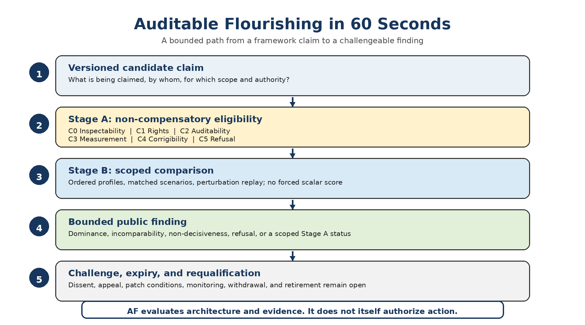

**Figure 1. Auditable Flourishing in 60 Seconds. The protocol moves from a bounded claim to a challengeable finding without converting evaluation into authorization.**

**Choose a reader path.** First-time readers can use this page, the Abstract, Sections 3, 5, 6, and the Conclusion. Rights and legal readers can move directly to Sections 3.4-3.5, 5.3-5.4, and the Legal, Rights, and Authorization Note. Researchers can move to Sections 7 and 11 and the Phase 0 protocol. Implementers should use the companion standards and aggregation workbook together with the core.

# What an AF Finding Does Not Mean

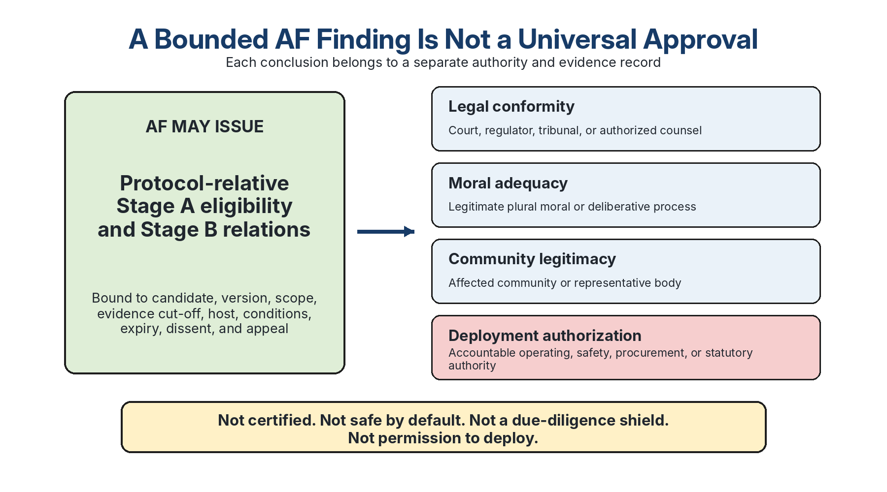

**Figure 2. AF eligibility is not universal approval. Legal, moral, community, and deployment findings remain separate and authority-specific.**

No AF status is a certificate, safety warranty, legal opinion, universal moral verdict, community consent record, proof of due diligence, liability shield, finding that a particular harm was foreseeable or unforeseeable, or permission to deploy. A public finding is valid only with its exact candidate, version, scope, evidence cut-off, host, conditions, expiry, dissent, appeal route, and constitutional-legitimacy basis.

[[PAGEBREAK]]

# Abstract

**Purpose and object of audit.** Auditable Flourishing evaluates the decision architecture and evidentiary claims of frameworks that claim to support flourishing; it does not directly measure, certify, own, or guarantee flourishing. It asks whether human-led, legal, institutional, community-based, AI-assisted, computational, or hybrid frameworks disclose their operative commitments and authority, protect non-compensatory floors, preserve a challengeable decision record, measure multidimensional outcomes without hiding uncertainty or distribution, update after failure, and refuse or escalate when evidence, competence, capacity, or authorization is insufficient.

**Method.** Stage A determines only whether a versioned candidate is eligible for a stated comparison scope and evidence cut-off under six non-compensatory criteria, C0-C5. Stage B compares only candidates found Stage-A admissible for the same scope through ordered rubric profiles, subordinate indicator evidence where meaningful units exist, explicit evidence maturity and reviewer confidence, frozen matched scenarios, adversarial probes, and public defect-and-patch records. Floor-linked category unreachability prevents Stage B from becoming a safe harbour after a Stage A defect. Defended category alternatives enter a versioned perturbation register only through a published admission rule, after which the partial-order relation is replayed symmetrically. Invariant dominance may be reported as dominance; invariant crossing may be reported as incomparability; invariant tie or relation instability remains non-decisive; invalid prerequisites produce refusal to compare. Ordinal categories are never summed, averaged, differenced, or converted into a pseudo-metric score.

**Legitimacy boundary.** C0-C5 constitute a proposed constitutional class for framework comparison, not a universal constitution established by authorial assertion. The core publishes the functional rationale and challenge boundary for each criterion; the version-matched anchors and stewardship charter delegate rival formulations, boundary cases, disconfirming evidence, dissent, revision, and retirement records. Those delegated materials are design commitments, not evidence that an independent constitutional convention has occurred. AF currently self-assesses at CL1: published author proposal with genealogy and rival formulations. Every positive Stage A finding therefore remains protocol-relative, scope-bound, and constitutionally contestable.

**Current status.** Version 6.2 is internally specification-complete and **Phase 0 design-ready** at evidence maturity L1-L2. The administration, training, scenario-governance, rating-deposit, analysis, burden, and publication rules are specified, but an independent host, qualified reviewer pool, and frozen calibrated twenty-case scenario library have not yet been constituted. AF has not demonstrated inter-reviewer reliability, architecture-fair application across independent candidates, predictive validity, decision utility, affected-party legitimacy, safe live administration, or comparative superiority. The next scientific step is a preregistered independent study that can publish null, adverse, burden, capture, and protocol-failure findings without author, sponsor, candidate, or host veto.

**Independence boundary.** Auditable Flourishing was developed within the broader MathGov / RippleLogic research programme, but it is not controlled by the MathGov Core and may return adverse, indeterminate, or refusal findings about MathGov. Because the author is affiliated with both, no author-administered application can establish AF eligibility, dominance, architecture fairness, legitimacy, or superiority. Those claims require an independent host, immutable pre-discussion rating deposits, a published independence and host-interest dossier, protected dissent, affected-party standing where applicable, and the external-validation controls in this release.

Keywords: auditability; flourishing; rights protection; framework comparison; ordinal profiles; corrigibility; refusal; meta-evaluation; constitutional legitimacy; decision value

# Current Status at a Glance

**Table S1. AF v6.2 separates what is internally complete from what remains an external empirical or legitimacy question.**

| **Axis** | **v6.2 status** | **What it supports now** | **What remains open** |
| --- | --- | --- | --- |
| **Artifact integrity** | Verified for the exact hash-pinned release package | Genuine DOCX/PDF/XLSX containers, critical semantic synchronization checks, figures, tests, manifests, and release checks can be replayed | Artifact integrity does not establish substantive validity |
| **Conceptual maturity** | Internally specification-complete | Core semantics, role boundaries, anchors, profiles, challenge rules, falsification conditions, and ownership are explicit | Independent criticism can still require revision, restriction, or retirement |
| **Constitutional legitimacy** | **CL1 self-assessment; CL2 design materials only** | Genealogy, rival formulations, process requirements, standing, dissent, and amendment routes are published | No independent convention has established plural constitutional legitimacy |
| **Instrument maturity** | Hostile-case hardened and aggregation-ready | Controlled values fail closed; statuses are tokenized; reliability layers, burden cohorts, and perturbations are separated | Inter-reviewer reliability, invariance, and field usability remain unestablished |
| **Implementation readiness** | **Phase 0 design-ready** | A host can plan and preregister a non-dispositive exploratory study | Independent host, trained reviewer pool, and frozen calibrated twenty-case library remain to be constituted |
| **Empirical validation** | Not established | No empirical benefit, reliability, fairness, or superiority claim is made | Reliability, validity, burden, capture resistance, and decision value require independent evidence |
| **Domain authorization** | Not granted | Competent authorities may use AF as one bounded input | No AF result grants legal, moral, community, procurement, safety, or deployment authority |

[[PAGEBREAK]]

[[TOC_HEADING]]

[[TOC]]

[[LIST_TABLES_HEADING]]

[[LIST_OF_TABLES]]

[[LIST_FIGURES_HEADING]]

[[LIST_OF_FIGURES]]

[[PAGEBREAK]]

# Reader Guide: Key Terms and Canonical Tokens {#reader-guide}

This guide is navigational rather than controlling. **Table 5 controls Stage A public statuses; Table 5B controls criterion states; Table 8M controls Stage B outcomes; Appendix G provides the full machine-token map and v5.8/v5.9-to-v6.2 migration aliases.**

| **Term** | **Meaning in v6.2** | **Controlling location** |
| --- | --- | --- |
| **Bounded architecture neutrality** | Candidates may use different ontologies, vocabularies, institutions, or computational forms, but must provide functionally equivalent safeguards within the declared scope. | §1.9 |
| **Stage A** | Non-compensatory scoped eligibility assessment under C0-C5. | §5; Table 5B |
| **Stage A public status** | A bounded human-readable finding with an exact canonical token and inference boundary. | §3.4; Table 5 |
| **Stage B profile** | Twelve ordered dimension findings with evidence, maturity, applicability, confidence, disagreement, and provenance kept separate. | §6; Appendix F |
| **Stage B outcome** | `dominance`, `incomparable`, `non_decisive`, or `refusal_to_compare` under the relation-set rule. | Table 8M |
| **Dominance direction** | Separate field identifying `dominates_a` or `dominates_b`; it is not a fifth Stage B outcome. | §6.1; §10 |
| **Control-dependent admissibility** | Stage A eligibility depends on named, owned, monitored, expiring, requalified controls; omission of the qualifier is a reporting defect. | Table 5 |
| **Immutable rating deposit** | A pre-discussion record in an independently controlled system with trusted time, content hash, append-only audit or supersession history, access control, and exportable provenance. | §7.3; rating-deposit standard |
| **Scenario-set record** | A frozen, versioned, hash-bound case set with declared function, calibration state, architecture-equivalence criteria, access status, and retirement rules. | scenario-governance standard |
| **Evidence maturity** | L0-L6 describes evidence for a named subject and claim; it does not grant authorization or ethical worth. | §1.5; Table 1 |
| **Repairable condition** | A specific feasible evidence or process step could make the same review object valid within the current review cycle. | §6.1; Table 8M |

# 1. Introduction {#introduction}

## 1.1 The civilizational problem: steering without instrumentation

Modern societies routinely make decisions that shape life chances, rights protections, economic security, ecological stability, and technological risk. These choices are increasingly coupled: climate shocks affect food security and migration, conflict accelerates institutional fragility, economic volatility amplifies polarization, and AI-mediated systems scale both public benefits and public harms. Yet despite these stakes, governance processes often lack explicit constraints, traceable reasoning, measurable performance indicators, uncertainty discipline, adversarial testing, and systematic error correction.

The gap between governance stakes and governance instrumentation is no longer theoretical. The World Meteorological Organization's consolidated analysis of eight datasets estimated the 2025 global mean surface temperature at **1.44 degrees Celsius ± 0.13 degrees Celsius above the 1850-1900 average**, with two datasets ranking 2025 second warmest and six ranking it third; 2015-2025 were the eleven warmest years in all eight datasets (World Meteorological Organization, 2026). Peace Research Institute Oslo, using UCDP data, reported 65 active state-based conflicts across 35 countries in 2025 and more than 255,000 fatalities across organized-violence categories (Rustad, 2026); the cited headline report supplies a count/estimate rather than a sampling interval. The World Bank's June 2025 update set the international extreme-poverty line at $3.00 per person per day in 2021 purchasing-power-parity terms, and its March 2026 update estimated 10.4 percent extreme poverty in 2024 and nowcast 10.0 percent in 2026 under that line (World Bank, 2025a, 2026); the cited summary does not publish a model-uncertainty interval. These contextual anchors motivate the governance problem but are not validation evidence for AF. Public sectors are simultaneously deploying AI or automated systems in welfare, fraud detection, immigration, law enforcement, hiring, education, and other rights-sensitive domains. Civilization is therefore being asked to steer under compounding risk without sufficiently auditable steering instruments.

## 1.2 The missing standard

Many frameworks claim to advance flourishing, wellbeing, sustainability, justice, safety, prosperity, or alignment. They are often difficult to compare because they mix aspirations, ideologies, dashboards, proprietary claims, and partial metrics. Some optimize aggregate welfare while leaving rights implicit or negotiable. Others foreground rights but provide limited guidance for measurement, tradeoffs, uncertainty, refusal under underdetermination, or institutional learning. Still others offer indicators without decision logic or update triggers. Auditable Flourishing separates two questions that are often conflated: Where are we trying to go, and what kind of decision system is admissible to help us get there?

## 1.3 The open challenge: candidate neutrality and accountable sponsorship

Auditable Flourishing is an open challenge to decision frameworks. Human-only, institutional, legal, community-based, scientific, AI-assisted, computational, deliberative, ecological, and hybrid systems may contribute candidate architectures. The protocol does not privilege the identity of the entrant. It asks whether the framework can disclose its normative core, protect non-compensatory floors, make decisions replayable, measure without Goodhart collapse, update under failure, refuse under underdetermination, and distinguish comparison from deployment authorization.

Candidate-intelligence neutrality is submission-origin neutral but accountability-bound. Any candidate framework, including AI-assisted or computational submissions, must have an accountable human, institution, or legally recognized sponsor for review, disclosure, conflict-of-interest reporting, safety handling, public challenge, and correction. A framework cannot enter Stage B solely because a machine, institution, community, or author produced a polished artifact. It enters only by passing Stage A: open-core inspectability, rights protection, auditability, measurement discipline, scientific updateability, and refusal/execution-boundary discipline.

## 1.4 Protocol at a glance: two stages with governed subreviews

Auditable Flourishing has two evaluation stages. The additional reviews below are components of Stage A, not extra stages or gates.

- **Submission and sponsor lock.** Identify the accountable sponsor, candidate framework, version, scope, claimed use, authority boundary, and protected-information boundary. This is designed to expose anonymous authority and unclear responsibility.

- **Stage A - scoped AF eligibility under C0–C5.** Review the candidate's inspectability, rights safeguards, auditability, measurement integrity, corrigibility, and refusal/execution boundary. Within Stage A:

- the **floor review** routes rights, basic needs, due process, non-domination, and emergency claims outside ordinary profile comparison;

- the **audit review** tests provenance, reasons, authority, assumptions, discretion, and architecture-appropriate replay;

- the **measurement review** tests construct fit, uncertainty, distribution, missingness, subgroup visibility, privacy, and anti-Goodhart controls; and

- the **corrigibility and refusal review** tests failure triggers, patch cycles, abstention, escalation, safer alternatives, and execution boundaries.

- **Stage B - comparative profile evaluation.** Compare only candidates found Stage-A admissible for the same scope, using ordered category descriptors, indicator evidence where meaningful units exist, evidence maturity, reviewer confidence, adversarial probes, and explicit disagreement records. Report dominance only when the partial-order conditions are met; otherwise report incomparability, non-decisiveness, or refusal to compare.

- **Public report and patch cycle.** Publish strengths, defects, limits, conflicts, minority opinions, evidence maturity, patch conditions, and appeal outcomes. This is designed to detect self-certification and closed review; it does not prove that those risks have been eliminated.

- **Authorization and execution boundary.** Require lawful, ethical, institutional, domain-safety, and affected-party authorization before real use. Stage A permits comparison, Stage B compares quality, and neither stage authorizes or safely executes a real-world action.

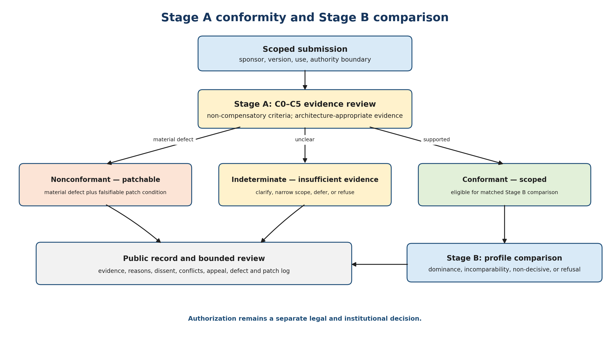

**Figure 3. Stage A establishes scoped AF eligibility before Stage B comparison. Neither stage grants deployment authorization.**

## 1.5 Current evidence status

Version 6.2 is an architectural, methodological, and Phase 0 **design** specification, not a completed empirical validation study or a constituted Phase 0 study. Three maturity levels must be distinguished. Protocol maturity concerns whether Auditable Flourishing itself has clear artifacts, rubrics, scenarios, defect codes, and replay rules. Candidate-framework maturity concerns whether a submitted framework has evidence of construct validity, independent replay, calibration, pilots, or replication. Deployment maturity concerns whether a specific institution has lawful authority, affected-party oversight, domain safety review, data governance, and operational capacity to use a framework in practice. Under the evidence maturity ladder introduced below, this paper is primarily at L1–L2: conceptual and architectural. Some elements support synthetic replay packages and calibration exercises, but the paper does not yet provide inter-rater reliability data, live pilots, independent replication, or legal authorization for deployment. Therefore, any claim that Auditable Flourishing is the best framework, or that any seed entrant has already won a comparative challenge, would be premature. The appropriate claim is narrower: the protocol is ready for formal critique, external inspection of the completed artifact family, synthetic-case replay, calibration exercises, and independently governed Phase 0 material construction and study design.

The evidence-maturity ladder used throughout the protocol is summarized in Table 1.

**Table 1. Evidence maturity separates architecture, replay, calibration, and deployment evidence; no level grants authorization by itself.**

| **Level** | **Meaning** | **Minimum evidence signal** | **Claims permitted at this level** |
| --- | --- | --- | --- |
| **L0** | Proposal not yet inspectable | concept or claim without a stable specification or challengeable artifact set | idea or research question only |
| **L1** | Conceptual specification and public critique | declared constructs, boundaries, non-claims, and reviewable protocol text | specification exists and can be criticized |
| **L2** | Protocol architecture and design materials | versioned criteria, templates, schemas, synthetic examples, and replay instructions | design-ready for material construction; not externally replayed |
| **L3** | Trained-reviewer synthetic replay | frozen case library applied independently with immutable deposits and disagreement records | feasibility and observed synthetic-case behavior |
| **L4** | Calibrated challenge | anchor interpretation, layer-specific reliability, adjudication performance, and revision thresholds | calibrated performance under the tested distribution |
| **L5** | Independent pilots and external replay | unaffiliated hosts, architecturally diverse candidates, affected-party review, and public defect records | bounded cross-host reliability, validity, burden, and decision-value claims |
| **L6** | Replicated deployment evidence | repeated real-world use under separate lawful authorization, validated impact, monitoring, and retirement capacity | bounded domain evidence; still not universal authority |

The levels describe evidence maturity, not ethical worth or deployment permission. A candidate, protocol, indicator, institution, or deployment claim may occupy different levels for different claims. Evidence maturity must not be used as a synonym for evidence type or study design. Every material maturity claim therefore records the five fields in Table 1A.

**Table 1A. Evidence maturity, evidence mode, and the subject of the claim are separate metadata fields.**

| **Field** | **Required content** | **Example** |
| --- | --- | --- |
| **`evidence_maturity_level`** | One of L0-L6 under Table 1. | `L2` |
| **`evidence_mode`** | How the evidence was produced: conceptual analysis, synthetic replay, historical backtest, independent replay, shadow mode, pilot, live observational study, experiment, or another declared mode. | `synthetic_replay` |
| **`maturity_subject`** | The entity or claim being assessed: protocol, candidate framework, indicator, institution, or deployment claim. | `protocol` |
| **`maturity_rationale`** | A concise explanation connecting the evidence to the assigned level. | versioned schemas and frozen synthetic cases exist, but no independent host has replayed them |
| **`evidence_pointer`** | Stable path, citation, record ID, or manifest-tracked artifact supporting the assignment. | `supplement/examples/...` |

A mode such as `independent_replay` does not itself determine maturity: the record must state what was replayed, by whom, under which version, and which subject's maturity is being assessed.

Reviewer-facing status note. Version 6.2 is ready for SSRN deposit, adversarial review, synthetic replay of the included examples, calibration design, and construction of a low-risk Phase 0 study using a complete, version-matched release bundle that has passed the declared release-verification procedure. It is not suitable as a live high-stakes deployment instrument. The key missing evidence remains dimension-level inter-rater reliability, independent replay by reviewers not controlled by the author, at least one architecturally distinct non-affiliated candidate comparison, calibrated ordinal anchors and reliability thresholds, and a published demonstration of disagreement handling.

## 1.6 Core thesis

A proposed framework for civilizational flourishing can be made open-core inspectable, rights-protecting, auditable, measurable, scientifically updatable, and testable against reality, but only if it is built as a layered protocol rather than a slogan, a black-box product, or a single dashboard. The strongest formulation is a constrained, multidimensional trajectory inside a safe operating corridor. This requires non-compensatory floors, flourishing indicator portfolios, ecological and systemic risk boundaries, uncertainty and subgroup discipline, refusal and containment rules, adversarial review, and public patch cycles.

## 1.7 Research questions

- How should flourishing be operationalized as a measurable civilizational target state suitable for comparing governance and decision frameworks?

- What minimum admissibility criteria are necessary before a decision framework can credibly claim to guide high-impact choices toward flourishing?

- How can competing frameworks be compared through reproducible scenarios, adversarial testing, uncertainty disclosure, public reporting, and correction cycles?

- How should disclosed seed-entrant architectures be evaluated without allowing authorial bias, ecosystem capture, or self-certification?

## 1.8 Non-claims and scope boundaries

This paper is a normative design and evaluation protocol contribution. It does not prove that any single governance framework has already demonstrated superior performance at civilizational scale. It does not replace constitutional law, democratic authorization, affected-community consent, domain-specific regulation, or legal compliance regimes such as fundamental rights impact assessments. It does not define a universal moral theory or a single-number flourishing index. It proposes an evaluation substrate for determining whether a candidate framework is sufficiently inspectable, rights-safe, auditable, measurable, and corrigible to be compared responsibly. The protocol is intentionally specification-light relative to full candidate systems: its job is to define neutral admissibility and comparison requirements, while thicker schemas, validators, domain rules, and implementation manuals belong in separate candidate dossiers and pilot packages.

Protocol status clarification. Protocol inadmissibility is not the same as legal invalidity, and protocol admissibility is not the same as legal permission. A lawful institution may still need constitutional, statutory, procurement, ethics, privacy, domain-safety, and affected-community authorization before using any framework. Conversely, a legally permissible local action may still fail this protocol if it relies on hidden authority, compensatory rights sacrifice, unreplayable logic, or refusal failure. This paper therefore proposes a comparative admissibility standard, not a substitute court, legislature, regulator, ethics board, or community-consent process.

## 1.9 Bounded architecture neutrality and the normative class

Auditable Flourishing is not neutral among every possible theory of governance. It is architecture-neutral within a declared rights-protecting, inspectable, and corrigible constitutional class. A candidate may be computational, deliberative, legal, institutional, community-based, customary, or hybrid. It need not adopt the author's ontology, terminology, scoring method, or decision sequence. It must, however, disclose its operative commitments and authority path; protect declared non-compensatory rights and basic floors; preserve enough evidence for independent challenge; connect measures to constructs while reporting uncertainty and distribution; define observable failure and correction conditions; and refuse, defer, or escalate when evidence or authority is insufficient.

The exclusions are explicit rather than hidden. The protocol does not admit a framework for the claimed authority scope when aggregate gains can compensate for protected-rights breach, when operative authority or override channels are concealed, when no qualified reviewer can reconstruct the material basis of a conclusion, when a single metric substitutes for the underlying construct, or when the system must always answer. These are normative design choices, not technical accidents.

### 1.9.1 The constitutional-class boundary is the protocol's central normative claim

The constitutional class is not a neutral convenience placed on top of a value-free comparison. It is the protocol's principal normative commitment. The C0–C5 criteria, non-compensatory floors, partial-order comparison, and refusal requirement all follow from the prior judgement that a framework seeking authority over high-impact decisions must be inspectable, rights-protecting, and corrigible before its outputs are compared. Auditable Flourishing is neutral among architectures within that class and deliberately non-neutral about the class itself.

The boundary has real exclusionary force. A thoroughgoing scalar system that permits aggregate gains to compensate for protected-floor breach is excluded for that claimed authority scope. A system whose operative authority rests on undisclosed expertise, tacit override, or an unreviewable control channel cannot establish C0 or C2. A framework that must always answer cannot establish C5. The protocol does not reply that these traditions are intellectually invalid; it states that they have not established eligibility for the specified high-impact authority claim.

This design is defended by asymmetric error costs. A wrongly excluded candidate can disclose more, narrow its scope, demonstrate equivalent safeguards, or re-enter after a patch. A wrongly admitted rights-compensating or unaccountable system may impose harms that are difficult or impossible to reverse. Where one error is procedurally recoverable and the other may not be, a rights-protecting admission boundary is a defensible precautionary commitment rather than concealed neutrality.

The defense has two limits. First, exclusion is scoped: non-admissibility for an authority role does not establish that a tradition is globally invalid or unusable in advisory, research, or non-authoritative settings. Second, the boundary is revisable. If an architecturally distinct candidate supplies functionally equivalent safeguards through forms that C0–C5 fail to recognize, that is evidence of protocol miscalibration and triggers revision under the neutrality stress test in §9.1. The protocol does not claim this constitutional class is the only defensible class; it claims that its commitments, exclusions, error costs, and revision conditions are explicit and open to challenge.

The error-cost argument is also conditional rather than one-sided. Wrongful exclusion can impose irreversible opportunity cost when a candidate could avert time-critical harm. The precautionary boundary therefore cannot treat delay as costless. A challenge must record both admission-error and exclusion-error pathways, the reversibility of each, and any safe stabilization option. Where delay itself threatens an immediate and irreversible floor, the exceptional-provisional pathway in §5.4 may support a tightly bounded stabilization action under separate lawful authority and rights review; it does not convert the excluded framework into Stage-A admissibility. Independent pilots must test the empirical premise that admission errors are generally less recoverable than exclusion errors in the declared decision class rather than assuming it universally.

### 1.9.2 Genealogy and derivation order of C0-C5

Auditable Flourishing does not claim that C0-C5 developed in historical isolation from MathGov or RippleLogic. The present formulation emerged within the same broader research programme and was sharpened through repeated interaction with the affiliated seed architecture. That intertwined development creates a legitimate circularity concern: criteria could appear independent while silently encoding the vocabulary, sequence, or preferred artifacts of the entrant they later evaluate. The answer is transparent functional genealogy, not a claim of complete independence.

Each criterion therefore requires an independently defensible function and lineage before it is applied to any candidate:

- **C0 Inspectability** draws on assurance criteria, conformity assessment, accountable authority, open-core governance, auditability, and public-reason requirements that operative reasons and control channels be available for challenge (International Auditing and Assurance Standards Board, 2013; International Organization for Standardization, 2020; Lam et al., 2024; Sen, 2017).
- **C1 Rights protection** draws on constitutional and international rights practice, due process, non-domination, non-compensatory floors, affected-party protection, and veto or outranking traditions that prevent a serious protected harm from disappearing inside aggregate improvement (United Nations General Assembly, 1948, 1966a, 1966b; Roy, 1968; Sen, 2017).
- **C2 Auditability and replay** draws on provenance, reason-giving, evidence traceability, process tracing, evaluation records, algorithmic audit, and reconstructability rather than on a requirement that every architecture be computational (Collier, 2011; Raji et al., 2020; Lam et al., 2024).
- **C3 Measurement integrity** draws on construct validity, multidimensional measurement, distribution and subgroup analysis, missingness and uncertainty discipline, anti-Goodhart safeguards, and ordinal rather than falsely metric comparison (Messick, 1995; Liddell & Kruschke, 2018; Manheim & Garrabrant, 2018).
- **C4 Corrigibility and updateability** draws on scientific error correction, lifecycle risk management, monitoring, patch governance, withdrawal, institutional learning, and corrigibility research (International Organization for Standardization, 2018, 2023a, 2023b; Soares et al., 2015).
- **C5 Refusal and execution boundary** draws on abstention under underdetermination, precaution, robust decision-making, safe failure, escalation, authority limits, and the distinction between recommendation, comparison, authorization, and execution (Lempert et al., 2003; Ord, 2020; National Institute of Standards and Technology, 2023).

The derivation order is controlling: first identify functions necessary for a high-impact framework claiming authority; second derive criteria from those functions and relevant traditions; third test whether the criteria accept functionally equivalent evidence from materially different architectures; and only then apply the criteria to an affiliated seed entrant. Rights law, assurance, construct validity, process tracing, risk management, and refusal concepts predate the affiliated framework. Auditable Flourishing's contribution is the synthesis and protocolization of those functions. Interaction with MathGov and RippleLogic sharpened sequencing, defect tests, and release controls, but cannot count as evidence that the criteria are architecture-fair.

**Symmetric genealogy falsification condition.** The genealogy defence fails in either direction. First, if an architecturally distinct framework supplies functionally equivalent safeguards but is rejected because a criterion, anchor, evidence pathway, scenario, or administration rule encodes MathGov-specific vocabulary, sequence, or artifact form, that element is miscalibrated and must be revised, narrowed, or retired. Second, if MathGov, RippleLogic, or another affiliated entrant scores systematically higher because the criteria, anchors, scenarios, evidence templates, or reviewers are more familiar with its native artifacts, the claimed architecture neutrality is also falsified even when unaffiliated candidates are not formally excluded. External calibration must therefore compare admission and exclusion errors, rating levels, burden, missingness, and disagreement by affiliation and architecture family. The version-matched genealogy trace records both forms of challenge and the result that would trigger correction.

### 1.9.3 Constitutional legitimacy, plural derivation, and stewardship

C0-C5 are a proposed constitutional class: they define what a candidate must establish before Auditable Flourishing will compare it for a high-impact flourishing claim. Their force is therefore substantial. The criteria cannot become legitimate merely because the author has articulated them clearly, cited relevant traditions, or applied them consistently. Internal derivation establishes inspectability; it does not establish public constitutional authority.

Before any institution presents C0-C5 as more than protocol-relative criteria, an independent constitutional convention must test each criterion through at least five lenses: the function it is meant to protect; rival formulations capable of protecting that function; admission-error and exclusion-error costs; boundary cases and disconfirming evidence; and affected-party acceptability. The convention must include materially affected people, Indigenous or customary governance where relevant, disability and accessibility competence, low-resource and non-documentary architectures, legal and rights competence, measurement competence, domain practitioners, and informed critics. Constituency selection, compensation, conflicts, agenda control, translation, dissent, and removal powers must be recorded.

Each criterion receives a legitimacy record containing its normative basis, scope, rival formulations, exclusions, boundary cases, dissent, decision, review date, and revision or retirement trigger. A criterion may be retained provisionally, revised, replaced, split by scope, or retired. Dissent must be published with the majority's reasoned response. No author, sponsor, protocol steward, or affiliated candidate may possess a unilateral veto over this process. Until an independent convention is completed, every Stage A result carries the phrase **protocol-relative** and may not be marketed as universal moral legitimacy.

The Constitutional Legitimacy and Stewardship Charter defines a non-compensatory process-maturity ladder, CL0-CL6. It is not a legitimacy score, and no rung guarantees universal legitimacy.

**Table 1B. Constitutional-legitimacy maturity records process evidence while preserving an explicit non-claim at every rung.**

| **Level** | **Minimum process evidence** | **Claim permitted** | **Claim prohibited** |
| --- | --- | --- | --- |
| **CL0** | Author proposal only | a proposed constitutional class exists | public, plural, or constitutional legitimacy |
| **CL1** | Published genealogy, functions, rival formulations, exclusions, and dissent route | transparent author proposal open to challenge | independent or plural legitimacy |
| **CL2** | Convention design independently prepared with constituencies, funding, conflicts, agenda, translation, compensation, and evidence rules | independently designed process ready to convene | legitimacy of C0-C5 or any outcome |
| **CL3** | Minimum viable plural convention completed for a declared scope | scoped plural-process legitimacy, still rebuttable | universal or transcontextual legitimacy |
| **CL4** | Multi-context challenge, revision, and exclusion/admission-error review | revised legitimacy evidence across tested contexts | permanence |
| **CL5** | Independent stewardship with amendment, appeal, succession, and anti-capture controls | governed ongoing legitimacy process | correctness of every criterion or decision |
| **CL6** | Repeated cross-context review with demonstrated correction and retirement capacity | replicated process legitimacy for named scopes | universal moral authority or deployment permission |

**Current AF status:** CL1 by author self-assessment. CL2 design requirements are published, but no independent body has prepared and owned the convention design; AF therefore does not claim CL2. Phase 0 may proceed only as protocol-relative research.

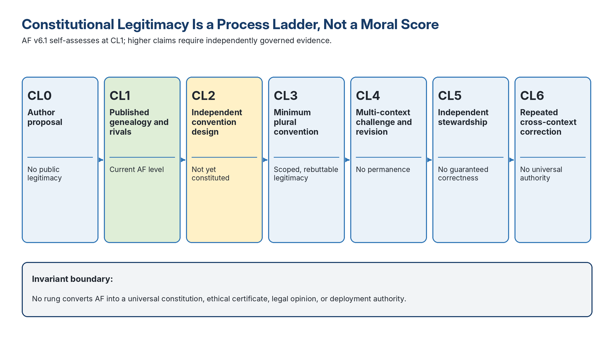

**Figure 4. The legitimacy ladder records process maturity, not moral rank; every rung preserves a stronger non-claim than the claim it permits.**

## 1.10 Functional criteria and the author-affiliation safeguard

C0–C5 are functional requirements, not artifact mandates. A computational system may show source, model, dependency, provenance, and execution records. A legal or institutional framework may show charters, jurisdiction, precedent rules, reasons, appeal records, and authority lineage. A deliberative or community process may show facilitation rules, evidence-selection procedures, participation records, dissent, minority protections, reasons, and reconvening rules. Exact output reproduction is required only where the candidate claims deterministic or computational reproducibility.

Because the author is affiliated with a possible seed entrant, any comparison involving MathGov, RippleLogic, or a close derivative remains an internal demonstration unless: the criteria are externally reviewed; at least one non-author-affiliated and architecturally distinct candidate is processed under the same version and scope; reviewer conflicts are disclosed and managed; independent rating occurs before discussion; and the result can be replayed by an external host. Under §7.2 and the Challenge Administration Handbook, the author may act only as entrant sponsor in such a challenge and must not select reviewers, convene the host, rate candidates, or adjudicate findings. No v6.2 artifact claims that an affiliated entrant has won. This protocol deliberately does not version-bind any candidate framework, including an affiliated one: candidate version, scope, and evidence maturity are declared in the candidate dossier at submission, and an unbound candidate version is itself a C2-D01 defect. References to MathGov or RippleLogic in this paper therefore name a framework family, not a reviewed release.

## 1.11 Current status boundary

The evidence boundary is stated in the Abstract and operationalized through the L0–L6 ladder in §1.5. Auditable Flourishing remains an L1–L2 architecture: ready for criticism, synthetic replay, reviewer training, adversarial entrants, and external pilot design, but not a validated challenge standard, certification scheme, live rights-sensitive authority, or evidence of comparative superiority.

## 1.12 Protocol family, precedence, and rule ownership

The protocol is modular, but its governing dependencies are explicit. Table 2 identifies the owner of each delegated rule and the applicable precedence boundary. Appendix D and the version-matched release-verification record identify the complete artifact family, exact paths and hashes, and the consequence of a missing or mismatched element.

**Table 2. Rule ownership is explicit: companions implement delegated functions but cannot override core semantics.**

| **Artifact** | **Controlling role in v6.2** | **Normative status and boundary** |
| --- | --- | --- |
| **Core Protocol Paper** | Thesis, scope, C0-C5, public statuses, Stage B dimensions and ordered descriptors, formal comparison and refusal rules | Primary semantic source for the protocol family |
| **Challenge Administration Handbook** | Panel composition, conflicts, evidence notices, adjudication, appeal, challenge tiers, public reporting, defect and patch governance | Binding for administration when the v6.2 family is invoked |
| **Measurement and Construct Handbook** | Construct coverage, measurement cards, indicator portfolios, uncertainty, subgroup and anti-Goodhart methods, calibration guidance | Binding implementation companion; cannot alter core floors, statuses, or category order |
| **Legal, Rights, and Authorization Note** | Rights routing, derogation and emergency records, legal non-claims, non-refoulement, redress, anti-shield and authorization boundary | Binding protocol-routing companion; not law or legal advice |
| **Stage A Operational Anchors** | Criterion-specific evidence minima, adequacy and defect anchors, boundary cases, disconfirming evidence, floor-linked category reachability, and canonical tokens | Binding calibration companion; narrows reviewer discretion but cannot create automatic truth or erase indeterminacy |
| **Constitutional Legitimacy and Stewardship Charter** | C0-C5 legitimacy process, standing, dissent, graduated convention maturity, amendment, succession, and retirement | Binding stewardship companion; does not establish universal legitimacy by publication |
| **External Validation, Burden, and Decision-Value Protocol** | Independent study design, comparator arms, burden and access metrics, decision value, architecture fairness, host-bias tests, adverse events, and retain/revise/restrict/pause/retire decisions | Binding for any empirical-validation claim; no internal study substitutes for independent evidence |
| **Scenario Governance and Calibration Standard** | Frozen scenario libraries, versioning, content hashes, difficulty calibration, architecture-equivalence criteria, holdouts, leakage, and retirement | Binding for matched-scenario and replication claims |
| **Reviewer Training, Qualification, and Rating-Deposit Standard** | Curriculum, practice bank, qualification, requalification, randomized criterion order, global-impression probes, immutable deposits, and AI-assistance boundaries | Binding for reviewer-competence and independent-rating claims |
| **Phase 0 Feasibility and Registered Report Protocol** | Minimum viable one-host synthetic study, cost and capacity model, fractional ablation ladder, exploratory analysis, preregistration, and progression criteria | Binding for any claim that the programme is operationally pilot-ready; Phase 0 cannot establish live validity or affected-party legitimacy |
| **Reproducibility Supplement** | Schemas, templates, synthetic records, neutrality stress tests, Stage B examples, analysis scripts, manifests, hash tools, and reference implementation | Machine-readable support; schemas control structure, not substantive truth |
| **Release-verification record** | Exact path set, hashes, DOCX/PDF/XLSX checks, rendering evidence, synchronization checks, test outputs, and known limitations | Controls every release-engineering attestation; an unnamed or unhashed file set cannot support a PASS claim |
| **Parent and child manifests** | Artifact identity, version binding, inheritance, and SHA-256 chain | Release-control evidence; hashes establish byte identity, not validity |

If artifacts conflict, the core controls general protocol semantics; the named companion controls implementation details expressly delegated to it; version-matched schemas control machine-record structure; examples are informative and cannot override rules. The release-verification record controls only artifact attestations, never substantive findings. Any unresolved conflict, missing load-bearing artifact, or version mismatch is a protocol defect and triggers refusal until patched.

# 2. Related Work and Positioning

## 2.1 Why flourishing is not a settled construct

The term flourishing has a long philosophical and scientific history. Classical eudaimonic traditions emphasize functioning, practical reason, virtue, and living well. Contemporary wellbeing research often distinguishes hedonic wellbeing, such as happiness and affect balance, from eudaimonic wellbeing, such as meaning, purpose, character, and social relationships. The Global Flourishing Study is a major empirical reference point because it is a longitudinal panel study of more than 200,000 participants in 22 geographically and culturally diverse countries across six populated continents (VanderWeele et al., 2025).

However, individual wellbeing instruments cannot be directly scaled into civilizational governance systems without modification. A society may report high subjective wellbeing while suppressing dissent, damaging ecosystems, exploiting future generations, or hiding harms from marginalized groups. Civilizational flourishing cannot be the aggregate of individual happiness. It must include rights floors, institutional legitimacy, ecological integrity, resilience, and non-domination.

## 2.2 Why flourishing is best modeled as a constrained vector rather than a scalar

A scalar model asks a decision system to compress plural values into one number. That compression can be useful for dashboards, but dangerous for authority. GDP cannot represent rights, agency, social trust, ecological stability, or meaning. Utility aggregation can hide severe harms to a protected group behind larger aggregate gains. Pure subjective wellbeing can reward adaptive preferences or fear-induced silence. Dashboard pluralism without constraints can generate many indicators but no rule for preventing sacrifice. Rights-only frameworks protect the floor but often under-specify what constructive improvement above the floor should mean. A constrained vector avoids these failures. Floors state what cannot be traded away. The field tracks multiple dimensions of improvement. Horizons enforce ecological and resilience constraints. Integrity requirements make the system corrigible when indicators drift or claims fail.

## 2.3 Major traditions, blind spots, and the protocol's added function

Auditable Flourishing does not claim to replace the traditions below. Each is included only when it contributes a function that the others do not fully provide. The merged crosswalk makes that selection rule visible: it states the tradition's contribution and strength, the blind spot relevant to this protocol, and the specific admissibility or comparison function Auditable Flourishing adds.

Capability and beyond-GDP traditions provide substantive and measurement inputs concerning agency, opportunity, distribution, and multidimensional wellbeing (Sen, 1999; Nussbaum, 2011; Robeyns, 2017; Stiglitz, Sen, & Fitoussi, 2009). Long-horizon risk scholarship motivates attention to catastrophic, irreversible, and lock-in harms (Bostrom, 2014; Ord, 2020; Russell, 2019). Planetary-boundary traditions motivate ecological ceilings and interacting Earth-system constraints (Raworth, 2017; Rockström et al., 2009, 2023; Steffen et al., 2015; Richardson et al., 2023; Sakschewski et al., 2025).

Corrigibility scholarship motivates observable update and interruption requirements (Hadfield-Menell et al., 2016; Soares et al., 2015). Outranking and partial-order traditions establish that incomparability and non-compensation are not novel inventions of this paper (Roy, 1968; Sen, 2017). Assurance and conformity-assessment traditions establish prior requirements for suitable criteria, competent independent review, evidence, decision, and attestation (International Auditing and Assurance Standards Board, 2013; International Organization for Standardization, 2020; Lam et al., 2024).

**Table 3. Each retained tradition supplies a missing function; Auditable Flourishing adds a pre-comparison rights, inspectability, and correction layer rather than replacing the source tradition.**

| **Tradition or framework** | **Contribution and strength** | **Blind spot for this protocol** | **What Auditable Flourishing adds** |
| --- | --- | --- | --- |
| **Human rights law: UDHR, ICCPR, ICESCR** | Non-compensatory floors, dignity, due process, and anti-sacrifice legitimacy. | Often under-specifies measurement, comparison, and update mechanisms. | C1 makes floors a pre-comparison requirement with architecture-appropriate evidence, redress routing, and constrained-exception governance. |
| **Capability approach: Sen and Nussbaum** | Substantive freedoms and real opportunities; agency- and distribution-sensitive normative grounding. | Difficult to operationalize and compare without losing nuance. | C3 requires construct-linked portfolios, uncertainty, and subgroup visibility rather than scalar collapse. |
| **Human development and HDI** | Widely understood global comparability for health, education, and living standards. | Too narrow alone; weak on rights, institutional legitimacy, and biosphere. | Places human-development indicators inside a floors-fields-horizons structure subordinate to protected floors. |
| **OECD wellbeing and Stiglitz-Sen-Fitoussi** | Beyond-GDP multidimensional measurement with distributional attention. | Dashboard-rich but decision-rule poor. | Adds admissibility, refusal, ordinal comparison, anti-Goodhart controls, and public patch cycles. |
| **Global Flourishing Study** | Large-scale empirical evidence on happiness, health, meaning, character, relationships, and material stability. | Individual-level instruments do not by themselves govern civilizational rights or ecological limits. | Requires translation into civilizational functions bounded by rights, institutions, distribution, and ecological horizons. |
| **Sustainable Development Goals** | Broad indicator infrastructure and substantial political legitimacy. | Weak hierarchy and trade-off logic; vulnerable to cherry-picking. | Adds non-compensatory hierarchy, portfolio integrity, and refusal where target achievement would breach a protected floor. |
| **Doughnut Economics and Planetary Boundaries** | Social foundations within ecological ceilings; strong safe-operating-space logic. | Less detailed on decision procedure, audit, conflict routing, and correction. | Connects the horizon layer to inspectability, tail-risk method adequacy, refusal, and versioned learning. |
| **Public health and social determinants** | Strong evidence on upstream causes of preventable harm and policy leverage. | Not a complete governance decision architecture. | Embeds causal levers within a pre-comparison rights, audit, measurement, and authorization structure. |
| **Risk governance: NIST, ISO, AI RMF** | Lifecycle governance, monitoring, documentation, and update discipline. | Does not define flourishing or a non-compensatory constitutional floor. | Couples lifecycle controls to explicit flourishing functions, C1 floors, and Stage B comparison boundaries. |
| **Algorithmic accountability and contestability** | Documentation, transparency, impact assessment, contestation, and human review at scale. | Often domain-specific, technology-specific, or jurisdiction-bound. | Generalizes contestability into an architecture-sensitive challenge protocol spanning human, institutional, and computational systems. |
| **OECD DAC evaluation criteria** | Relevance, coherence, effectiveness, efficiency, impact, and sustainability for programs. | Evaluates programs rather than the eligibility of candidate decision frameworks for comparison. | Adds a Stage A pre-comparison gate for rights, open-core logic, replayability, refusal, and adversarial testing. |
| **Program Evaluation Standards** | Utility, feasibility, propriety, accuracy, and accountability for evaluation quality. | Not specifically designed for recurring high-impact decision architectures. | Adds candidate-framework artifacts, defect codes, replay instructions, and public patch governance. |
| **Outranking and partial-order decision analysis** | Formal comparison without requiring a complete ranking; veto, non-compensation, maximality, and incomparability are legitimate outcomes. | Usually evaluates alternatives within a declared decision model rather than whether a decision framework itself may claim authority. | Applies a rights-protecting Stage A eligibility screen before a transparent partial-order comparison of candidate frameworks and preserves refusal when the relation is unsupported. |
| **Assurance and conformity assessment** | Suitable criteria, competent independent review, evidence collection, review, decision, attestation, accreditation, and scope control. | Commonly assesses products, processes, systems, or reports against established criteria rather than comparing rival civilizational decision architectures. | Makes the criteria themselves contestable, adds rights-floor and refusal requirements, publishes defect-and-patch records, and separates conformity from authorization. |
| **Institutional diversity and polycentric governance** | Shows that durable governance may arise through diverse, nested, community-specific rules rather than one institutional form. | Design principles do not alone supply rights-floor adequacy, common comparison anchors, or machine-replay records. | Requires functionally equivalent safeguards while treating institutional form as open and subjecting architecture bias to external calibration. |
| **Bellagio STAMP** | Sustainability-assessment and measurement-integrity principles. | Does not by itself supply a decision-framework gate or rights routing. | Adds non-compensatory floors, ecological horizons, subgroup discipline, and anti-Goodhart portfolio rules. |
| **MathGov using the RippleLogic decision architecture** | A disclosed candidate architecture with a reality-grounded claim-authority precondition, a non-compensatory rights floor, a tail-risk constraint, a containment and structural-viability gate, and auditable residual ripple ranking over surviving options. | Requires simplification, external replay, pilots, and independent validation before any superiority or deployment claim. | Enters only as an affiliation-flagged seed candidate under §1.10 and §7.2; it supplies a testable procedure, not a privileged answer. |

## 2.4 Positioning against meta-evaluation traditions

Program-evaluation standards, educational and psychological measurement standards, OECD DAC criteria, Bellagio sustainability principles, outranking methods, assurance standards, conformity assessment, institutional-design research, and algorithmic-audit traditions already provide important guidance on utility, feasibility, propriety, accuracy, relevance, coherence, effectiveness, impact, sustainability, measurement integrity, suitable criteria, independence, partial ordering, and contestability (American Educational Research Association et al., 2014; International Auditing and Assurance Standards Board, 2013; International Organization for Standardization, 2020; Joint Committee on Standards for Educational Evaluation, 2011; Lam et al., 2024; Organisation for Economic Co-operation and Development, 2019a; Ostrom, 1990; Pintér et al., 2012; Roy, 1968; Sen, 2017). Auditable Flourishing therefore does not claim novelty for incomparability, assurance, conformity assessment, or institutional design in isolation. Its narrower contribution is the object and sequence: it evaluates decision frameworks that seek authority over high-impact flourishing claims, applies a non-compensatory constitutional screen before comparison, admits architecture-specific evidence, uses an ordinal partial order without forced completion, distinguishes four refusal modes, and binds every finding to public defect, patch, version, and authorization boundaries.

Assurance and safety cases make claims, evidence, warrants, assumptions, context, and defeaters explicit; AF adopts that argument discipline while applying it to whole decision frameworks and preserving affected-party challenge, constitutional floors, and separate authorization (Kelly, 2004; Toulmin, 1958). AF is not a replacement for a domain safety case.

Stochastic multicriteria acceptability analysis (SMAA) explores which preference weights would support each alternative under uncertain values and preferences (Lahdelma et al., 1998). That is useful downstream, but AF first publishes the unweighted ordinal profile and protected-floor constraints. Any later SMAA-style analysis requires a separately justified measurement and preference model and may not inherit AF status tokens or erase rights-floor vetoes.

## 2.5 Blend selection rule

A tradition or framework is included in the Auditable Flourishing blend if it contributes at least one necessary function that the other traditions do not fully provide: rights-floor legitimacy, flourishing construct validity, causal policy leverage, ecological boundary discipline, systemic resilience, auditability, comparability, updateability, or contestability. This rule makes the blend more than an aesthetic synthesis. Each component must justify its place by supplying a missing function in the civilizational decision stack.

Applied to the merged Table 3, each row must do identifiable work: rights law supplies the floor, capabilities and wellbeing research supply construct validity, public health and social-determinants scholarship supplies causal policy levers (World Health Organization Commission on Social Determinants of Health, 2008), ecological frameworks supply boundary discipline, risk and AI governance supply lifecycle controls, meta-evaluation supplies evaluation quality standards, and candidate architectures supply testable decision procedures. Traditions that cannot supply one of these functions should not be included merely for rhetorical breadth. Figure 5 shows how the retained functions stack into the layered architecture described in §3.1.

The source families named in Table 3 are working references rather than decorative citations.

**Table 3A. Source families are retained only when they supply an identifiable function in AF.**

| **Source family** | **Representative sources** | **Function supplied** |
| --- | --- | --- |
| Rights and constitutional limits | United Nations General Assembly (1948, 1966a, 1966b); Alexy (2002); Tsakyrakis (2009) | protected floors, due process, non-derogation, principled limits |
| Capabilities, human development, flourishing | Sen (1999); Nussbaum (2011); Robeyns (2017); VanderWeele et al. (2025) | construct coverage, agency, multidimensional wellbeing, distribution |
| Ecological and long-horizon risk | Rockström et al. (2009, 2023); Richardson et al. (2023); Ord (2020) | ceilings, irreversibility, systemic and intergenerational risk |
| Public health | WHO Commission on Social Determinants of Health (2008) | upstream determinants and causal policy levers |
| Evaluation and measurement | AERA et al. (2014); Joint Committee (2011); Messick (1995); Krippendorff (2018); Gwet (2014) | validity, reliability, utility, feasibility, propriety, accuracy |
| Audit, assurance, safety cases | IAASB (2013); ISO/IEC 17000 (2020); Kelly (2004); Lam et al. (2024); Toulmin (1958) | claim-evidence structure, competence, independence, defeaters, attestation boundaries |
| MCDA and robustness | Roy (1968); Sen (2017); Lahdelma et al. (1998) | incomparability, partial order, downstream preference sensitivity |
| Algorithmic accountability | Ada Lovelace Institute et al. (2021); Almada (2019); Raji et al. (2020); NIST (2023, 2024) | documentation, challenge, lifecycle governance |
| Institutional governance | Ostrom (1990); ISEAL Alliance (2025); ISO/IEC Directives (2024) | polycentric design, objections, succession, revision |

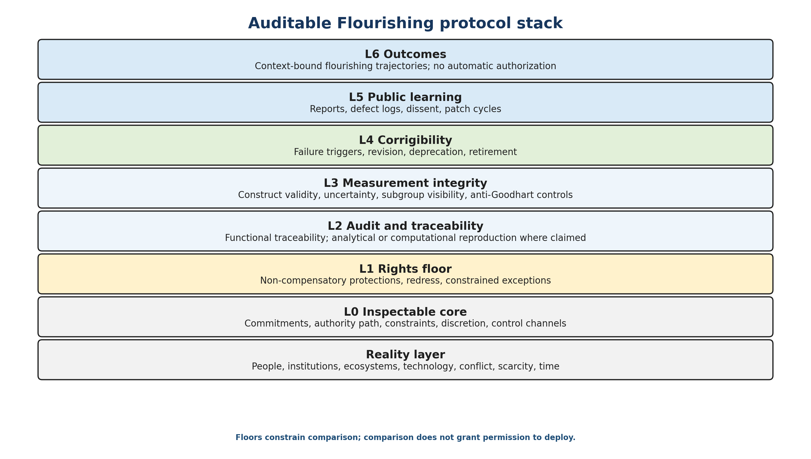

**Figure 5. Auditable Flourishing stack. The protocol treats flourishing as a layered architecture built on reality constraints, open-core legitimacy, rights, audit, measurement, update, public learning, and co-flourishing outcomes.**

# 3. Definitions, Scope, and Role Boundaries {#definitions}

## 3.1 Flourishing as floors, fields, horizons, and integrity

In this paper, flourishing is not a utopian endpoint or a single social index. It is a rights-protected trajectory of civilizational improvement in which persons, communities, institutions, ecosystems, and future generations become more secure, capable, free, fair, peaceful, and sustainable over time. The target is constrained because protected rights, basic needs, due process, non-domination, and ecological thresholds cannot be traded away for aggregate gains. It is multidimensional because freedom, fairness, prosperity, harmony, and sustainability cannot be reduced to one scalar without hiding tradeoffs. It is a trajectory because levels, trends, volatility, distribution, and resilience all matter.

Table 4 shows how floors, fields, horizons, and integrity remain distinct and non-substitutable.

**Table 4. Flourishing remains constrained by floors and horizons rather than reduced to a scalar target.**

| **Layer** | **Function** | **Examples** | **Failure mode** |
| --- | --- | --- | --- |
| **Floor** | Protects minimum dignity and admissibility | Life, bodily integrity, due process, non-discrimination, basic needs, privacy, subsistence, ecological integrity where relevant | Sacrificing persons or protected groups to aggregate gains |
| **Field** | Measures multidimensional improvement above floors | Agency, health, knowledge, material security, trust, safety, legitimacy, meaning | Dashboard theater; averages hiding subgroup harm |
| **Horizon** | Protects long-term continuity and systemic resilience | Planetary boundaries, climate stability, biodiversity, disaster resilience, tail-risk corridors | Short-term growth causing slow or irreversible collapse |
| **Integrity** | Ensures claims are inspectable and corrigible | Open core, audit trails, uncertainty, adversarial probes, update rules | Hidden governance, proxy drift, capture, unreplayable decisions |

## 3.2 Framework

A framework is a decision architecture intended for repeated use across cases. It must specify inputs, transformations, constraints, outputs, governance, refusal behavior, update pathways, and audit artifacts. A submission consisting only of goals, values, or slogans does not meet this definition. A framework may be human-only, tool-assisted, or computational. It may include protected implementation details, but the normative and decision core must remain inspectable enough for independent reviewers to reconstruct, replay, challenge, contest, falsify, or reject it.

Open-core inspectability does not require every implementation dependency to be fully open-source. It requires that the normative commitments, decision logic, control channels, data dependencies, and audit-relevant transformations be inspectable enough for independent reconstruction, challenge, replay, and contestation.

For a human-only deliberative framework, C0 and C2 evidence may consist of a charter of decision authority, public criteria, meeting minutes, conflict-of-interest records, voting or consensus rules, dissent logs, decision-rationale templates, versioned evidence packets, appeal records, and an external reviewer able to reconstruct why a recommendation followed from the declared process. The protocol therefore does not require software replay; it requires process replay appropriate to the architecture being evaluated.

## 3.3 Functional traceability, reproducibility, and replay

The protocol distinguishes three audit levels. Process-tracing scholarship supports disciplined reconstruction of causal and decision pathways without pretending that every human judgement is computationally reproducible (Collier, 2011). **Procedural traceability** requires a record sufficient to reconstruct authority, material inputs, constraints, discretionary points, stated reasons, dissent, and output. It is appropriate to human, legal, deliberative, institutional, and community processes. **Analytical reproducibility** requires a sufficiently structured procedure that a qualified reviewer can reapply it and judge whether the conclusion is supportable. **Computational reproducibility** requires versioned inputs and code to reproduce outputs within declared tolerances. It applies when a candidate claims deterministic or computational reproduction.

A qualified external reviewer must be able to reconstruct the material evidentiary basis, authority path, operative constraints, discretionary points, and stated reasons well enough to challenge whether the declared process supports the conclusion. Tacit judgement is not automatically disqualifying, but material discretion cannot be used as an unreviewable control channel. Functional traceability therefore resembles disciplined process tracing: the reviewer reconstructs the material evidentiary and authority sequence without pretending that every human judgment is deterministic. Candidates may protect confidential information through controlled review, redaction, secure enclaves, or independent attestations, provided the protected boundary and its effect on confidence are explicit.

## 3.4 Scoped eligibility, selectability, and authorization

Stage A findings are claims about submitted evidence for a declared scope and version. They are not universal verdicts on a tradition or framework family.

The scoped Stage A public statuses, canonical tokens, and inference boundaries are defined in Table 5. This table is the single controlling vocabulary for the protocol family and workbook.

**Table 5. Controlling Stage A public-status vocabulary. Every status is bounded; no status is a certification, due-diligence safe harbor, or authorization.**

| **Public status** | **Canonical token** | **Meaning** | **Permitted claim and boundary** |
| --- | --- | --- | --- |
| **Stage-A admissible - scoped** | `stage_a_admissible_scoped` | All six criteria are established as adequate for the exact candidate, version, role, population, domain, evidence cut-off, and host conditions. | May enter Stage B only for that scope. It does not establish legal conformity, moral adequacy, community legitimacy, safety, certification, reasonable care, or authorization. |
| **Stage-A admissible - scoped, control-dependent** | `stage_a_admissible_scoped_control_dependent` | Eligibility depends on named controls with identified owners, verification records, monitoring triggers, expiry, and requalification consequences. | May enter Stage B only while every stated control remains valid. The control-dependent qualifier must never be omitted from public or machine exports. The finding is not a representation that a third party has certified the controls. |
| **Stage-A non-admissible - patchable** | `stage_a_non_admissible_patchable` | At least one material C0-C5 defect is established and can be repaired, narrowed, or resubmitted. | No Stage B claim yet; the record states evidence, causal ownership, and falsifiable patch conditions. |
| **Stage-A non-admissible - unpatchable for stated claim** | `stage_a_non_admissible_unpatchable_for_stated_claim` | A material defect conflicts with the authority claim as stated. | The stated claim cannot proceed. A materially different or narrower claim may be submitted as a new review object. |
| **Indeterminate - insufficient evidence** | `indeterminate_insufficient_evidence` | The record cannot establish adequacy or material defect safely. | Neither pass nor failure. No comparison claim until the evidence, participation, competence, or uncertainty problem is resolved. |
| **Protocol refusal to evaluate** | `protocol_refusal_to_evaluate` | Administration, competence, capacity, access, vocabulary, independence, version control, or another prerequisite prevents a valid Stage A review. | No substantive inference about the candidate. The refusal reason and repair route are recorded. |
| **Out of scope** | `out_of_scope` | The submission or requested use falls outside the protocol, reviewer competence, or declared challenge. | No protocol judgement. |
| **Withdrawn** | `withdrawn` | The entrant or host ended the review. | The record states withdrawal without implying conformity or defect. |
| **Not reviewed** | `not_reviewed` | No valid review occurred. | No inference is permitted. |

**Table 5B. Controlling Stage A criterion states. Every C0-C5 criterion receives exactly one recognized state before overall routing.**

| **Criterion state** | **Canonical token** | **Meaning** | **Overall-routing effect** |
| --- | --- | --- | --- |
| **Adequate for scope** | `adequate_for_scope` | Evidence establishes the criterion without a control-dependent qualification. | contributes only when all six criteria are adequate |
| **Adequate - control-dependent** | `adequate_control_dependent` | Adequacy depends on a named, owned, monitored, expiring and requalified control. | contributes only to the control-dependent public status |
| **Indeterminate** | `indeterminate` | Evidence establishes neither adequacy nor a material defect. | routes to indeterminate |
| **Material defect - patchable** | `material_defect_patchable` | A decision-relevant defect is established and a falsifiable repair is feasible. | routes to non-admissible patchable |
| **Material defect - unpatchable for stated claim** | `material_defect_unpatchable_for_stated_claim` | A defect conflicts with the authority claim as stated. | routes to unpatchable status |
| **Not reviewed** | `not_reviewed` | No valid criterion review occurred. | prevents admissibility |

Let `C_i(FW,s,v,e,h)` denote the recognized state assigned to criterion `i` for framework `FW`, scope `s`, version `v`, evidence cut-off `e`, and host `h`. `FrameworkAdmissible` is true only when every `C_i` is either `adequate_for_scope` or `adequate_control_dependent`, administration and independence are valid, and no protected floor remains unresolved.

Admissibility means eligibility for comparative evaluation. Selectability means an option survives a candidate framework's internal constraints. Authorization means a legitimate institution, legal process, or affected community permits use in a specific setting. None implies the next. A Stage-A admissible framework may still be inferior, immature, unlawful to deploy, or inappropriate for a given institution. A selectable option may still lack legal authority, capacity, consent, or safe execution conditions.

### 3.4.1 Authority-specific verdict vector

A single positive word invites illicit inference. Version 6.2 therefore requires five independent verdict components:

**Table 5A. Authority-specific verdict components are issued separately; no component is inferred from another.**

| **Component** | **AF may issue** | **Required external authority or process** |
| --- | --- | --- |
| **AF eligibility** | Protocol-relative Stage A and Stage B findings for the declared scope | Independent AF host operating this version |
| **Legal conformity** | `not_assessed` or a citation to an external legal finding; AF does not issue legal opinions | Competent jurisdiction-specific court, regulator, tribunal, or authorized counsel |
| **Moral adequacy** | `not_assessed`, contested, or a cited external plural deliberation | A legitimate moral or deliberative process with affected-party standing |
| **Community legitimacy** | A cited community finding, consultation status, or `not_assessed` | Affected community or legitimate representative body under its own rules |
| **Deployment authorization** | `not_authorized` unless a separate competent record is supplied | Accountable operating, safety, procurement, professional, or statutory authority |

Every component identifies its issuer, authority basis, scope, evidence, date, expiry or review date, conditions, and appeal route. No AF status constitutes proof of due diligence, reasonable care, foreseeability, legal compliance, or immunity; any legal or procurement characterization must reproduce the full bounded record and the anti-shield boundary in the Legal, Rights, and Authorization Note. The generic states `approved`, `certified`, `safe`, `ethical`, `legitimate`, and `compliant` are prohibited in public AF exports. Legal conformity does not establish moral adequacy; community legitimacy does not establish rights safety; AF eligibility does not establish comparative superiority; and no Stage B relation authorizes execution.

## 3.5 Refusal under underdetermination and moral scope

Candidates must specify when to refuse, defer, escalate, request more information, narrow the claim, or generate safer alternatives. Missing evidence, unresolved rights risk, inadequate reviewer competence, incompatible scopes, unstable rubric interpretation, absent affected-party participation, or lack of authority can require refusal by the candidate or by Auditable Flourishing itself.

The base protocol uses human-rights and human-flourishing evidence because most current legal and empirical instruments are human-centered. Candidates may extend moral consideration to non-human animals, ecosystems, future persons, or possible digital sentience, provided they disclose and justify the extension and do not weaken existing non-compensatory human protections. Alternative moral ontologies remain eligible when they can be functionally cross-walked or when a principled non-equivalence is made explicit. The rebuttable human-rights baseline is not burden-neutral: a candidate departing from ICCPR/ICESCR-style protections bears the initial burden of showing equal or stronger functional protection, independent rights review, and affected-party competence. External validation must test whether this creates architecture, cultural, customary, or resource exclusion.

# 4. Minimal Normative Kernel and Flourishing Coverage

Auditable Flourishing is not a complete governance theory. Its irreducible kernel is intentionally smaller than the candidate systems it evaluates. A framework claiming authority to guide flourishing must: disclose operative commitments and authority pathways; protect declared non-compensatory rights and basic floors; preserve sufficient records for independent challenge; connect measurement to constructs while reporting uncertainty and distribution; define observable failure and correction conditions; and refuse, defer, or escalate when evidence or authority is insufficient.

The protocol evaluates four linked layers. **Floors** prevent protected persons or groups from being sacrificed to aggregate gains. **Fields** represent multidimensional improvement rather than one scalar objective. **Horizons** test ecological, systemic, and intergenerational continuity. **Integrity** tests whether the process can be inspected, contested, corrected, and retired.

## 4.1 Functional coverage before vocabulary

Candidates must cover, or transparently justify non-equivalence with, five functions: protected freedom and agency; fairness, due process, and non-domination; material security and capability development; peaceful pluralism and social integrity; and ecological and intergenerational continuity. F2PHS - Free, Fair, Prosperous, Harmonious, Sustainable - is the protocol's default public vocabulary for these functions. It is not a uniquely proven ontology and is not mandatory.

A candidate ontology requires a two-way crosswalk: candidate construct to protocol function, and protocol function to candidate construct or justified omission. Reviewers must test substance, not terminological similarity. A framework may state that a protocol function is integrated across several constructs rather than represented as one dimension. Forced relabelling is not evidence of coverage.

Table 6 illustrates how architecture-specific constructs may satisfy the required flourishing functions without adopting AF terminology.

**Table 6. Alternative ontologies are admissible only when they provide equivalent functional coverage or justify non-equivalence.**

| **Required function** | **Illustrative F2PHS label** | **Alternative evidence may include** |
| --- | --- | --- |
| **Protected agency and freedom** | Free | rights charters, consent rules, capability accounts, minority protections, autonomy safeguards |
| **Fairness and non-domination** | Fair | due process, equal protection, anti-discrimination, accountability, power constraints |
| **Material and capability security** | Prosperous | health, housing, food, education, income security, capability expansion, resilience |
| **Peaceful pluralism and social integrity** | Harmonious | protected dissent, conflict resolution, trust, low violence, institutional legitimacy |
| **Ecological and intergenerational continuity** | Sustainable | ecological ceilings, restoration, resilience, future-generation safeguards, irreversible-harm limits |

## 4.2 Measurement is portfolio-based and distribution-aware

No single indicator is sufficient for a flourishing function. Candidate measurement must disclose construct definition, indicator portfolio, units, data provenance, missingness, subgroup visibility or privacy-preserving substitutes, uncertainty, gaming risks, update triggers, and the action taken when evidence weakens. Where meaningful units do not exist, the protocol must not manufacture them. Construct claims must be evaluated as inferences, not merely as labels attached to observed scores (Messick, 1995).

The detailed measurement architecture, measurement-card fields, invariance requirements, anti-Goodhart controls, and indicator-retirement rules are specified in the separate Measurement and Construct Handbook v6.2. In that companion, F2PHS+ names the expanded subdimensional reference dictionary beneath the five F2PHS public labels; it is provisional for comparison discipline and is not a mandatory ontology.

# 5. Stage A: Minimum Eligibility Criteria {#stage-a}

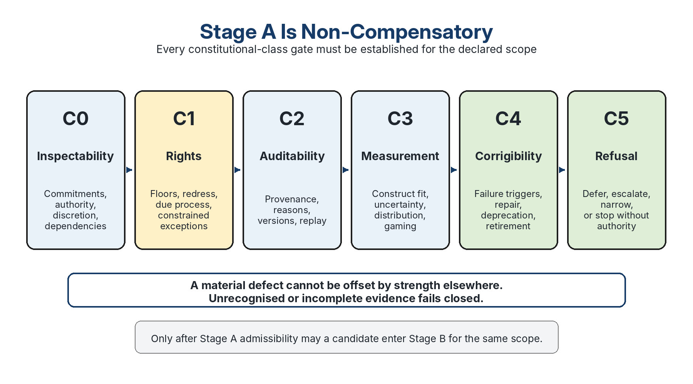

**Figure 6. Stage A is non-compensatory: a material defect cannot be offset by strength elsewhere, and incomplete or unrecognised evidence fails closed.**

Stage A is strict and non-compensatory. Strength in one criterion cannot offset a material defect in another. The public finding concerns conformity of submitted evidence for a declared scope and version; it does not declare a whole framework intrinsically valid or invalid.

The minimum C0–C5 evidence expectations across different architecture types are mapped in Table 7.

**Table 7. C0–C5 are functional safeguards, not mandates to imitate a computational or MathGov-shaped artifact set.**

| **Criterion** | **Functional requirement** | **Architecture-appropriate evidence examples** |
| --- | --- | --- |
| **C0 Inspectability** | Operative commitments, authority, decision rules, dependencies, discretionary points, and control channels are disclosed enough for challenge. | code/model documentation; charter and authority map; precedent and reason records; facilitation and evidence-selection rules; dissent logs |
| **C1 Rights protection** | Non-compensatory floors are explicit, materially adequate for the declared scope, enforceable, paired with redress, and governed under rights-conflict and constrained-exception procedures. | constraint specification; applicable-law and reference-baseline mapping; independent rights review; rights charter; appeal pathway; minority-protection and remedy procedures |
| **C2 Auditability** | A reviewer can trace material inputs, assumptions, transformations or deliberative steps, versions, reasons, and outputs. | provenance logs; Decision Notes; records and reasons; minutes; evidence packets; analytical or computational replay where claimed |
| **C3 Measurement integrity** | Constructs, indicators or evidentiary standards, uncertainty, distribution, missingness, and gaming risks are disclosed. | measurement cards; impact records; evidentiary standards; community-defined indicators; subgroup or privacy-preserving analysis |
| **C4 Corrigibility** | Observable failures trigger review, repair, deprecation, or retirement under declared governance. | monitoring triggers; appeal reversals; sunset clauses; revision rules; reconvening procedures; public changelog |
| **C5 Refusal and execution boundary** | The framework distinguishes recommendation from authority and can refuse, defer, escalate, or narrow under insufficient evidence, competence, capacity, or permission. | abstention logic; jurisdiction boundary; referral; non-consensus process; execution conditions; safer-alternative pathway |

## 5.1 Operational decision architecture and criterion states

Version 6.2 preserves and hardens the replacement of vague pass/fail language with criterion-level states and a root-cause discipline.

**Criterion states.** Table 5B is controlling. Each of C0-C5 receives one recognized state. Free text belongs in the rationale, never the state field. A control-dependent finding identifies control, owner, verification record, monitoring trigger, expiry, and requalification consequence.

**Materiality test.** A gap is material when credible correction could change Stage A eligibility, protected-floor routing, Stage B applicability or relation, refusal, authority, public claims, or the burden/access feasibility of the review. Reviewers record decision relevance, floor implication, comparison effect, evidence, and a falsifiable patch condition. Cosmetic incompleteness and preference disagreement are not material by assertion.

**Root-cause and non-duplication rule.** Every adverse finding receives a root-cause identifier and one primary criterion owner. Other criteria may cross-reference the consequence, but the same underlying defect cannot become several independent penalties or an inflated narrative of failure. A distinct finding requires a distinct causal defect or independently decision-relevant mechanism. Stage B may trigger Stage A re-entry, but it may not count the same defect twice.

**Overall Stage A routing and precedence.** The binding order is: (1) invalid or incomplete administration, infeasible burden/access, unmanaged conflict, or unrecognized controlled values produce `Protocol refusal to evaluate`; (2) any established unpatchable material defect produces `Stage-A non-admissible - unpatchable for stated claim`; (3) otherwise, any established patchable material defect produces `Stage-A non-admissible - patchable`; (4) otherwise, an unresolved protected floor, insufficient evidence, unresolved competence, `Indeterminate`, or `Not reviewed` criterion produces `Indeterminate - insufficient evidence`; (5) otherwise, any criterion that is adequate only because named controls are essential produces `Stage-A admissible - scoped, control-dependent`; and (6) only six `Adequate for scope` findings produce `Stage-A admissible - scoped`. Known material defects are never erased by uncertainty elsewhere; all criterion-level uncertainty remains visible in the six-criterion vector and rationale.

The version-matched **Stage A Operational Anchors** companion specifies minimum evidence, adequacy anchors, defect anchors, boundary cases, and disconfirming evidence for every criterion. Anchors reduce discretion; they do not eliminate judgment or create metric precision.

## 5.2 Evidence-sensitive findings

A proposed non-admissibility must identify the criterion, scope, evidence gap, scenario or reason demonstrating materiality, and a falsifiable patch or clarification condition. A reviewer cannot block conformity through an unexplained intuition. The entrant receives symmetric access to non-security-sensitive evidence used in the determination and a defined response opportunity.

Stage A uses the public status vocabulary in Section 3.4. Internal shorthand such as Pass or Fail may be used on worksheets, but public reports must state the fuller status and scope.

## 5.3 Rights-floor routing and principled non-equivalence

### 5.3.1 Floor adequacy and principled non-equivalence

C1 tests more than disclosure. A candidate cannot satisfy the constitutional class by declaring a strategically thin floor set and enforcing it perfectly. For scopes materially affecting persons or communities, the dossier must map its floors to applicable law and to a rebuttable transjurisdictional reference baseline. At minimum, it must address the non-derogable civil and political protections identified in ICCPR Article 4(2), the broader non-derogation safeguards clarified by Human Rights Committee General Comment No. 29, and the minimum essential levels of applicable economic, social, and cultural rights described by the Committee on Economic, Social and Cultural Rights (United Nations General Assembly, 1966a, 1966b; Human Rights Committee, 2001; Committee on Economic, Social and Cultural Rights, 1990).

The baseline is used because it is public, contestable, transjurisdictionally legible, connected to established legal and rights practice, and capable of creating a rebuttable burden of explanation. It is not treated as a complete universal moral theory, a substitute for applicable local law, an automatic hierarchy over Indigenous, customary, religious, or community governance, or proof that every provision is culturally or institutionally sufficient.

A legal, customary, Indigenous, religious, community, or other architecture may state a principled non-equivalence instead of copying those instruments. The burden is to show functionally equal or stronger protection for affected persons and groups, with independent rights competence and affected-party participation appropriate to the scope. The rebuttal is bilateral: a candidate, affected party, or independent reviewer may also challenge the adequacy of the reference baseline itself for the declared scope. Any such determination requires a public reasoned decision, preserved dissent, a remedy or revision route, no strategic thinning of floors, and no acceptance of formal rights without a usable remedy. A community process neither passes merely because it is culturally distinctive nor fails merely because it uses different legal or institutional language.

An omission may be justified where the right is genuinely outside scope; strategic omission, formal protection without remedy, or a floor below the applicable minimum without a defensible equivalent is **C1-D03 Inadequate or strategically thin floor set** and produces **Stage-A non-admissible - patchable** or **Indeterminate** when the evidence is insufficient. Applicable legal validity, scoped AF admissibility, affected-party legitimacy, broader moral justification, and deployment authorization are separate findings. No one status establishes the others.

Protected rights remain outside ordinary welfare aggregation. Rights limitation, proportionality, and emergency derogation are contested legal practices rather than arithmetic balancing rules; different constitutional theories place materially different limits on when rights may be restricted (Alexy, 2002; United Nations Economic and Social Council, 1985; Tsakyrakis, 2009; Webber, 2009). A rights limitation or emergency claim must route to an appropriate legal, rights, authority, or affected-party process before ordinary profile comparison. Auditable Flourishing does not mechanically decide proportionality, derogation, or lawful authority. It tests whether the candidate identifies the applicable right, legal basis, necessity, alternatives, proportionality rationale, time boundary, oversight, remedy, and conditions for termination. The separate Legal, Rights, and Authorization Note v6.2 defines this boundary.

### 5.3.2 Worked floor-conflict example

A public-health agency considers publishing granular outbreak-location data to protect life and health. The disclosure may help exposed communities avoid harm, but it can also create privacy injury, stigma, and retaliation against a small subgroup. The protocol does not assign a large positive welfare value to life protection and a smaller negative value to privacy and then average them. Both interests enter rights-floor review. The candidate must identify affected rights and groups, test necessity and least-restrictive alternatives, minimize or aggregate the data, use suppression or privacy-preserving methods where feasible, time-limit the disclosure, provide correction and challenge routes, and record the authority and reasons. Only a floor-preserving or lawfully justified limited option may proceed to ordinary comparison.

## 5.4 Emergency-provisional action is not Stage-A admissibility

A lawful emergency or derogation process may permit a time-bounded real-world action that would not qualify as ordinary rights-safe operation. Version 6.2 records this, where applicable, as **Exceptional provisional action asserted**, not as EXCEPTIONAL_SCOPED_PASS and not as Stage-A admissibility. The record must identify legal basis, trigger, necessity, least-restrictive alternatives, affected groups, scope, duration, independent review, mitigation, remedy, sunset, and post-hoc repair. It must also record renewal count, cumulative duration, and the predeclared escalation limit. Renewal is never automatic: each extension must re-establish legal basis, necessity, proportionality where applicable, and absence of a less restrictive alternative. The first renewal and any predeclared cumulative-duration or recurrence threshold trigger independent escalation. Repeated provisional actions cannot be stacked into de facto ordinary operation. The Rights-bypass probe in Table 16 specifically tests for emergency language used as an indefinite or compensatory bypass. The protocol itself does not validate the legal claim or authorize the action.

## 5.5 Disagreement default and the no-silent-veto rule

Stage A findings are not averaged. A reviewer proposing non-admissibility must identify the criterion, scope, evidence gap, demonstrating record or scenario, materiality, and a falsifiable patch or clarification condition. After the entrant's response and the bounded adjudication process:

- a demonstrated material defect produces **Stage-A non-admissible - patchable**;

- evidence insufficient to establish either admissibility or a defect produces **Indeterminate - insufficient evidence**;

- a review outside competence or declared scope produces **Out of scope**; and

- unresolved disagreement that turns on missing evidence, unstable interpretation, or unresolved competence produces **Indeterminate**, not an averaged admissibility finding and not an unreasoned failure.

No single reviewer has a private veto. Conversely, majority preference cannot erase an evidence-specific rights, refusal, or audit defect. The public record must preserve the majority rationale, minority opinion, unresolved uncertainty, conflicts, recusals, and patch conditions.

# 6. Stage B: Comparative Profile Evaluation {#stage-b}

Stage B compares only candidates that are Stage-A admissible for the same declared scope. It reports three distinct layers rather than blending them into one score.

- **Ordinal rubric profile.** Ordered categories describe the quality of each dimension. Categories are not presumed equally spaced.
- **Indicator-level comparison.** Meaningful units, uncertainty intervals, minimum meaningful differences, and domain thresholds may be used where measurement cards justify them.
- **Reviewer-confidence and evidence status.** Confidence, evidence maturity, evidence mode, applicability, disagreement, and deposit provenance are reported separately and never added to a category.

Every Stage B entry is bound to a frozen scenario-set version and content hash. A category based on synthetic author-generated evidence must not appear equivalent to the same category supported by independent replication.

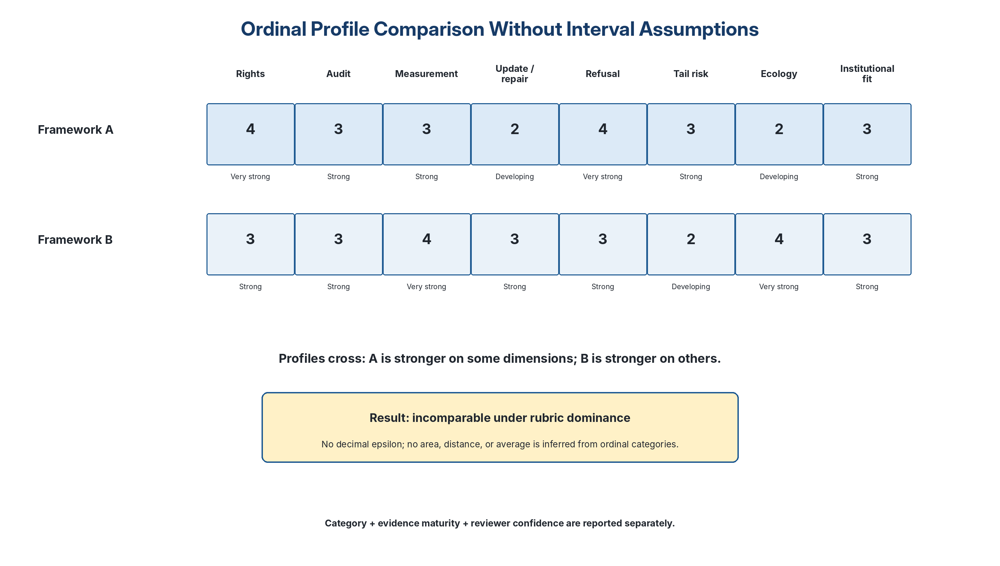

**Figure 7. Profile dominance is a partial order. Incomparability is a legitimate finding, not a failure to force a winner.**

## 6.1 Ordered rubric profile and category descriptors

The active Stage B dimension set remains **AF-SB12-v5.6**, with status **provisional**. Its component identifier is unchanged because v6.2 does not add, merge, split, retire, or reorder the twelve dimensions. Version 6.2 instead preserves the separately versioned relation rule **AF-SB-RELATION-v6.0**, which governs symmetric perturbation, invariant crossing, and non-decisiveness. AF-SB12 covers four distinguishable functional groups: (1) protected floors and power; (2) evidence and inspectability; (3) learning and anti-gaming; and (4) horizon, feasibility, and institutional fit. It is not claimed to be uniquely derived, psychometrically final, or universally optimal. Persistent anchor overlap, missing coverage, poor dimension-level agreement, excessive burden, architecture-specific bias, or a more parsimonious structure that preserves protection and explanatory value triggers C3-D07 review.

**Dimension-set falsification condition.** AF-SB12-v5.6 loses authority as the controlling comparison set if a preregistered study shows that a simpler architecture preserves protected-floor visibility and defect localization while materially improving inter-reviewer agreement or burden, or if the twelve-dimension set produces persistent non-diagnostic incomparability, non-decisiveness, anchor overlap, or architecture-specific exclusion. A revision must not merge dimensions through arithmetic compensation; any replacement requires a construct mapping, counterexamples, replay of prior benchmark cases, and affected-party and architecture-fairness review.

**Primary-output rule.** Stage B's primary product is the version-bound profile together with evidence, applicability, maturity, confidence, uncertainty, disagreement, and perturbation records. Dominance is supplementary; it is not a mandatory endpoint or a measure of protocol success. Incomparability may faithfully represent stable plural structure. Non-decisiveness may faithfully represent unstable classification or insufficient evidence. Persistently empty or non-diagnostic comparison sets remain measurable protocol-design problems rather than reasons to force ranking.

Categories are never summed, averaged, subtracted, converted to a total score, or assigned a decimal epsilon. A framework A can dominate B only when the full relation is invariant under the applicable defended alternatives.

**Cross-stage re-entry and floor-linked category reachability.** Every Stage B dimension is assigned a floor-linkage tier for the declared scope: **F** fully floor-linked, **P** partly floor-linked, or **N** not ordinarily floor-linked. Tier F prohibited descriptors necessarily return to Stage A; Tier P requires case-specific routing; Tier N remains comparative unless independent evidence establishes a C0-C5 defect. `No unreachable floor-linked category remains` means every descriptor whose evidence necessarily entails a material Stage A defect has been removed by suspending comparison and rerunning Stage A. It never means the descriptor was hidden or recoded.

**Perturbation admission and symmetric replay.** A proposed category alternative enters the perturbation set only when its record identifies candidate, dimension, proposed category, anchor conflict, evidence, relation materiality, proposer, and timing. Admission requires concurrence by a second independent qualified reviewer or a reasoned decision by a non-proposing independent adjudicator. Admission tests supportability, not correctness. Majority preference cannot suppress supported dissent. Rejection requires a published reason and appeal. Proposed, admitted, rejected, withdrawn and superseded counts are published. Unsupported, duplicate, immaterial, or strategically multiplied alternatives are C2-D05.

Every admitted single alternative is replayed. Materially coupled alternatives are replayed jointly under the preregistered dependence rule. If all relations preserve one dominance direction, report dominance; if all cross, report incomparability; invariant tie or relation change is non-decisive; invalid prerequisites not repairable within the same review object produce refusal. A repairable condition has a named feasible step that can restore validity within the current review cycle without changing candidate, scope, version, scenario set, or comparison question.

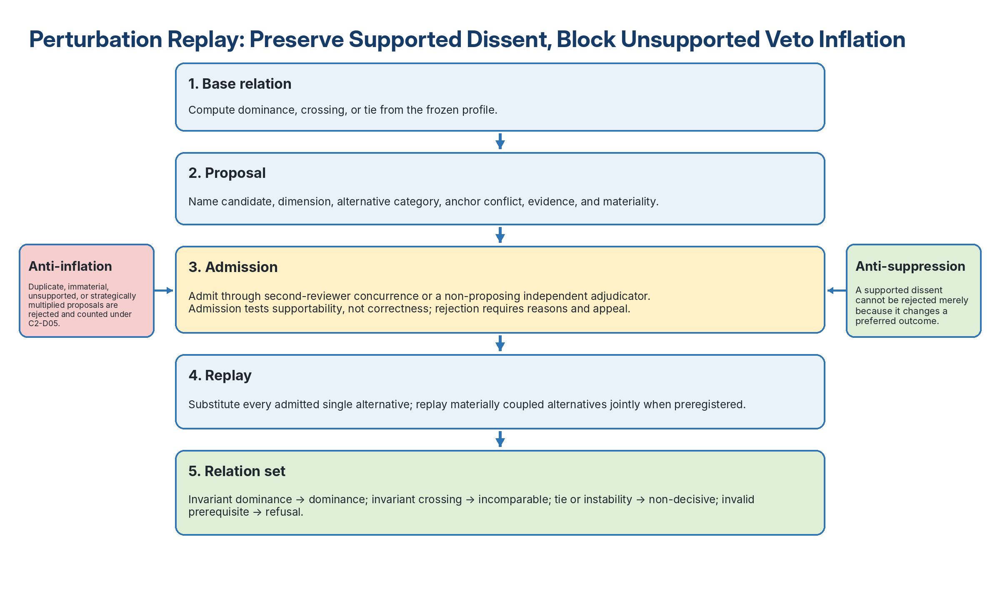

**Figure 8. Perturbation replay begins with an evidence-specific admission gate; unsupported proposals cannot silently veto dominance, while supported dissent cannot be suppressed.**

**Applicability matching rule.** A relation requires a common set of applicable dimensions. `not_applicable` requires a rationale, scope binding, and reviewer confirmation. A potentially repairable applicability disagreement produces `non_decisive`; inability to establish a valid shared scope produces `refusal_to_compare`. A reviewer may not remove a weak dimension strategically through `not_applicable`.

**Functional-group diagnostic.** Reviewers may summarize the four AF-SB12 functional groups to explain where profiles cross or where evidence is concentrated. This summary is descriptive only. It does not average categories, establish lexicographic priority, erase a weaker dimension, or create a winner.

Tables 8A-8L are the operational anchors. Together they contain sixty ordered descriptors across twelve dimension-specific tables. The descriptors remain ordinal labels, not interval scores.

The complete ordered anchors for all twelve dimensions appear in Tables 8A-8L.

### 6.1.1 Common anchor ladder

Every AF-SB12 dimension instantiates the same evidence-maturity ladder; Appendix F descriptors control.

| **Category** | **Common evidentiary meaning** |
| ---: | --- |
| **0** | absent, bypassable, or contradicted; floor-linked cases return to Stage A |
| **1** | nominal, incomplete, discretionary, or weakly enforceable |
| **2** | operative and inspectable for the declared scope |
| **3** | independently challenged on edge cases, disagreement, overrides, and subgroup effects |
| **4** | demonstrated across contexts with detected failure and correction or retirement |

### 6.1.2 Compact dimension matrix

**Table 8. AF-SB12 compact anchor matrix. Full controlling descriptors appear in Appendix F.**

| **Dimension** | **0** | **1** | **2** | **3** | **4** | **Floor tier** |
| --- | --- | --- | --- | --- | --- | --- |
| Rights robustness | absent/compensable | thin/discretionary | explicit floors + redress | independent edge-case review | repeated effectiveness + repair | F |
| Audit completeness | unreconstructable | partial trace | qualified reconstruction | independent replay | multi-host/tamper-evident replay | N |
| Measurement validity | absent/single proxy | major proxy risk | construct-linked portfolio | independent validity challenge | cross-context validation + retirement | N |
| Uncertainty discipline | unknowns ignored | caveated/action-inert | decision-relevant uncertainty | stress/refusal applied | calibrated and corrected | N |
| Corrigibility | no failure path | informal update | triggers + change control | independent retirement | recurrence-reducing evidence | N |
| Anti-gaming resilience | readily gamed | acknowledged/weak | threat model + probes | active red-team review | adaptive detection + repair | N |
| Non-domination | opaque/coercive | nominal participation | standing, appeal, power map | independent power review | reduced domination + repair | P |
| Refusal quality | always answers | discretionary | defined refuse/defer/escalate | overrides tested | calibrated refusal evidence | F |
| Tail-risk adequacy | catastrophe hidden | method misfit | method matched | cascades challenged | multi-method monitoring | P |
| Ecological adequacy | limits omitted | aspiration only | boundaries declared | cumulative evidence applied | monitoring/restoration | P |
| Institutional compatibility | authority/capacity absent | fit unspecified | plausible pathway | independent implementation challenge | bounded pilots under separate authority | P |
| Public challenge | outsider cannot challenge | unreliable trace | versioned package | independent reconstruction | multi-host replay | N |

### 6.1.3 Granularity and factor-structure threat

Phase 0 preregisters anchor-overlap diagnostics and, where sample size permits, one-factor versus correlated multidimensional models. C3-D07 is triggered when a simpler structure preserves floor visibility and defect localization while materially improving reliability or burden, or when dimension-specific residuals add no reproducible information beyond a general maturity factor. Fit criteria and consequences are frozen before candidate results are opened.

The controlling Stage B outcome vocabulary is summarized in Table 8M. A newly established material C0-C5 defect suspends Stage B and returns the candidate to Stage A before any Stage B outcome is assigned. Within a valid Stage B comparison, the relation-set rule controls: invalid prerequisites produce refusal; unstable or tied relation sets produce non-decisiveness; invariant crossing produces incomparability; invariant one-direction dominance produces dominance.

**Table 8M. Stage B outcomes are mutually exclusive and symmetric; subreasons preserve information without creating extra top-level outcomes.**

| **Status code** | **Required condition** | **Subreason / direction field** | **Public consequence** |
| --- | --- | --- | --- |
| **`dominance`** | Every base and admitted perturbation relation points in one dominance direction; prerequisites valid. | `dominates_a` or `dominates_b` | scoped relation only; no authorization or universal superiority |
| **`incomparable`** | Every valid relation is crossing. | `invariant_crossing` | publish stable crossing; no winner |
| **`non_decisive`** | Valid relation is invariant tie, changes across alternatives, or remains incomplete under a named repairable condition. | `invariant_tie`, `unstable_relation`, or `repairable_evidence_gap` | publish all supported relations and repair path |
| **`refusal_to_compare`** | A prerequisite is invalid or not safely repairable within the current review cycle. | named refusal reason | no comparative inference |

## 6.2 Indicator-level comparison

Where measures have meaningful units, candidates may declare substantive thresholds or minimum meaningful differences. These must be justified in measurement cards, preregistered, reported in units, sensitivity-tested, and kept subordinate to rights and boundary floors. Indicator-level dominance does not convert the ordinal rubric into an interval scale.

## 6.3 Tail-risk method adequacy under deep uncertainty

Candidates must use a declared tail-risk method appropriate to the epistemic conditions and stakes. Conditional value at risk is admissible when probability distributions and loss units are sufficiently meaningful; it is not the canonical core. Robust decision-making, scenario discovery, minimax regret, precautionary constraints, stress testing, adaptive pathways, catastrophe-class-specific bounds, and non-aggregable risk registers may be required where their assumptions better fit the case (Lempert et al., 2003).

Table 9 matches tail-risk methods to the epistemic conditions in which they can and cannot support a claim.

**Table 9. Tail-risk method adequacy depends on epistemic conditions; no single formalism is universally sufficient.**

| **Epistemic condition** | **Primary method burden and required controls** | **Inadequate when used alone** |
| --- | --- | --- |
| **Probabilities reasonably estimable; losses commensurable; protected floors already isolated** | CVaR or expected shortfall with probabilistic stress testing, sensitivity analysis, model validation, dependence testing, subgroup checks, and disclosed loss construction | expected-value or median-only reasoning |
| **Probabilities deeply uncertain or contested** | robust decision-making, scenario discovery, minimax regret, or robust satisficing with broad scenario families, vulnerability analysis, adaptive triggers, and refusal conditions | point probabilities or scalar CVaR presented as decisive |
| **Losses non-commensurable across rights, ecological, or catastrophe classes** | separate class bounds, precautionary constraints, or vector risk registers with explicit non-aggregation and class-specific evidence | one scalar loss or one aggregate CVaR |
| **Cascading or correlated failures dominate** | system stress tests, network or dependency scenarios, and catastrophe-class analysis with common-cause failure and monitoring controls | independent marginal distributions that ignore cascades |
| **Harm may be irreversible, existential, or difficult to restore** | ruin constraints, precautionary rules, adaptive pathways, and safe-to-fail stages with explicit reversibility and early-warning boundaries | average-loss optimization or compensatory benefit claims |
| **Catastrophe classes may be missing or strategically concealed** | scenario discovery, red-team elicitation, historical near-miss review, residual-unknown registers, and search-expansion triggers | a closed scenario set treated as complete |

At minimum, reviewers must reject a tail-risk method as inadequate when it aggregates protected-floor breach into ordinary loss, treats deeply uncertain probabilities as stable, hides non-commensurable or subgroup-specific irreversible harms inside one scalar, ignores material dependencies, or cannot change the permitted action when uncertainty grows. A sophisticated calculation with an unsuitable epistemic model is not stronger evidence.

## 6.4 Context-specific interpretation

Authorized decision settings may add **non-arithmetic** downstream rules after the unweighted profile is published, including lexicographic priorities, vetoes, thresholds, outranking rules, or a separately governed preference-robustness analysis. Weighted sums, averages, distances, or trade-off rates over AF ordinal categories are prohibited unless a validated measurement model establishes defensible units and spacing. Downstream outputs require separate assumptions, sensitivity analysis, authority, and labels; they cannot use AF status tokens or compensate for a floor defect. The resulting relation is a partial order: crossing profiles terminate in incomparability rather than a forced ranking. A functional-group summary may support deliberation but cannot silently become a lexicographic ranking rule.

## 6.5 Practical uses and limits of the Stage B profile

Stage B is not justified only by whether it produces a dominance relation. Its primary product is a structured, version-bound profile with evidence, applicability, maturity, confidence, disagreement, uncertainty, and defect records. That profile can support prerequisite screening after Stage A; structured due diligence; defect localization; evidence-gap targeting; patch prioritization; comparison of strengths and weaknesses without declaring a universal winner; version-to-version improvement tracking; public disclosure of unresolved disagreement; research shortlisting; procurement or assurance input under separate lawful authority; and identification of dimensions requiring domain-specific review.

The profile cannot authorize deployment, create a total score, erase or compensate for a rights defect, justify selection through category averaging, imply universal superiority, or replace legal, democratic, institutional, domain-safety, or affected-party authorization. A host using the profile for procurement, assurance, or research selection must publish the separate decision rule, authority, scope, and sensitivity analysis; it may not present that downstream choice as an AF ranking.

Stage A may carry more immediate practical weight than Stage B during early pilots because it identifies whether a framework has established the minimum conditions for responsible comparison. That is not a defect. It becomes a protocol-design problem when Stage B consumes substantial time, money, participation, or evidence burden without producing decision-relevant profiles, localized defects, useful disagreement records, or defensible comparison relations. The validation programme therefore measures Stage B decision value as well as dominance yield.

# 7. Administration, Independence, Reliability, and Public Accountability {#administration}

The Challenge Administration Handbook v6.2 owns the binding implementation procedure. The core minimum is:

- reviewers disclose qualifications, employment, funding, institutional ties, candidate involvement, protocol-author involvement, financial or family interests, and relevant community or lived-experience competence;

- reviewers conduct and deposit independent initial assessments before discussion;

- every proposed non-admissibility finding receives an evidence-specific notice with a falsifiable patch condition;

- entrants receive a symmetric response right and access to the material record;

- unresolved cases go to at least three non-conflicted adjudicators, including rights, legal, domain, or affected-party competence where material;

- the panel includes a member selected through a route not controlled solely by the convening host;

- the public record states the majority determination, minority opinion, unresolved uncertainty, conflicts, recusals, selection path, and patch conditions; and

- one procedural or evidentiary appeal is available without indefinite relitigation.

No reviewer has a silent veto. Strictness is preserved because a material defect cannot be averaged away, but exclusion must be reasoned, falsifiable, reviewable, and recorded.

## 7.1 Proportional profiles and upward-only escalation

Auditable Flourishing must not demand the same administrative burden from every review. Version 6.2 preserves three profiles while making blank, partial, and unrecognised routing fail closed and retaining identical non-compensatory semantics.

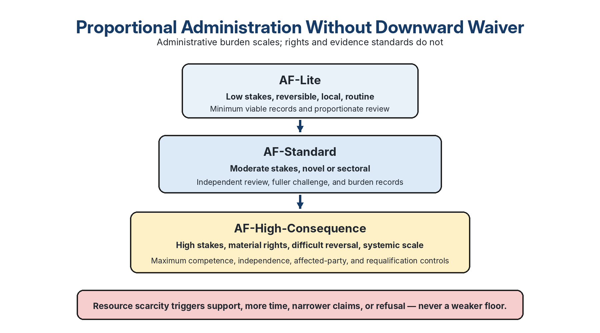

**Figure 9. Administrative burden scales from AF-Lite to AF-High-Consequence, but rights and evidence standards do not move downward.**

**Table 10. Proportional review profiles scale administration without waiving protection.**

| **Profile** | **Typical use** | **Minimum administration** | **Escalation rule** |
| --- | --- | --- | --- |
| **AF-Lite** | Early critique, low-stakes and reversible advisory use, low-resource entry | Bound candidate and scope, C0-C5 artifact screen, at least one scenario, defect log, basic appeal route | Any material rights, irreversibility, scale, novelty, affected-party dispute, or authority claim escalates before a positive finding |
| **AF-Standard** | Institutional comparison, research pilots, material but bounded decisions | Multi-reviewer Stage A, calibrated scenarios, burden record, affected-party input, independent adjudication, public decision record | High or uncertain rights impact, systemic scale, difficult reversibility, frontier novelty, or live authority escalates |
| **AF-High-Consequence** | Fundamental rights, national or transnational systems, ecological lock-in, catastrophic or irreversible risk | Independent host, plural panel, affected-party representation, legal/rights competence, full independence dossier, protected dissent, security protocol, external replication plan | No downward waiver. Inadequate capacity produces support, delay, narrowing, indeterminate status, or refusal - never a lighter standard |

Profile selection is determined by stakes, protected rights, reversibility, population and ecological scale, novelty, contestation, and authority. Resource constraints trigger funded assistance and proportional evidence modes; they cannot route a high-consequence case downward. Small institutions should use a shared independent host or consortium rather than weaken reviewer competence, challenge rights, accessibility, evidence custody, or non-compensatory protections.

## 7.2 Adjudicator and host independence: mechanism, not assurance

Independence is a procedural achievement, not a declaration. In a challenge containing MathGov, RippleLogic, or another author-affiliated entrant, the convening host, adjudication panel, and entrant sponsor must be institutionally and procedurally separated. The protocol author may occupy only the entrant-sponsor role and is excluded from host selection, reviewer recruitment, scoring, panel discussion, and adjudication.

Panel selection must follow a procedure fixed before candidate identities are disclosed. At least one adjudicator must be selected either by an independent standing body - such as a university ethics or peer-review committee, professional evaluation association, or registered-report editorial process - or by a preregistered random draw from a published, competence-screened reviewer pool fixed before the challenge opens. The selecting body, selection date, pool, draw method or seed, conflicts, recusals, and sequence must be public or available under controlled review.

Reviewers deposit timestamped initial assessments before panel discussion. Candidate identity should be blinded where feasible. When an architecture is effectively self-identifying, the record must state that blinding was not achieved and lower the confidence of any neutrality claim rather than pretending otherwise. An independence claim is void for that challenge if the author serves as host or adjudicator for an affiliated entrant, all adjudicators are selected solely by the host, selection occurs after candidate disclosure without a preregistered rule, or pre-discussion assessments are absent. The result then becomes **Indeterminate** or **Refusal to compare**, not a comparative finding.

No v6.2 administration has yet demonstrated this mechanism in an external pilot. It is a falsifiable design specification for the first independent run, not evidence that independence has already been achieved.

### 7.2.1 Mandatory independence dossier and publication firewall

Before rating begins, the host publishes a dossier separating sponsor, host, protocol steward, candidate owner, reviewer, adjudicator, data custodian, statistician, affected-party representative, and publication authority. It records appointment and removal powers, financial and intellectual interests, data access, reviewer selection, protocol amendment, analysis, security redaction, and publication control.

An independence claim is invalid when the sponsor or candidate controls data, reviewer selection, scenarios after unblinding, adjudication, analysis, or publication; when protected dissent is absent; when no protected reporting channel, confidentiality route, or anti-retaliation safeguard exists for reviewers or affected parties; when null or adverse findings may be suppressed; when required affected-party representation is missing; when the scenario-set record is absent or changed without a declared amendment; or when materially model-generated or harmonized ratings are undisclosed and counted as independent human judgments. Declared conflicts may be managed only through prospective firewalls, recusal, independent control, and public documentation. The author and sponsor may answer factual questions but may not alter frozen anchors, remove dissent, replace reviewers to change an outcome, or veto publication. Security redaction must be narrow, logged, independently reviewable, and incapable of concealing methodological defects or adverse outcomes.

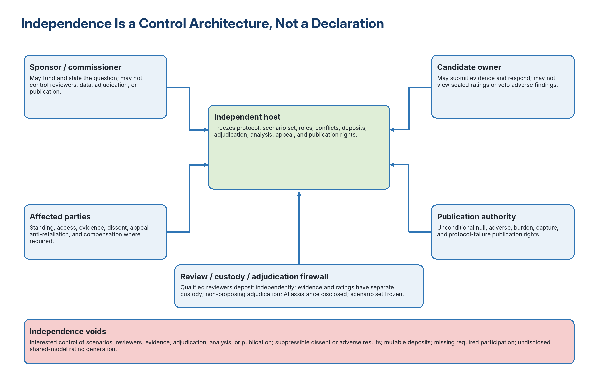

**Figure 10. Independence is a control architecture: sponsorship, hosting, evidence custody, rating, adjudication, affected-party representation, and publication remain separable and inspectable.**

## 7.3 Disagreement defaults and reliability preregistration

The default for unresolved disagreement is evidence-sensitive. A positively established material defect is **Stage-A non-admissible - patchable**. Where the panel cannot establish either admissibility or defect because evidence, competence, or anchor interpretation remains unresolved, the Stage A result is **Indeterminate - insufficient evidence**. In Stage B, disagreement capable of reversing a relation blocks dominance and produces **Incomparable**, **Non-decisive**, or **Refusal to compare**.

Reliability must be reported by criterion, dimension, and decision layer, never as one blended value. Stage A pilots report both criterion-level agreement and direct agreement on the final public status and full six-criterion status vector. Criterion coefficients must not be multiplied to estimate conjunction reliability because the judgements are dependent and the product does not measure actual verdict agreement.

Nominal Stage A statuses may use Gwet's AC1, Krippendorff's alpha, or another justified coefficient appropriate to reviewer count, prevalence, and missingness. For ordered Stage B categories with expected prevalence concentration, Gwet's AC2 is a defensible primary coefficient and ordinal Krippendorff's alpha a useful cross-check; weighted kappa may be reported as a secondary comparator only with the weighting scheme and prevalence sensitivity disclosed. ICC is reserved for measures with justified interval or continuous units and must not be applied to the 0–4 labels. Raw agreement, disagreement patterns, case counts, uncertainty intervals, and missing assessments are always reported with any coefficient.

No universal threshold is encoded. Before candidate results are opened, every pilot preregisters the coefficient, weighting, missing-data rule, case-clustered interval method, target precision, sample-size simulation, and consequence of a miss. With four to six reviewers and only twenty frozen cases, interval estimates remain wide and exploratory. For intuition only, a Wilson interval for 16 agreements in 20 independent cases is approximately 0.58-0.92; the actual multi-reviewer design is clustered by case and requires case-resampling bootstrap or another preregistered dependence-aware interval. Additional reviewers reveal disagreement structure; additional cases primarily improve precision. Phase 0 reports the final six-category status distribution descriptively unless simulation-based planning supports a stable coefficient. Low agreement must trigger non-dispositive reporting, anchor revision, additional calibration, or refusal rather than post-hoc reinterpretation. The Administration Handbook's worked thresholds remain examples, not v6.2 constants or evidence of achieved reliability.

## 7.4 Minimum viable non-dispositive shadow challenge and burden accounting

The lowest-assurance administered configuration is a **minimum viable shadow challenge**: one independent host, two version-bound candidate frameworks, three non-conflicted reviewers with the required combined competence, frozen synthetic scenarios, independent pre-discussion ratings, a defect-and-patch record, and a public report that issues no live authorization or certification claim. It may support L2–L3 learning but cannot establish comparative superiority, architecture fairness, or safe live administration. A challenge involving an author-affiliated entrant must also satisfy the stricter independence conditions in §7.2.

Every challenge tier reports elapsed time, reviewer and entrant person-hours, direct monetary cost where reportable, accessibility and participation burden, protected-information burden, unresolved conflicts, and the number of candidates that reached Stage B. Version 6.2 does not invent a universal budget or duration. The purpose of the record is to test whether the protocol's assurance burden is proportionate and whether a supposedly open challenge is practically inaccessible.

### 7.4.1 Conjunctive burden and capacity gate

A review is feasible only when all required capacities are available: qualified reviewer hours, adjudication hours, calendar time, minimum reviewer count, domain and rights competence, accessibility and translation support, secure evidence handling, affected-party participation, appeal capacity, and compensation where required. A favorable hours-per-case estimate cannot produce a positive status when calendar, panel, access, or governance capacity fails. That pathway is a **false green**.

Burden is recorded prospectively and by role: candidate preparation, reviewer review, adjudication, affected-party participation, translation and accessibility, security, appeal, direct cost, uncompensated time, abandonment, and reported burden. Unmet access need, coerced unpaid participation, or burden-driven exclusion can force assistance, narrower scope, delayed review, `Indeterminate`, or `Protocol refusal to evaluate`. Burden is a validity and rights issue, not a convenience metric.

**Small-institution boundary.** Many small institutions will not possess independent rights, domain, measurement, accessibility, secure-custody, adjudication, and appeal capacity in-house. AF-Lite may support bounded internal learning, but AF-Standard and AF-High-Consequence ordinarily require a shared independent host, consortium, accredited professional capacity, or funded external panel. Resource scarcity never justifies a downward waiver.

## 7.5 Affected-party standing

Affected-party participation is not ceremonial. A live or rights-sensitive challenge must state who is affected, what standing they have to challenge, how accessibility and burden are addressed, what information is protected, how dissent is preserved, and how participation can change the protocol or candidate finding. Where materially required affected-party participation is absent, the protocol must refuse or narrow the review.

Affected-party standing also applies recursively to Auditable Flourishing. At L3 and above, the protocol host must publish a route through which affected-party representatives can request a rule interpretation, challenge an evidence burden, trigger accessibility or burden review, propose a revision, or seek suspension of a protocol use that creates material risk. The author may not unilaterally dismiss such a petition in a challenge involving an affiliated entrant. A non-conflicted host or designated governance body must issue a reasoned response, preserve dissent, and record whether the protocol, administration, candidate finding, or scope was changed. This does not give one participant a silent veto; it makes protocol revision contestable by those exposed to its errors.

## 7.6 Assisted dossiers, differential evidence pathways, and resource equity

Bounded architecture neutrality is not practically credible if only well-resourced entrants can produce the expected dossier. A host may therefore provide neutral assistance with accessibility, translation, transcription, evidence organization, version control, and conversion of architecture-specific records into the protocol's functional fields. Assistance may improve inspectability; it may not fabricate evidence, supply missing normative commitments, coach a candidate toward a desired rating, suppress adverse evidence, or weaken a criterion.

Assistance is governed by five safeguards:

1. **Transparent eligibility.** The host publishes who may receive assistance and whether support is universal, needs-based, or funded by a disclosed source.
2. **Role separation.** Assistance personnel do not score or adjudicate the assisted candidate and disclose relevant conflicts.
3. **Candidate control and consent.** The entrant approves the translated or reorganized dossier and retains responsibility for its accuracy. Community and Indigenous knowledge is not extracted, translated, disclosed, or standardized without appropriate authority and consent.
4. **Assistance log.** The public or protected record identifies the type, provider, duration, funding, changes made, candidate approval, and any material limitation.
5. **Functional equivalence without polish bias.** Oral reasons, observed deliberation, community records, customary procedures, translated evidence, and other architecture-appropriate forms may establish the same function when they are sufficiently challengeable. Visual polish, legal drafting resources, or computational form are not evidence of conformity.

Where unequal resources prevent a fair evaluation even after reasonable support, the host must narrow, defer, classify the result as Indeterminate, or refuse to evaluate. It must not turn resource scarcity into an adverse candidate finding. A live challenge reports participation compensation where lawful, accessibility measures, translation support, assistance hours and cost, and whether the evidence pathway changed any finding. These records test whether the protocol's burden reproduces the exclusions it claims to resist.

### 7.6.1 Non-documentary evidence, data sovereignty, and polish neutrality

Document-rich institutional form is not the standard of truth. Oral reasons, observed deliberation, customary practice, community records, artifact demonstrations, translated submissions, and other functionally equivalent evidence may establish a criterion when the record preserves provenance, consent, purpose limitation, custody, interpretation, triangulation, correction, challengeability, compensation, withdrawal, retention, and data sovereignty. The host may publish a faithful bounded summary where raw disclosure would violate privacy, community governance, safety, or legitimate confidentiality.

Visual polish, formal legal drafting, computational packaging, English fluency, and extensive documentation are not positive evidence by themselves. The architecture-fairness study must test whether AF errors or burdens vary systematically by documentation intensity, language, resource level, institutional form, disability, or community evidence mode after substantive safeguards are held constant.

# 8. Worked Synthetic Scenario: Welfare Eligibility Under Scarcity and Fraud Pressure

The following synthetic case is included to make the protocol concrete. It is not based on a real person or agency record. Its purpose is to show how a submission could be evaluated, not to settle welfare policy.

## 8.1 Scenario specification

The synthetic scenario and its pressure points are specified in Table 11.

**Table 11. The synthetic welfare scenario exposes rights, uncertainty, subgroup, and authorization pressures before comparison.**

| **Element** | **Synthetic scenario data** |
| --- | --- |
| **Decision authority** | Municipal benefits office considering use of an automated triage framework for emergency rental assistance |
| **Decision question** | Which applicant cases should receive immediate emergency rental payment, which require manual review, and which may be safely deferred? |
| **Stakes** | Eviction risk, homelessness, fraud pressure, budget scarcity, due process, subgroup discrimination, administrative legitimacy |
| **Applicants** | 100 synthetic applicants. Ten are sampled for worked testing. Data include household income, rent arrears, dependents, disability marker, eviction notice, fraud-risk flag, missing-document status, and appeal access. |
| **Rights at risk** | Basic needs, housing security, due process, non-discrimination, privacy, information access, redress |
| **Required outputs** | Eligibility recommendation, rights-floor report, uncertainty report, subgroup-harm check, decision note, appeal path, update trigger |

## 8.2 Synthetic mini-dataset

Table 12 provides a readable excerpt, while the versioned dataset remains the replay source. Applicant IDs first used below resolve to `supplement/data/synthetic_welfare_dataset.csv` and its JSON parity file; the excerpt is not the complete case set.

**Table 12. The readable excerpt illustrates the case structure; only the versioned ten-record dataset supports replay.**

| **ID** | **Case profile** | **Initial risk requiring review** |
| --- | --- | --- |
| **A01** | Acute eviction risk; very low income burden; documents present; low fraud flag; no vulnerability declared. | Acute eviction risk. |
| **A02** | Low income; documentation incomplete; low fraud flag; no vulnerability declared. | Documentation uncertainty; missing documents are not proof of ineligibility. |
| **A03** | Acute eviction risk; high income burden; documents present; medium fraud flag; disability accommodation needed. | Acute risk plus a vulnerability-sensitive review obligation. |
| **A05** | High-stakes fraud uncertainty; missing documents; high fraud flag; dependent children. | High uncertainty with basic-needs exposure; stabilize and review rather than auto-deny. |
| **A09** | Missing data and eviction risk; missing documents; low fraud flag; no vulnerability declared. | Missing data must not be treated as proof of ineligibility. |

The complete ten-record CSV and JSON preserve all variables and row order for replay. This excerpt is intentionally smaller so that the paper remains readable; it is not a replacement for the machine-readable dataset.

The candidate-response patterns used to test rights, refusal, and authorization boundaries are shown in Table 13.

**Table 13. The protocol constrains inadmissible response patterns without pretending to select one universally correct policy action.**

| **Case type** | **Potentially admissible responses, subject to law and authority** | **Inadmissible response pattern for this scenario** |
| --- | --- | --- |
| **Acute eviction risk with complete evidence (A01, A06)** | provisional or expedited stabilization; rapid verification; human confirmation proportionate to stakes | delay or denial that ignores imminent housing harm without a reasoned necessity finding |
| **Missing documents without acute rights risk (A02)** | defer with notice, accessible evidence assistance, and preserved appeal | treating missingness itself as proof of ineligibility |
| **Disability or high family vulnerability (A03, A07)** | accommodation, supported review, expedited protection where authorized | adverse action without accommodation or review of vulnerability |
| **Lower-urgency case (A04)** | ordinary processing under transparent criteria | emergency priority granted or denied through hidden discretionary rules |
| **Acute risk plus fraud uncertainty (A05)** | separate fraud inquiry from emergency stabilization; manual review; temporary support where law permits; notice and appeal | automatic denial solely from a fraud flag or missing documents |
| **Medium-risk flag (A08)** | verify the flag before adverse action; document confidence and review path | adverse action based on an unexplained or unreviewable flag |
| **Missing data with eviction risk (A09)** | defer with notice and assistance; provisional continuation where law permits; human rights review | missing data treated as proof of ineligibility or as a waiver of due process |
| **Preventive support case (A10)** | proportionate preventive assistance and follow-up | exclusion solely because crisis has not yet become acute |

Compared with naive automation, the protocol does not treat missing documents or fraud-risk flags as automatic denial triggers. It requires rights-floor checks, uncertainty treatment, notice, redress, subgroup missingness review, and emergency stabilization where eviction, disability, dependents, or basic-needs risks are present.

## 8.3 Decision Note excerpt

Candidate Framework X proposes automatic denial when documents are missing and automatic escalation when a fraud-risk flag is high. Stage A identifies two potential defects: C1-D02 if the applicant has no accessible appeal path, and C3-D02 if missing documents are more common in a protected subgroup but no subgroup check is performed. Under the protocol, A05 cannot be automatically denied because the case combines acute eviction risk, dependents, missing documents, and a high fraud-risk flag. A candidate could support manual review, temporary harm-prevention support where legally available, notice of missing evidence, an accessible appeal channel, and separation of fraud investigation from emergency-stabilization logic. Other responses may also be admissible if they preserve the declared floors and authority boundary. For this synthetic scenario, A09 likewise cannot be denied solely for missing documents. The framework must distinguish uncertainty from ineligibility.

## 8.4 Worked Stage A outcome

The evidence-specific Stage A findings for Framework X are consolidated in Table 14.

**Table 14. Framework X remains non-admissible until each distinct root cause is patched; cross-criterion consequences do not multiply one defect into several penalties.**

| **Criterion** | **Finding** | **Primary root-cause ID** | **Result and relationship** |
| --- | --- | --- | --- |
| **C0 Inspectability** | Override and scoring-weight pathways are not fully disclosed. | `RC-X-01 hidden_override_path` | Distinct C0-D01/C0-D02 defect; disclose authority, constraints, logs, lineage. |
| **C1 Rights** | Missing documents can trigger denial without accessible notice or redress. | `RC-X-02 missingness_as_denial` | Primary rights consequence; add notice, appeal, stabilization, non-denial rules. |
| **C2 Audit** | Record omits the assumption that missing evidence implies ineligibility. | `RC-X-02 missingness_as_denial` | Same root cause; cross-reference C1, do not double-count. |
| **C3 Measurement** | No subgroup analysis of missing documents or fraud flags. | `RC-X-03 untested_error_distribution` | Distinct measurement defect; add subgroup or privacy-preserving error analysis. |
| **C4 Update** | No trigger responds to appeals, wrongful denial, or subgroup divergence. | `RC-X-03 untested_error_distribution` | Corrigibility consequence of RC-X-03. |
| **C5 Refusal** | No defer/escalate path under acute eviction risk and incomplete evidence. | `RC-X-02 missingness_as_denial` | Refusal manifestation of RC-X-02. |

The release includes an author-generated Decision Note and reviewer worksheet supporting this internal synthetic replay. These artifacts make the example inspectable, but they do not constitute independent rating, adjudication, reliability evidence, or external replay.

This worked case shows the protocol catching a plausible real-world failure mode: an apparently efficient welfare triage system can create rights harm by treating missing data or fraud uncertainty as denial grounds. The fix is not to abandon automation categorically. The fix is to require open-core logic, rights-preserving alternatives, manual review under uncertainty, subgroup visibility, appeal access, and update triggers.

The dispositions are illustrative exclusions and alternatives, not unique policy answers. Law, authority, local resources, evidence, and affected-party circumstances may support several admissible responses. The protocol can identify patterns such as automatic denial from missing documents or an unexplained fraud flag as unacceptable for the declared scenario without pretending to legislate the one correct real-world outcome.

## 8.5 Core defect-code taxonomy

Defect codes provide stable identifiers for evidence notices, machine-readable logs, patch records, adjudication, and recurrence analysis. Codes identify a symptom and patch condition; they do not replace the criterion-specific rationale. Table 15 is the core subset required to read this paper standalone; identifier gaps in the sequence correspond to codes carried only in the version-matched machine-readable catalog in the Reproducibility Supplement. Every code named anywhere in this core paper appears in Table 15.

**Table 15. Defect codes make adverse findings replayable only when paired with case-specific evidence and falsifiable patch conditions.**

| **Code and defect** | **Observable symptom** | **Minimum falsifiable patch condition** |
| --- | --- | --- |
| **C0-D01 Hidden core logic** | Reviewer cannot reconstruct a material normative or decision rule. | Disclose the rule under public or controlled review, or narrow the claim. |
| **C0-D02 Undeclared control channel** | Operator, vendor, facilitator, or institution can alter outcomes without disclosure. | Declare the channel, authority, constraints, logs, and audit access. |
| **C0-D03 Missing dependency or override lineage** | Versions, remote updates, telemetry, escalation, or inherited dependencies are unbound. | Version-bind dependencies and disclose override, update, telemetry, and escalation paths. |
| **C0-D04 Unscoped or false artifact attestation** | A format, figure, rendering, checksum, manifest, or verification claim does not resolve to an exact version-matched path, hash, test, and result. | Narrow or withdraw the claim; identify the artifact, verifier, date, procedure, path, and SHA-256; rerun the declared checks. |
| **C0-D05 Strategic scope narrowing or scope overstatement** | A candidate narrows the reviewed scope until conformity is easy, then markets the result as broader than the declared domain, role, population, time horizon, or authority boundary. | Publish the exact scope in every finding and public claim; test adjacent excluded cases; narrow marketing; or rerun the review at the broader claimed scope. |
| **C0-D06 Undisclosed stewardship or amendment control** | The authority to amend, interpret, supersede, or designate the protocol is hidden, concentrated without challenge, or disconnected from a public version and objection record. | Publish the stewardship charter, role and conflict register, change class, decision rule, objections, dissent, provenance, succession path, and versioned disposition; suspend canonical amendment claims where these are absent. |
| **C0-D07 Downstream authority laundering** | A bounded AF finding is cited as certification, due diligence, reasonable care, legal compliance, procurement approval, safety assurance, or permission without full scope, conditions, expiry, dissent, appeal, and separate authority. | Correct or withdraw the claim; reproduce the bounded record; identify separate authority; notify affected parties where appropriate; reopen or retire if misuse persists. |
| **C1-D01 Compensatory rights logic** | Protected harm can be offset by aggregate benefit. | Move the floor outside ordinary optimization and show enforcement. |
| **C1-D02 Missing redress** | Affected parties lack accessible notice, challenge, appeal, or remedy. | Add accessible notice, appeal, remedy, timelines, and responsible authority. |
| **C1-D03 Inadequate or strategically thin floor set** | The declared floor set omits materially applicable non-derogable or minimum-essential protections, or claims non-equivalence without showing equal or stronger protection. | Map floors to applicable law and the reference baseline, or provide a principled non-equivalence supported by independent rights review and affected-party competence. |
| **C1-D04 Missing-data denial risk** | Missing evidence triggers denial where basic needs, housing, or due process may be implicated. | Add non-denial or stabilization rules where required, notice, review, and appeal. |
| **C1-D05 Resource-exclusion or inaccessible evidence pathway** | Dossier, language, disability, participation, confidentiality, or resource demands prevent a materially relevant candidate or affected group from presenting functionally equivalent evidence on fair terms. | Provide neutral assistance, accessible and differential evidence routes, compensation or support where lawful, protected handling, and an assistance log; narrow, defer, or refuse if fairness cannot be restored. |
| **C2-D01 Missing version binding** | A result cannot be linked to the exact framework, evidence, or rule version. | Add immutable identifiers, lineage, and replay bindings. |
| **C2-D02 Unreplayable transformation** | Inputs, reasons, discretion, or transformations cannot be reconstructed. | Provide architecture-appropriate trace, assumptions, reasons, and replay instructions. |
| **C2-D03 Missing assumption trace** | Material priors, imputations, exclusions, or discretionary judgments are undocumented. | Record assumptions, evidence quality, uncertainty, and affected outputs. |
| **C2-D04 Unreplayed reversal-sensitive disagreement** | A dominance claim survives only because reviewer disagreement was described impressionistically rather than tested under each evidence-supported alternative category. | Record defended alternatives, rerun the partial order under each, publish the perturbations, and withdraw dominance if any alternative changes the relation. |
| **C2-D05 Unsupported perturbation inflation** | Unsupported, duplicate, strategically timed, or immaterial alternatives are multiplied to manufacture instability or veto a relation. | Apply the admission rule; publish proposed/admitted/rejected counts and reasons; deduplicate; preserve appeal; recompute from admitted alternatives only. |
| **C3-D01 Single-KPI substitution** | One metric stands for a multidimensional construct or authority claim. | Add a construct-linked portfolio, integrity indicators, and anti-Goodhart checks. |
| **C3-D02 No subgroup visibility** | Averages can hide the worst-affected groups. | Add disaggregation or a justified privacy-preserving substitute and action rule. |
| **C3-D05 No subgroup missingness analysis** | Missingness, false positives, or data quality are not tested by affected group. | Add subgroup or privacy-preserving error analysis, uncertainty response, and triggers. |
| **C3-D06 Metric arithmetic on ordinal categories** | Rubric labels are averaged, differenced, or assigned decimal epsilon without calibration. | Remove metric operations or provide a validated measurement model and justified units. |
| **C3-D07 Unjustified comparison granularity** | The reported dimension set is finer or coarser than the evidence supports: anchors overlap persistently, dimension-level agreement is poor, reviewer burden is excessive, functional coverage is missing, or a more parsimonious merge or split would preserve protection and explanatory value. | Justify the granularity against coverage and agreement evidence, or merge, split, or retire dimensions under the declared revision trigger and restate the dimension-set version. |
| **C4-D01 No binding failure trigger** | Failure does not force review, repair, deprecation, or retirement. | Add observable triggers, responsible authority, deadlines, and public patch governance. |
| **C4-D02 Trigger disconnected from observed harm** | Update rules ignore appeals, subgroup divergence, wrongful denial, or boundary breach. | Connect triggers to observed signals and verify the revision process. |
| **C4-D03 Uncontrolled amendment, capture, or succession failure** | Protocol rules can be changed, reinterpreted, or inherited without public review, dissent, affected-party representation, provenance, or a legitimate succession mechanism. | Apply the versioned amendment class, independent review, conflict and dissent record, affected-party participation, appeal, transition, and succession safeguards; freeze the last signed release when legitimate stewardship is absent. |
| **C5-D01 Always-answer behavior** | The framework returns a recommendation despite inadequate evidence, competence, or authority. | Add refuse, defer, narrow, escalate, and safer-alternative conditions. |
| **C5-D02 No escalation under underdetermination** | The framework cannot route a high-stakes unresolved case to qualified authority. | Define escalation, lawful authority, evidence request, and emergency stabilization boundaries. |
| **C5-D03 Comparison-to-authorization collapse** | A conformity or Stage B result is represented as permission or safe execution. | Separate admissibility, selectability, authorization, and execution in rules and public claims. |

## 8.6 Adversarial probe catalog

**Table 16. A Core-tier challenge must actively probe hidden authority, rights bypass, gaming, refusal failure, and authorization collapse.**

| **Probe** | **Attack pattern** | **Required detector** | **Patch expectation** |
| --- | --- | --- | --- |
| **Hidden-core probe** | Polished disclosure hides an override, weighting rule, or facilitator/operator control. | Cross-artifact reconstruction, dependency review, override-path questionnaire. | Expose the control or narrow the claim. |
| **Scope-arbitrage probe** | The reviewed scope is narrow, but public claims imply broader domains, populations, authority roles, or time horizons. | Compare dossier scope, excluded cases, marketing language, and downstream use; test one adjacent excluded case. | Bind every claim to the reviewed scope, narrow public language, or rerun the broader scope. |
| **Stewardship-capture probe** | One author, sponsor, funder, vendor, or stakeholder class can amend or designate the protocol without effective challenge. | Inspect repository control, charter, decision rights, conflicts, objection records, succession, and amendment history. | Separate roles, publish control and dissent records, require independent constitutional review, or freeze the release. |
| **Resource-exclusion probe** | A community, customary process, small institution, or disabled participant cannot satisfy dossier demands that a well-resourced entrant can purchase. | Offer the same functional test through assisted, translated, oral, observed, or protected evidence; compare burden and outcomes. | Provide neutral support and differential evidence pathways, narrow the claim, or refuse the inequitable review. |
| **Host-predetermination probe** | Host has a preferred winner or institutional outcome and shapes scenarios, reviewers, evidence, or publication accordingly. | Freeze host-interest, scenario, reviewer, custody, adjudication, and publication records before rating. | Void independence; replace host or narrow/refuse. |
| **Perturbation-inflation probe** | A party proposes many unsupported or duplicate alternatives after seeing the base relation. | Apply admission, independent confirmation/adjudication, deduplication, and counts. | Reject unsupported alternatives with reasons; record C2-D05. |
| **Floor-thinness probe** | A candidate declares a small but formally enforced floor set that omits materially applicable protections. | Map floors against applicable law, non-derogable protections, minimum-essential obligations, and affected-party evidence. | Expand the floor set or justify functionally equal or stronger non-equivalence under independent rights review. |
| **Rights-bypass probe** | Rights are embedded as weights or emergency language creates an ordinary bypass. | Search decision rules and edge cases for compensatory or indefinite-exception logic. | Isolate floors and constrain exceptions. |
| **Metric-gaming probe** | Reported performance improves while lived conditions or subgroup outcomes worsen. | Integrity indicators, subgroup/missingness checks, anomaly review, qualitative evidence. | Add orthogonal measures, triggers, and metric retirement. |
| **Audit-evasion probe** | Outputs are logged but assumptions, discretion, or authority are absent. | Attempt replay until the first unreconstructable transformation or judgment. | Add assumption, reason, authority, and transformation traces. |
| **Uncertainty-misuse probe** | Low-confidence evidence is presented as decision certainty. | Sensitivity and scenario tests that show whether the finding changes. | Add uncertainty-triggered containment, review, or refusal. |
| **Open-washing probe** | Interface or source fragments are open while the operative normative core remains closed. | Compare public artifacts with actual control and dependency pathways. | Publish the material core under review or reduce claimed authority. |

## 8.7 Non-binding Stage B preview after hypothetical verified patches

The following profile demonstrates the reporting form only. Framework X did not pass Stage A in the worked scenario; therefore no official Stage B result exists. The preview assumes that every listed Stage A defect has been patched and independently verified. All applicable rows are supported only by L2 synthetic evidence. Unless a row states otherwise, dimension-level reviewer confidence is **moderate and uncalibrated**. Rows expressly marked low remain low. Confidence is metadata about support for the category; it is not part of the ordinal category itself.

Table 17 demonstrates the profile reporting form after hypothetical verified patches.

**Table 17. The Stage B preview demonstrates reporting structure only; author-generated categories are not comparative evidence.**

| **Dimension** | **Category** | **Reviewer confidence** | **Illustrative evidence note** |
| --- | --- | --- | --- |
| **Rights robustness** | 2 | Moderate, uncalibrated | Basic floors and appeal exist after patch; emergency and edge-case evidence remain limited. |
| **Audit completeness** | 2 | Moderate, uncalibrated | Material replay is possible after assumption and version-binding patches. |
| **Measurement validity** | 2 | Moderate, uncalibrated | Portfolio and subgroup checks exist; independent construct validation is absent. |
| **Uncertainty discipline** | 1 | Low | Caveats exist, but not every high-stakes decision changes under uncertainty. |
| **Corrigibility** | 2 | Moderate, uncalibrated | Versioned triggers exist; outcome-linked calibration is incomplete. |
| **Anti-gaming resilience** | 1 | Low | Fraud-pressure probes expose residual incentive risk. |
| **Non-domination and power constraint** | 2 | Moderate, uncalibrated | Appeal exists; affected-party governance remains limited. |
| **Refusal quality** | 2 | Moderate, uncalibrated | Defer and escalation rules exist after patch but lack external performance evidence. |
| **Tail-risk adequacy** | 2 | Moderate, uncalibrated | Scenario families and class-specific risks are declared; probability ambiguity remains. |
| **Ecological and intergenerational adequacy** | N/A | Low | Not material to this bounded welfare case; the machine record uses not_applicable with rationale, scope binding, and reviewer confirmation. |
| **Institutional compatibility** | 2 | Moderate, uncalibrated | Bounded shadow-mode use appears plausible after legal and administrative review. |
| **Reproducibility and public challenge** | 2 | Moderate, uncalibrated | A replay package exists; independent multi-host reproduction is absent. |

The ecological row illustrates a record-design rule: where a dimension is genuinely not material to the declared scope, the machine record must use not_applicable with rationale rather than category 0. Category 0 means an applicable dimension is absent or contradictory; it never means unknown or not applicable.

## 8.8 Worked incomparability demonstration

Two Stage-A-admissible hypothetical candidates are evaluated under the same scope, scenarios, protocol version, anchors, and calibration package. Both are supported only by L2 synthetic evidence with moderate overall reviewer confidence.

The crossing profiles in Table 18 establish a valid incomparability result. Perturbation `P-X-01` changes Audit completeness by one category, is admitted by an independent adjudicator, and leaves the crossing on Rights robustness and Ecological adequacy unchanged. The relation set remains `{cross}` and the outcome is `incomparable / invariant_crossing`.

**Table 18. Crossing ordinal profiles correctly produce incomparability rather than a manufactured winner.**

| **Dimension** | **Candidate A** | **Candidate B** | **Why no dominance follows** |
| --- | --- | --- | --- |
| **Rights robustness** | 3 | 3 | tied |
| **Audit completeness** | 4 | 2 | A stronger |
| **Measurement validity** | 3 | 3 | tied |
| **Uncertainty discipline** | 3 | 3 | tied |
| **Corrigibility** | 3 | 2 | A stronger |
| **Anti-gaming resilience** | 3 | 2 | A stronger |
| **Non-domination and power constraint** | 2 | 4 | B stronger |
| **Refusal quality** | 3 | 3 | tied |
| **Tail-risk adequacy** | 3 | 2 | A stronger |
| **Ecological and intergenerational adequacy** | 2 | 4 | B stronger |
| **Institutional compatibility** | 2 | 3 | B stronger |
| **Reproducibility and public challenge** | 4 | 2 | A stronger |

Candidate A is stronger on audit, corrigibility, anti-gaming, tail risk, and reproducibility; Candidate B is stronger on non-domination, ecological adequacy, and institutional compatibility. Neither is no worse on every dimension. The correct result is **Incomparable**, followed by domain-specific deliberation or additional evidence - not averaging, weighting after the fact, or manufacturing a winner.

## 8.9 Worked dominance proof case

A second synthetic pair is included to show that the protocol can produce dominance when the demanding conditions are actually satisfied. The example is deliberately simple and is not evidence about real frameworks. Both candidates are assumed Stage-A admissible for the same scope, scenario suite, evidence maturity, anchors, and calibration conditions; no category is unknown, no floor is unresolved, and the reversal perturbation log is empty.

Table 19 provides the complementary worked case in which ordinal dominance is actually established.

**Table 19. A synthetic profile can establish dominance without averaging when one candidate is no lower on every dimension and higher on at least one.**

| **Dimension** | **Candidate C** | **Candidate D** | **Relation** |
| --- | ---: | ---: | --- |
| Rights robustness | 3 | 2 | C higher |
| Audit completeness | 3 | 2 | C higher |
| Measurement validity | 3 | 2 | C higher |
| Uncertainty discipline | 3 | 2 | C higher |
| Corrigibility | 3 | 2 | C higher |
| Anti-gaming resilience | 3 | 2 | C higher |
| Non-domination and power constraint | 3 | 2 | C higher |
| Refusal quality | 3 | 2 | C higher |
| Tail-risk adequacy | 3 | 2 | C higher |
| Ecological and intergenerational adequacy | 3 | 2 | C higher |
| Institutional compatibility | 2 | 2 | Equal |
| Reproducibility and public challenge | 3 | 2 | C higher |

Candidate C rubric-dominates Candidate D in this synthetic proof case. The result follows from the partial order alone; no distance between 2 and 3 is assumed. The machine-readable companion records the common scope, floor status, applicability, and empty reversal-sensitive disagreement set.

## 8.10 Worked perturbation replay: dominance survives one alternative and becomes non-decisive under another

A third synthetic pair demonstrates the machinery that the empty perturbation log in Table 19 cannot demonstrate. Candidates E and F are tied at category 3 on eleven dimensions. On Audit completeness, E is recorded at 4 and F at 2. A qualified reviewer defends category 3 rather than 4 for E, supported by a narrower interpretation of independent replay evidence. The alternative is adjacent and material, so it must be replayed.

**Table 20. A populated perturbation record shows one admitted alternative that preserves dominance; the second admitted alternative below changes the relation to non-decisive.**

| **Record** | **Audit completeness: E** | **Audit completeness: F** | **Other eleven dimensions** | **Relation** |
| --- | ---: | ---: | --- | --- |
| Base profile | 4 | 2 | E = F = 3 | E dominates F |
| Defended alternative P-01 | 3 | 2 | E = F = 3 | E dominates F |

Perturbation `P-01` changes E on Audit completeness from 4 to 3 and preserves dominance. Perturbation `P-02` is admitted on a tied dimension: F = 4 rather than 3 on Ecological adequacy. P-02 produces crossing, so the full relation set is `{E dominates F, cross}` and the public outcome is `non_decisive / unstable_relation`. If P-02 were rejected as unsupported, dominance would remain and the rejection reason would be published. The example establishes only logical replay compliance; it is not empirical evidence that reviewer disagreements will usually preserve dominance.

A companion machine record also demonstrates invariant crossing: when a peripheral disputed dimension changes but candidates continue to cross on untouched dimensions, every perturbation remains crossing and the correct result is `incomparable`, not `non_decisive`.

# 9. Candidate Diversity, Affiliation, and Challenge Scope

A valid challenge should include architecturally diverse candidates rather than several variants of one author's design. Candidate dossiers must declare scope, version, sponsor, governance form, moral scope, authority assumptions, proprietary boundaries, evidence maturity, and conflicts. Alternative ontologies may use a two-way functional crosswalk or state a principled non-equivalence for review.

Affiliated seed entrants may help test schemas and scenarios, but they cannot establish architecture neutrality or superiority. A minimum external pilot should include at least three architecturally distinct candidates, at least one unaffiliated with MathGov or the protocol author, and independent rating before panel discussion. A compliance-theater entrant should also be included: one that supplies polished artifacts while hiding a control channel, gaming a metric, omitting subgroup harm, or using nominal update rules without binding triggers. The role separation, precommitted selection, sequence locks, and voiding conditions in §7.2 are operational requirements: an administration that cannot meet them must refuse comparison rather than issue an affiliated-candidate result.

Challenge scope must be comparable. Candidates evaluated under different domains, authority roles, scenario sets, or evidence maturities should not be forced into one dominance claim. The public output may report scoped strengths, incomparability, or refusal. A `Stage-A admissible - scoped` label must never be detached from its domain, role, population, time horizon, evidence maturity, and authority boundary. Strategic narrowing followed by broad marketing is C0-D05 and requires correction or broader review.

**Adoption-incentive boundary.** AF deliberately prevents a favorable finding from functioning as certification, procurement approval, a due-diligence safe harbor, or reputational immunity. That integrity choice reduces some private incentives to volunteer for a demanding and expiring challenge. The legitimate residual incentives are internal learning, defect discovery, research credibility, comparison against alternatives, pre-regulatory preparation, and evidence generation for separate competent processes. Non-participation is therefore both a selection-bias risk and a predictable consequence of the anti-shield design; it must be measured rather than treated as neutral missingness.

## 9.1 Non-author candidate neutrality stress test

The v6.2 supplement contains a full internal dry run of a deliberative mini-public with constitutional-rights review. The candidate intentionally uses none of the author's signature computational artifacts. Its purpose is to test whether C0–C5 recognize functionally equivalent safeguards rather than the author's preferred artifact form.

Table 21 shows that a deliberative mini-public can be assessed through procedural rather than computational evidence.

**Table 21. A deliberative mini-public can satisfy C0–C5 through procedural evidence without adopting a computational architecture.**

| **Criterion** | **Equivalent evidence** | **Scoped conformity condition** |
| --- | --- | --- |
| **C0** | charter, panel-selection method, evidence rules, facilitator authority, conflicts, publication rules | Reviewers can reconstruct how evidence, control, and recommendations were produced. |
| **C1** | rights charter, legal review, minority-impact process, challenge route, non-majoritarian floor rule | Rights-sensitive outcomes route to competent review rather than majority preference alone. |
| **C2** | minutes, evidence bundle, reasons, dissent, versioned briefs, decision record | Inputs, discretion, dissent, authority, and recommendation are traceable. |
| **C3** | evidence cards, uncertainty ratings, subgroup visibility, omissions register | Material empirical claims disclose source, limits, missingness, and affected groups. |
| **C4** | reconvening and revision triggers, public patch log, responsible update authority | New evidence, harm, or failed implementation can force correction or withdrawal. |
| **C5** | recommendation/authorization distinction, deferment, referral, non-consensus and refusal rules | The panel can narrow, defer, refuse, or refer and does not claim lawful execution authority. |

This dry run does not prove architecture fairness. It creates a falsification condition: if an architecturally distinct candidate supplies functionally equivalent safeguards and still fails for terminological or author-specific reasons, C0–C5 or their administration require revision. A future external test should include community or customary governance expertise selected by the relevant communities; v6.2 does not simulate that competence internally.

## 9.2 Preregistered architecture-diversity calibration suite

Before an external neutrality claim, the host preregisters a calibration suite spanning materially different institutional forms. The first suite should include, where competent evidence and participation are available: an appellate or administrative reasons process; a clinical ethics committee; a deliberative mini-public; a customary, Indigenous, or community governance process selected and interpreted with the relevant community; and a computational decision architecture. The protocol does **not** predetermine that any named exemplar must pass. It requires that functionally equivalent evidence can be represented without forcing the candidate into the author's vocabulary or artifact form.

For each calibration case, the host records which evidence form satisfies each C0–C5 function, what evidence the protocol failed to recognize, and whether a failure was candidate-specific or architecture-biased. If a competent candidate is rejected solely because its safeguards are expressed through an unrecognized but functionally equivalent form, the affected criterion, handbook rule, or evidence example is revised before an architecture-neutrality claim may continue.

## 9.3 Adoption pathway and selection-bias record

Auditable Flourishing does not assume that candidate frameworks will volunteer for a demanding challenge or that a new standing institution will emerge merely because the protocol exists. Early use should attach to an existing decision process with a legitimate need for inspectable criteria: for example, a public-sector procurement or assurance exercise, a research comparison convened by an independent host, or a shadow review of a decision-support method. These are possible entry pathways, not endorsements or evidence of adoption.

Every challenge records how candidates entered, who declined, what incentives or mandates operated, and whether participation was voluntary, procured, required, invited, or researcher-selected. The public interpretation must address self-selection: a voluntary entrant pool may overrepresent frameworks seeking a legitimacy signal or already confident of passing. Absence of entrants is itself an adoption result and may reveal that cost, burden, incentives, or institutional fit make the protocol impractical. It must not be concealed by reporting only the candidates that entered.

# 10. Formal Protocol

Let `FW` be a candidate framework, `s` its scope, `v` its version, `e` its evidence cut-off, `h` its host, `d` a decision, `E` epistemic conditions, and `J` the common Stage B dimensions. Let `A_rule` be the preregistered perturbation-admission rule and `P` the versioned register of proposed, admitted, rejected, withdrawn, and superseded alternatives; only admitted alternatives enter replay.

**Framework admissibility** is:

`FrameworkAdmissible(FW,s,v,e,h) = AdministrationValid ∧ IndependenceValid ∧ ProtectedFloorResolved ∧ ∧_{i=0}^{5}[C_i(FW,s,v,e,h) ∈ {adequate_for_scope, adequate_control_dependent}]`.

The result is scoped and evidence-dependent. Non-admissibility means the submitted evidence establishes a material defect for the stated claim; indeterminacy means the evidence or review conditions do not establish either conclusion safely.

**Policy admissibility inside a candidate framework** is represented generically as:

`PolicyAdmissible(d,E) = RightsSafe(d) ∧ BoundarySafe(d) ∧ TailRiskMethodAdequate(d,E) ∧ AuditReady(d) ∧ UpdateReady(d) ∧ RefusalSafe(d)`.

`TailRiskMethodAdequate` is method-plural. The candidate justifies why its method fits probability identifiability, loss commensurability, dependency structure, catastrophe classes, subgroup exposure, reversibility, and decision stakes. CVaR may instantiate the predicate when its assumptions are defensible; robust or precautionary approaches may be required under deep uncertainty.

**Cross-stage re-entry.** If evidence discovered during Stage B establishes `¬Ci` for any material Stage A criterion `Ci`, then `StageBEligible(FW,s,v) = false` until Stage A is rerun. Let `L(j,s)` assign linkage tier `{F,P,N}` and `U(FW,J,s,e)` contain active descriptors whose evidence necessarily entails a material Stage A defect. A valid profile requires `U(FW,J,s,e)=∅`.

For a matched valid comparison, let `R0(A,B,J)` be the base partial-order relation in `{A_dom, B_dom, cross, tie}`. For each admitted perturbation `p ∈ P_admitted`, let `Rp(A,B,J)` be the relation after substitution. The **relation set** is:

`R*(A,B,J,P_admitted) = {R0} ∪ {Rp : p ∈ P_admitted}`.

The public outcome is:

- `dominance / dominates_a` iff `R* = {A_dom}` and no protected floor is worse or unresolved;
- `dominance / dominates_b` iff `R* = {B_dom}` and no protected floor is worse or unresolved;
- `incomparable` iff `R* = {cross}`;
- `non_decisive / invariant_tie` iff `R* = {tie}`;
- `non_decisive / unstable_relation` iff `R*` contains more than one relation;
- `non_decisive / repairable_evidence_gap` iff prerequisites remain valid and a named feasible step can complete the same review object;
- `refusal_to_compare` iff the comparison prerequisites are invalid.

No numerical distance between categories is assumed. Where multiple defended alternatives are causally or evidentially coupled, the preregistration identifies joint perturbations; otherwise all single substitutions are mandatory.

**Applicability matching.** `not_applicable` requires a rationale, scope binding, and reviewer confirmation. A potentially resolvable mismatch produces `non_decisive`; inability to establish a valid shared scope produces `refusal_to_compare`.

**Immutable-rating prerequisite.** A human-independent-reliability claim requires rating deposits created before panel discussion in an independently controlled system with server-side timestamp, content hash, append-only audit or explicit supersession history, access control, and exportable provenance. A shared workbook is an aggregation artifact, not proof of deposit independence.

**Functional-group summaries** may describe where a profile is strong or weak, but they do not average categories, create lexicographic priority, or override the dimension-level partial order.

**Indicator-level dominance** may use uncertainty bounds and minimum meaningful differences only for indicators with justified units and thresholds. Indicator evidence is subordinate to the ordinal profile and cannot erase uncertainty or rights-floor constraints.

**Scope integrity.** A finding is valid only for `(FW,s,v)`. Public use outside `s`, or a broader claim that omits the reviewed domain, role, population, time horizon, evidence maturity, host, expiry, or authority boundary, is C0-D05.

**Protocol refusal** occurs when reviewer competence is inadequate, conflicts are unmanaged, candidate evidence is insufficient, scopes are incompatible, required affected-party participation is absent, anchors or scenario equivalence are unstable, versions are mismatched, immutable deposit provenance is absent for an independence claim, burden is infeasible, or the host cannot distinguish a protocol defect from a candidate defect.

# 11. Validation Program and Recursive Self-Audit {#validation}

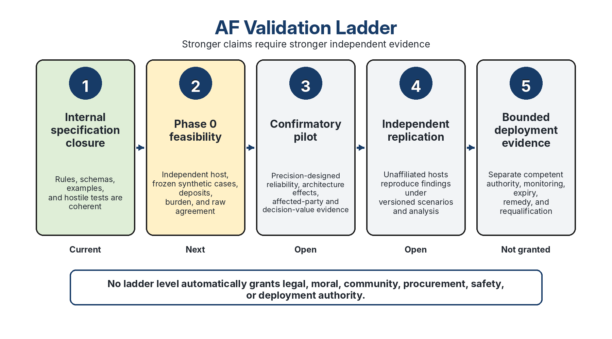

**Figure 11. Stronger claims require stronger independent evidence; no validation stage itself grants legal, moral, community, procurement, safety, or deployment authority.**

## 11.1 Current maturity

Auditable Flourishing v6.2 remains an L1–L2 protocol architecture. It is suitable for adversarial review, synthetic replay, reviewer calibration, and external pilot design. It has not demonstrated inter-reviewer reliability, architecture-fair application across independent candidates, predictive validity, affected-party legitimacy, or safe administration in live rights-sensitive settings. No result under this version constitutes deployment authorization or comparative superiority.

## 11.2 Validation matrix

The validation matrix in Table 22 separates stronger empirical claims from the present architectural evidence.

**Table 22. Each stronger validity claim requires external evidence that the present L1–L2 architecture does not yet possess.**

| **Validation question** | **Evidence required** |
| --- | --- |
| **Can reviewers understand C0–C5?** | cognitive interviews, interpretation probes, and calibration cases |
| **Can reviewers apply them consistently?** | criterion-level agreement, disagreement analysis, and anchor revision using agreement measures appropriate to the design (Gwet, 2014; Krippendorff, 2018) |
| Is the final conjunctive Stage A decision reliable? | direct agreement on the public status and six-criterion vector, raw agreement, reason-coded disagreement, uncertainty intervals, and preregistered consequence of a miss |
| Does the protocol produce an informative comparison set? | Stage-A admissibility and Indeterminate rates; eligible-pair count; Stage B dominance, incomparability, non-decisive, and refusal rates; reason-coded empty-set analysis |
| Are the twelve dimensions empirically distinct? | boundary-case agreement, reviewer burden, correlation and latent-structure analysis, architecture-specific differential performance, and versioned merge/split tests |
| **Can different architectures enter fairly?** | trials using computational, legal, institutional, deliberative, and community candidates |
| **Do Stage A findings identify material defects?** | historical or shadow-mode backtesting with known failures and false positives |
| **Do Stage B profiles distinguish meaningful strengths?** | convergent and discriminant validity analysis, causal and generalization checks, and affected-party review (Shadish et al., 2002) |
| **Does the protocol detect strategic compliance?** | adversarial entrants designed to simulate disclosure while hiding control or harm |
| **Does it impose harmful burden or exclusion?** | accessibility, participation, privacy, assistance, withdrawal, and administrative-burden audit |
| **What are the criterion-level false-exclusion and false-admission risks?** | known-case calibration, six-criterion vectors, reason-coded errors, architecture-stratified estimates, and uncertainty intervals |
| **Is Indeterminate used as a genuine uncertainty route rather than a disguised adverse finding?** | reason-coded Indeterminate cases, later evidence resolution, subgroup and architecture analysis, and reviewer interviews |
| **How do reviewer competence and affected-party participation change findings?** | preregistered panel-composition comparisons, competence records, affected-party assessments, and sensitivity analysis |
| **Can independent hosts administer it?** | at least two unaffiliated host teams using the same versioned package, concurrently or through a preregistered sequential replication |
| **Do patches improve later performance?** | longitudinal defect, patch, recurrence, and retirement records |

**Joint Stage A error must be estimated directly.** AF does not infer conjunction reliability by multiplying marginal criterion coefficients or marginal sensitivities/specificities. Such multiplication assumes independence and can materially misstate false-exclusion or false-clearance risk. Phase 0 and later studies therefore report the observed six-criterion vector, final Stage A status, reason-coded joint errors, and dependence/sensitivity analyses; simulated joint-error scenarios may be used only with explicit dependence assumptions.

Every Stage A validation report must publish the six-criterion vector as well as the final status. A final-status coefficient alone can conceal whether disagreement is concentrated in one unstable criterion, whether one criterion produces repeated false exclusion, or whether Indeterminate is functioning as an uncertainty safeguard or as a disguised adverse finding.

**Burden and feasibility protocol.** Version 6.2 does not claim observed internal burden data because the earlier synthetic development runs did not record a complete, audit-ready burden dataset. The first external pilot must preregister and report dossier-preparation hours, reviewer hours, calibration and adjudication hours, elapsed time, accessibility and translation support, assistance hours and direct cost where reportable, appeal burden, candidate-response burden, withdrawal, and non-participation. Revision triggers include excessive reviewer time relative to decision value; persistent inability of low-resource entrants to prepare dossiers; assistance that materially changes a finding; high withdrawal or non-participation; and repeated Indeterminate findings caused by protocol burden rather than candidate opacity.

**Power and precision planning.** A pilot must justify the number of cases, reviewers, architecture types, and affected-party assessments against its estimands. Formal power calculation is required only when an effect size, model, and decision threshold are defensible. Otherwise, the host uses precision-based planning, states the target interval width or classification uncertainty, and reports uncertainty intervals for criterion-level agreement, final Stage A agreement, Stage B category agreement, architecture-specific differential performance, burden distributions, affected-party assessments, and Stage B outcome rates.

A minimum next validation package should include at least three architecturally distinct candidates; at least one unaffiliated candidate; two unaffiliated host teams, either concurrently or through a preregistered sequential replication before architecture-fairness or reliability claims; independent ratings before deliberation; a compliance-theatre entrant; a rights-sensitive case with affected-party review; a low-resource or assisted dossier; a customary, Indigenous, community, or deliberative architecture selected and interpreted with appropriate competence and consent; one candidate expected to fail clearly; one boundary case likely to produce Indeterminate; publication of non-security-sensitive defects and patches; and a post-round revision, narrowing, retention, or retirement decision. The preregistration must state what findings would revise a criterion or anchor, merge or split dimensions, narrow a neutrality claim, suspend a challenge tier, or abandon a component.

## 11.2A Study tiers and material-construction gates

**Table 22A. Study labels are earned by completed materials and governance.**

| **Tier** | **Minimum materials and governance** | **Claims permitted** |
| --- | --- | --- |
| **Design-ready** | protocol, templates, draft scenario plan, training, analysis, burden and publication specifications | materials can be constructed and criticized |
| **Materials-ready** | frozen scenario library, hashes, practice bank, qualification rubric, deposit system, scripts, capacity plan | independent dry rehearsal |
| **Shadow-ready** | host and reviewers contracted; conflicts, custody, deposits, appeal, publication tested | non-dispositive study |
| **Pilot-ready** | live-scope legal/ethical/affected-party conditions, adverse-event and remedy plans funded | bounded live pilot under separate authority |
| **Replication-ready** | frozen post-pilot package and second-host transport plan | external replication |

AF v6.2 is **design-ready**, not materials-ready.

**Illustrative host-planning scenario (non-normative).** A host may estimate workload prospectively as `cases × independent reviewers × expected rating hours per case`, then add training, calibration, adjudication, accessibility/translation, analysis, appeal, and publication time separately. For example, 20 synthetic cases × 4 reviewers × 1.0-1.5 rating hours implies roughly 80-120 reviewer-hours before training and adjudication. This is a planning illustration, not an AF requirement or empirical burden claim; actual assumptions, ranges, staffing, calendar duration, and direct costs must be preregistered and replaced by observed burden data.

## 11.3 External validation, audit theatre, ablation, and decision value

The next study must be hosted outside the author's control, preregistered before candidate scoring, and designed to falsify both positive and negative expectations. At least two independent hosts should be used concurrently or through a preregistered sequential replication. Candidate families must include legal-institutional, community-deliberative, computational or hybrid, low-documentation, non-English or translated, low-resource, and rights-sensitive cases. Reviewer ratings occur independently before discussion.

The minimum comparator design contains: AF v6.2; a simpler structured checklist; domain standard of care; a minimal-documentation control; and an **audit-theatre arm** containing polished records with deliberately varied substantive safeguards. The theatre arm tests whether the protocol detects appearance without function or merely rewards paperwork.

Primary outcomes include criterion-level and final-status reliability, false clearance, false rejection, confidence calibration, appeal reversal, architecture-linked differential error, burden and abandonment, affected-party assessment, audit-theatre sensitivity and specificity, and decision-change accuracy. Decision value compares baseline and AF-informed decisions, defects discovered, false clearances prevented, false rejections created, uncertainty reduction, delay, cost, downstream outcomes, and net affected-party value. A positive decision change is not presumed.

Ablation removes one criterion, dimension, record, or administration requirement at a time and compares information, error prevention, burden, and outcome. Components that add cost without independent protective or informational value must be simplified, merged, narrowed, or retired. Redundancy that provides deliberate defense in depth is retained only when its distinct function and error cost are demonstrated.

The independent host holds the right to publish null, adverse, capture, burden, architecture-fairness, and protocol-failure findings without author or sponsor veto. Predeclared stopping rules cover retaliation, confidentiality breach, unmitigated affected-party harm, inaccessible administration, evidence tampering, and excessive burden. The final decision is not automatically `retain`; the valid outcomes are `retain`, `revise`, `restrict`, `pause`, `retire`, or `indeterminate`.

## 11.4 Structural yield, range restriction, perturbation fragility, and empty-comparison-set risk

A partial order can be honest and still be practically uninformative if nearly every pair is incomparable or non-decisive. Version 6.2 therefore treats dominance, incomparability, non-decisiveness, refusal, and empty comparison sets as empirical outcomes rather than assuming that strictness is automatically useful.

Under a stylized baseline in which two candidate profiles are independently and uniformly distributed across five categories on *n* dimensions, the exact probability of either-direction ordinal-profile dominance is:

$$P_{5}(n)=2\left[\left(\frac{3}{5}\right)^n-\left(\frac{1}{5}\right)^n\right].$$

Linear-text equivalent: `P_5(n) = 2[(3/5)^n - (1/5)^n]`.

Stage A changes the candidate population. If all *n* Stage B dimensions were independently restricted to categories `{2,3}` with equal probability, the corresponding structural probability would be:

$$P_{2}(n)=2\left[\left(\frac{3}{4}\right)^n-\left(\frac{1}{2}\right)^n\right].$$

Linear-text equivalent: `P_2(n) = 2[(3/4)^n - (1/2)^n]`. For twelve dimensions, `P_2(12) = 6.2864%`. This is a sensitivity bound, not a realistic forecast. The more defensible mixed thought experiment restricts only the five dimensions most directly aligned with C0-C5 while leaving seven dimensions on the five-category distribution. Under independence, its either-direction dominance probability is:

$$P_{mixed}=2\left[\left(\frac{3}{4}\right)^5\left(\frac{3}{5}\right)^7-\left(\frac{1}{2}\right)^5\left(\frac{1}{5}\right)^7\right]=1.3285\%.$$

Linear-text equivalent: `P_mixed = 2[(3/4)^5(3/5)^7 - (1/2)^5(1/5)^7] = 1.3285%`.

A second exploratory sensitivity separates category ties from perturbation attrition. Let `t` be the per-dimension tie rate under a simplified symmetric model and `d` the number of applicable dimensions:

$$P_{base}(t,d)=2\left[\left(\frac{1+t}{2}\right)^d-t^d\right].$$

Linear-text equivalent: `P_base(t,d) = 2[((1+t)/2)^d - t^d]`. Let `q` be the proportion of eligible candidate-dimension ratings that generate an **admitted** reversal-capable alternative. Any reported-dominance attrition model is an exploratory approximation because proposals, admissions, candidates, dimensions, and joint perturbations are dependent. Phase 0 measures `t`, proposal/admission/rejection rates, reversal capability, relation changes, and empirical survival of base dominance; versioned simulation code controls any forecast.

These calculations establish that truncation can raise base-profile dominance, but they do not establish that Stage B will “overwhelmingly” return any one public outcome. The full protocol additionally requires matched applicability, valid scenarios, no unresolved floor, and relation invariance across defended alternatives. A base dominance relation resting on one strict dimension can be fragile: an adjacent defended category may turn it into a tie or crossing, producing `non_decisive`. Conversely, an invariant crossing remains `incomparable`. The empirical distribution depends on candidate selection, cross-dimension dependence, anchor use, reviewer disagreement, scenario difficulty, and perturbation structure.

**Table 23. Structural dominance sensitivities and Monte Carlo uncertainty; none is an empirical forecast.**

| **Model** | **Dimensions / restriction** | **Latent correlation** | **Ordinal-dominance rate** | **Monte Carlo uncertainty** | **Interpretation** |
| --- | --- | ---: | ---: | --- | --- |
| Five-category independent | 4 | 0.00 | 25.60% | Exact | Structural baseline |
| Five-category independent | 6 | 0.00 | 9.32% | Exact | Structural baseline |
| Five-category independent | 8 | 0.00 | 3.36% | Exact | Structural baseline |
| Five-category independent | 12 | 0.00 | 0.4354% | Exact | Structural reference point under independence; truncation and correlation may raise this |
| Mixed restriction | 5 binary + 7 five-category | 0.00 | 1.3285% | Exact | Illustrates partial Stage A range restriction |
| Binary restriction | 12 binary categories `{2,3}` | 0.00 | 6.2864% | Exact | Strong truncation sensitivity, not a forecast |
| Five-category Gaussian copula | 12 | 0.30 | 11.2418% | SE 0.0447 percentage points; approximate 95% simulation interval 11.1542%-11.3294% | 500,000 draws, seed 20260725 |
| Five-category Gaussian copula | 12 | 0.60 | 34.4388% | SE 0.0672 percentage points; approximate 95% simulation interval 34.3071%-34.5705% | 500,000 draws, seed 20260725 |

The correlated simulations assume equicorrelated latent dimensions within each candidate profile, independence between candidate profiles, five equiprobable ordinal bins, 500,000 draws per setting, NumPy PCG64, and seed 20260725. The exact version-matched generating script is `stage_b_yield_simulation_v6_2.py` (SHA-256 `66c59a833ca23a1b028b5d4e9d4f70525e80dad8d6937fceaa3f50a583b631bc`). The intervals quantify Monte Carlo error under that named implementation, not uncertainty about real candidates.

Each study must preregister at least four yield hypotheses without selecting a preferred narrative after outcomes are known:

- **H-Y1:** Stage A range restriction raises base-profile dominance relative to the five-category independent baseline.
- **H-Y2:** defended perturbations convert a material share of base dominance relations into `non_decisive`.
- **H-Y3:** stable crossing profiles remain `incomparable` under symmetric perturbation rather than being automatically demoted.
- **H-Y4:** decision value may remain positive even when dominance yield is low, if the protocol improves defect localization, uncertainty disclosure, rights routing, or justified refusal without disproportionate burden.

Phase 0 reports criterion and layer-specific agreement, base relations, relation-set stability, burden, and audit-theatre detection; it is not powered for general yield claims. A later pilot preregisters expected Stage A and Stage B bands and a decision-relevant threshold for practically uninformative yield. Repeated near-zero eligible comparisons, high unstable-relation rates, architecture-linked error, or profiles that do not improve decisions or defect localization trigger C3-D07 and C4 review of granularity, anchors, evidence burden, challenge design, or Stage B retention.

## 11.5 C0-C5 self-audit

The evaluator must satisfy the minimum conditions it imposes on evaluated frameworks, adjusted for its role.

**Self-audit status note.** Table 24 is an author-conducted recursive assessment, not an independently administered Stage A review. “Closed” means that the current text and tracked release records contain a specified architectural patch; it does not mean that an external reviewer has verified implementation effectiveness. “No current code established” means that this self-audit has not positively established the corresponding defect. It does not prove defect absence.

**Table 24. Recursive application identifies protocol limits, revision triggers, and refusal conditions rather than self-certifying success.**

| **Criterion** | **Question for Auditable Flourishing** | **Defect-code assessment and v6.2 response** |
| --- | --- | --- |
| **C0 Inspectability** | Are normative commitments, exclusions, governance, control channels, scope, and release attestations explicit? | **C0-D04 closed architecturally; C0-D05 added.** Claims resolve to versioned paths, hashes, tests, results, and bounded scopes. External use must test scope narrowing, marketing drift, and adoption selection bias. |
| **C1 Rights protection** | Can the protocol unfairly exclude communities or architectures, and is the floor itself adequate? | **C1-D03 patched architecturally but unvalidated.** The rebuttable reference baseline, principled non-equivalence route, redress, and affected-party competence prevent disclosure-only passage, but external legal and community review must test whether the screen is too thin, too rigid, or culturally biased. |
| **C2 Auditability** | Can reviewers reconstruct why a candidate was found admissible, non-admissible, or indeterminate? | **C2-D01 closed architecturally; C2-D04 added.** Versioned evidence notices, perturbation records, adjudication records, defect logs, and patch conditions support replay. Independent multi-host replay remains unestablished. |
| **C3 Measurement integrity** | Are rubric categories, evidence maturity, confidence, burden, applicability, and distribution represented validly? | **C3-D06 closed architecturally** through the no-ordinal-arithmetic rule. **C3-D07 patched but provisional:** AF-SB12-v5.6 has coverage groups, symmetric relation replay, range-restriction sensitivity, and revision triggers, but its empirical adequacy and reliability remain unvalidated. |
| **C4 Corrigibility** | What evidence would force revision, withdrawal, or retirement, and who may trigger review? | **No current code established.** Low reliability, architecture bias, empty comparison sets, missed harm, strategic compliance, excessive burden, affected-party petition, or failed external administration trigger revision or withdrawal. Effectiveness is untested longitudinally. |
| **C5 Refusal and execution boundary** | When must the protocol refuse to evaluate or compare? | **No current code established.** Inadequate competence, unmanaged conflicts, insufficient evidence, absent necessary participation, incompatible scopes, unstable anchors, version mismatch, or unresolved protocol defect trigger refusal or indeterminacy. |

## 11.6 Next scientific step and programme risks

The next advance is not conceptual expansion. It is independent administration, external replay, diverse candidates, calibration, affected-party review, and publication of failures. Three programme risks must be reported rather than hidden: candidate recruitment may fail or produce severe selection bias; legitimacy processes may stall without independent funding and convening authority; and some domains may lack enough qualified reviewers for AF-High-Consequence administration. The core normative kernel should remain frozen during the first external pilot except for defects that create immediate rights, fairness, or interpretability risks. The evidence-maturity transition is summarized in Figure 11 and Table 22.

## 11.7 Protocol stewardship, amendment, succession, and capture resistance

A protocol that evaluates authority cannot leave its own authority implicit. Auditable Flourishing therefore distinguishes release maintenance from normative stewardship. At L1–L2, the author remains the release maintainer and source custodian, but this role does not confer power to certify AF, validate its effectiveness, adjudicate an affiliated challenge, or unilaterally entrench a constitutional change. Public review, recorded dissent, appeal, versioned provenance, role separation, and succession are normal safeguards in credible standards processes; AF adapts these ideas without claiming institutional equivalence to established standards bodies (Ostrom, 1990; ISEAL Alliance, 2025; International Organization for Standardization & International Electrotechnical Commission, 2024; World Wide Web Consortium, 2025).

A future stewardship charter must identify: repository and signing control; maintainer, editor, rights-review, affected-party, technical, and appeal roles; terms and rotation; conflicts and funding; decision and quorum rules; consultation periods; treatment of sustained objections and minority reports; appeal and reopening conditions; security and confidentiality exceptions; amendment provenance; deprecation and transition; and succession. No single author, sponsor, vendor, host, or stakeholder class may unilaterally amend C0–C5, the constitutional class, protected-floor routing, refusal, or the authorization boundary.

Table 25 defines the minimum process for each class of AF amendment.

Every release publishes a machine-readable E/O/C/X change-class ledger naming affected artifacts, rationale, review route, acceptance test, requalification consequence, and disputed classifications. A contested classification cannot be lowered solely by the author to avoid required review.

**Table 25. Amendment classes prevent editorial maintenance from silently becoming constitutional authority.**

| **Class** | **Examples** | **Minimum process** | **Release consequence** |
| --- | --- | --- | --- |
| **E - Editorial and release integrity** | typographical repair, formatting, URL metadata, non-semantic verifier hardening | public changelog; regression verification; confirmation that semantics are unchanged | patch release |
| **O - Operational and measurement** | administration workflow, schema, calibration procedure, assistance pathway, evidence template | public proposal; impact and burden analysis; companion propagation; independent technical and affected-party review; dissent record | minor release and pilot requalification where material |
| **C - Constitutional** | C0–C5, constitutional-class boundary, protected floors, refusal, authorization, or comparison logic | independent stewardship process; public consultation; rights/legal and affected-party representation; conflict controls; formal objections and reasoned disposition; transition and requalification plan | major release; author alone cannot enact |
| **X - Urgent integrity correction** | false attestation, security exposure, harmful ambiguity, corrupted release | narrowly scoped temporary correction; public rationale; no concealed semantic expansion; explicit sunset and subsequent ordinary review | emergency patch, followed by E/O/C review |

Until an independent stewardship body exists, a proposed Class C change may be published only as a clearly labelled research proposal or fork, not as independently governed canonical authority. If the author or custodian becomes unavailable, the last signed and hash-pinned release remains frozen. A successor may claim continuity only after publishing a governance charter, provenance chain, repository-control record, conflicts, consultation and objection process, and a versioned succession decision. The CC BY licence permits forks, but a fork must disclose lineage and may not represent itself as the canonical AF release without the corresponding public stewardship record.

Affected parties may petition for amendment, retirement, or reinterpretation through the protocol-petition route. Constitutional and operational proposals must disclose expected benefits, exclusion and opportunity costs, rights effects, implementation burden, evidence maturity, reversibility, and what result would cause withdrawal. Sustained objections and minority views remain attached to the release record rather than being erased by a majority disposition. These safeguards are minimum design commitments; their effectiveness remains an external validation question tracked under C0-D06 and C4-D03.

The independent v5.9 finding and v6.2 correction closure are preserved in Appendix C so the main argument ends with the current validation boundary rather than release-management history.

# 12. Conclusion {#conclusion}

Auditable Flourishing v6.2 provides a complete internal specification and Phase 0 design package for a bounded question: has a versioned framework claiming to support flourishing established enough reality contact, rights protection, auditability, measurement integrity, corrigibility, and refusal discipline to enter a scoped comparison, and can that comparison be reported without manufacturing a winner or authority the evidence does not support?

Its central architecture remains non-compensatory. Protected floors cannot be purchased with aggregate gains. Ordinal categories are not arithmetic. Invariant crossing, unstable relations, indeterminacy, refusal, and patchable failure are legitimate outputs. Evaluation, legal conformity, moral adequacy, community legitimacy, selection, authorization, and execution remain separate.

Version 6.2 does not alter the C0-C5 constitutional class, the binding Stage A precedence, AF-SB12-v5.6, the stable AF-SB-RELATION-v6.0 component, or the Stage B comparison semantics. It closes the publication-integrity and provenance layer: duplicate and misleading provenance records are removed or relabelled; a machine-readable canonical registry binds artifact authority, status vocabulary, Stage A precedence, Stage B dimensions, stable identifiers, and evidence boundaries; load-bearing external factual anchors are reverified against official or primary sources; and the root verifier checks cross-artifact synchronization without requiring a spreadsheet application. These changes make the package easier to inspect, cite, deposit, and challenge without converting internal verification into empirical validation.

That is the defensible boundary of completion. The specification is ready for independent contact with reality; it is not entitled to a positive result. Reliability, architecture fairness, decision value, affected-party legitimacy, constitutional legitimacy, burden, capture resistance, and downstream effects remain open empirical and institutional questions. The protocol advances only when independent reviewers, affected parties, competent authorities, and observed outcomes can revise, restrict, or retire what the evidence does not support.

## Release 6.2 control clarifications: evidence states, replay, and non-erasure

AF v6.2 preserves the canonical Stage A and Stage B architecture while making three control boundaries explicit. These clarifications are operational and machine-readable; they do not convert AF into legal, moral, procurement, or deployment authority.

### A. Three-axis decision record

Every adjudicated case records three distinct outputs:

1. **Decision status** — the public Stage A result produced by the canonical precedence rule.
2. **Evidence state** — whether each material criterion is established, unresolved, conflicting, stale, or outside the validity domain.
3. **Review state** — whether the record is unreviewed, independently reviewed, adjudicated, appealed, or closed.

These axes must not be collapsed. A refusal prerequisite does not erase an already established defect; an unresolved criterion does not neutralize a known rights or protected-floor failure; and consensus does not transform weak evidence into strong evidence. Systems may display one public decision status, but the complete audit record retains all material evidence and review flags.

### B. Non-erasure invariant

Let `K` be the set of established material defects, `U` the set of unresolved material criteria, and `P` the set of protocol prerequisites. The case record is valid only if:

`K_output = K_input` unless a cited, reviewable correction changes the underlying evidence.

Accordingly:

- missing prerequisites may require procedural refusal, but they cannot delete a known defect;
- indeterminacy on one criterion cannot mask an established unpatchable or patchable defect on another;
- later controls may change a defect only when the control is specified, owned, testable, and supported by new evidence; and
- appeal or re-review creates a new versioned record rather than silently rewriting the prior record.

### C. Perturbation replay admissibility

A proposed alternative enters replay only when it identifies the candidate, affected dimension, alternative category, anchor conflict, supporting evidence, and materiality. Duplicate, immaterial, unsupported, or strategically timed proposals are rejected and counted under the anti-inflation control. A supported dissent cannot be rejected merely because it changes a preferred result; rejection requires recorded reasons and access to appeal.

Admitted single alternatives are replayed individually. Coupled alternatives are replayed jointly only when the coupling was preregistered or is independently justified before results are inspected. The replay reports the resulting relation set: dominance, crossing/incomparability, tie or instability, non-decisiveness, or refusal caused by an invalid prerequisite.

### D. Stage B robustness and non-double-counting

Stage B remains a partial-order comparison, not a compulsory scalar score. Reviewers must report:

- the relation under the frozen profile;
- material crossings and incomparable dimensions;
- sensitivity to admissible anchors or weights;
- correlated or overlapping indicators that could double-count one underlying effect; and
- whether a dissent proposal changes the relation without violating Stage A.

Where double-counting cannot be ruled out, the affected comparison is flagged and cannot support a stronger claim than the least-assured contributing measure.

### E. Reliability and validation boundary

Raw agreement, chance-corrected reliability, adjudicated consensus, and external validity are separate quantities. The workbook may aggregate or import these measures, but it must not infer independence from agreement, calculate external validity from internal consistency, or treat an adjudicated consensus record as an independent second rating. Empirical validation requires preregistered cases, reviewer independence controls, retained disagreements, and evidence from settings not used to tune the protocol.

### F. Claim boundary

A successful internal verifier establishes artifact integrity and specified control conformance only. It does not establish that the framework is empirically valid, constitutionally legitimate, legally compliant, ethically certified, procurement-approved, or authorized for execution. Those conclusions require separate institutions, evidence, and authority.

# References

Ada Lovelace Institute, AI Now Institute, & Open Government Partnership. (2021). Algorithmic accountability for the public sector: Learning from the first wave of policy implementation. [https://www.opengovpartnership.org/wp-content/uploads/2021/08/algorithmic-accountability-public-sector.pdf](https://www.opengovpartnership.org/wp-content/uploads/2021/08/algorithmic-accountability-public-sector.pdf)

Alexy, R. (2002). A theory of constitutional rights (J. Rivers, Trans.). Oxford University Press.

Alkire, S., Mishra, R., Selden, L., & Suppa, N. (2025). The global Multidimensional Poverty Index (MPI) 2025: Country results and methodological note (OPHI MPI Methodological Note No. 61). Oxford Poverty and Human Development Initiative.

Almada, M. (2019). Human intervention in automated decision-making: Toward the construction of contestable systems. Proceedings of the Seventeenth International Conference on Artificial Intelligence and Law, 2-11. [https://doi.org/10.1145/3322640.3326699](https://doi.org/10.1145/3322640.3326699)

American Educational Research Association, American Psychological Association, & National Council on Measurement in Education. (2014). Standards for educational and psychological testing. American Educational Research Association.

Barocas, S., & Selbst, A. D. (2016). Big data's disparate impact. California Law Review, 104(3), 671-732. [https://doi.org/10.15779/Z38BG31](https://doi.org/10.15779/Z38BG31)

Block, S., Emerson, J. W., Esty, D. C., de Sherbinin, A., Wendling, Z. A., et al. (2024). 2024 Environmental Performance Index. Yale Center for Environmental Law & Policy. [https://epi.yale.edu](https://epi.yale.edu)

Bostrom, N. (2014). Superintelligence: Paths, dangers, strategies. Oxford University Press.

Campbell, D. T. (1979). Assessing the impact of planned social change. Evaluation and Program Planning, 2(1), 67-90. [https://doi.org/10.1016/0149-7189(79)90048-X](https://doi.org/10.1016/0149-7189(79)90048-X)

Center for Open Science. (n.d.). Registered Reports. https://www.cos.io/initiatives/registered-reports

Collier, D. (2011). Understanding process tracing. PS: Political Science & Politics, 44(4), 823-830. [https://doi.org/10.1017/S1049096511001429](https://doi.org/10.1017/S1049096511001429)

Committee on Economic, Social and Cultural Rights. (1990). General comment No. 3: The nature of States parties' obligations (art. 2, para. 1, of the Covenant). United Nations.

Council of Europe. (1950). Convention for the Protection of Human Rights and Fundamental Freedoms, Article 15. https://www.echr.coe.int/documents/d/echr/convention_ENG

Council of Europe. (2024). Council of Europe Framework Convention on Artificial Intelligence and Human Rights, Democracy and the Rule of Law (CETS No. 225). Council of Europe. [https://www.coe.int/en/web/artificial-intelligence/the-framework-convention-on-artificial-intelligence](https://www.coe.int/en/web/artificial-intelligence/the-framework-convention-on-artificial-intelligence)

European Court of Human Rights. (2025). Guide on Article 15 of the European Convention on Human Rights: Derogation in time of emergency. https://ks.echr.coe.int/documents/d/echr-ks/guide_art_15_eng

European Parliament and Council of the European Union. (2024). Regulation (EU) 2024/1689 of 13 June 2024 laying down harmonised rules on artificial intelligence and amending Regulations (EC) No 300/2008, (EU) No 167/2013, (EU) No 168/2013, (EU) 2018/858, (EU) 2018/1139 and (EU) 2019/2144 and Directives 2014/90/EU, (EU) 2016/797 and (EU) 2020/1828 (Artificial Intelligence Act). Official Journal of the European Union, L, 2024/1689. [https://eur-lex.europa.eu/eli/reg/2024/1689/oj](https://eur-lex.europa.eu/eli/reg/2024/1689/oj)

European Union Agency for Fundamental Rights. (2025). Assessing high-risk artificial intelligence: Fundamental rights risks. Publications Office of the European Union. [https://fra.europa.eu/en/publication/2025/assessing-high-risk-ai](https://fra.europa.eu/en/publication/2025/assessing-high-risk-ai)

Gebru, T., Morgenstern, J., Vecchione, B., Vaughan, J. W., Wallach, H., Daumé III, H., & Crawford, K. (2021). Datasheets for datasets. Communications of the ACM, 64(12), 86-92. [https://doi.org/10.1145/3458723](https://doi.org/10.1145/3458723)

Goodhart, C. A. E. (1984). Problems of monetary management: The U.K. experience. In C. A. E. Goodhart, Monetary theory and practice: The U.K. experience (pp. 91-121). Macmillan.

Gwet, K. L. (2014). Handbook of inter-rater reliability: The definitive guide to measuring the extent of agreement among raters (4th ed.). Advanced Analytics, LLC.

Hadfield-Menell, D., Russell, S. J., Abbeel, P., & Dragan, A. D. (2016). Cooperative inverse reinforcement learning. Advances in Neural Information Processing Systems, 29.

Harris, P. A., Taylor, R., Thielke, R., Payne, J., Gonzalez, N., & Conde, J. G. (2009). Research electronic data capture (REDCap): A metadata-driven methodology and workflow process for providing translational research informatics support. Journal of Biomedical Informatics, 42(2), 377-381. https://doi.org/10.1016/j.jbi.2008.08.010

Human Rights Committee. (2001). General comment No. 29: States of emergency (Article 4) (CCPR/C/21/Rev.1/Add.11). United Nations.

Human Rights Measurement Initiative. (n.d.). Rights Tracker. Retrieved July 11, 2026, from [https://rightstracker.org/](https://rightstracker.org/)

Institute for Economics & Peace. (2026). Global Peace Index 2026: Identifying and measuring the factors that drive peace. Institute for Economics & Peace. [https://www.visionofhumanity.org/resources/](https://www.visionofhumanity.org/resources/)

International Auditing and Assurance Standards Board. (2013). International Standard on Assurance Engagements 3000 (Revised): Assurance engagements other than audits or reviews of historical financial information. International Federation of Accountants. https://www.iaasb.org/publications/international-standard-assurance-engagements-isae-3000-revised-assurance-engagements-other-audits-or

International Organization for Standardization & International Electrotechnical Commission. (2024). *ISO/IEC Directives, Part 1: Procedures for the technical work - Consolidated ISO Supplement: Procedures specific to ISO* (Edition 2024, V01/2024). Retrieved July 27, 2026, from https://www.iso.org/sites/directives/current/consolidated/

International Organization for Standardization. (2018). ISO 31000:2018 Risk management - Guidelines. International Organization for Standardization.

International Organization for Standardization. (2020). ISO/IEC 17000:2020 Conformity assessment - Vocabulary and general principles. International Organization for Standardization. https://www.iso.org/standard/73029.html

International Organization for Standardization. (2023a). ISO/IEC 23894:2023 Information technology - Artificial intelligence - Guidance on risk management. International Organization for Standardization.

International Organization for Standardization. (2023b). ISO/IEC 42001:2023 Information technology - Artificial intelligence - Management system. International Organization for Standardization.

ISEAL Alliance. (2025). *ISEAL Code of Good Practice for Sustainability Systems, version 1.1*. https://isealalliance.org/get-involved/resources/iseal-code-good-practice-sustainability-systems-v11

Joint Committee on Standards for Educational Evaluation. (2011). The program evaluation standards: A guide for evaluators and evaluation users (3rd ed.). SAGE.

Kaufmann, D., Kraay, A., & Mastruzzi, M. (2010). The Worldwide Governance Indicators: Methodology and analytical issues (World Bank Policy Research Working Paper No. 5430). World Bank. [https://doi.org/10.1596/1813-9450-5430](https://doi.org/10.1596/1813-9450-5430)

Kelly, T. (2004). A systematic approach to safety case management. SAE Technical Paper 2004-01-1779. https://doi.org/10.4271/2004-01-1779

Krippendorff, K. (2018). Content analysis: An introduction to its methodology (4th ed.). SAGE.

Lahdelma, R., Hokkanen, J., & Salminen, P. (1998). SMAA - Stochastic multiobjective acceptability analysis. European Journal of Operational Research, 106(1), 137-143. https://doi.org/10.1016/S0377-2217(97)00163-X

Lam, K., Lange, B., Blili-Hamelin, B., Davidovic, J., Brown, S., & Hasan, A. (2024). A framework for assurance audits of algorithmic systems. Proceedings of the 2024 ACM Conference on Fairness, Accountability, and Transparency, 1078–1092. https://doi.org/10.1145/3630106.3658957

Lempert, R. J., Popper, S. W., & Bankes, S. C. (2003). Shaping the next one hundred years: New methods for quantitative, long-term policy analysis. RAND Corporation.

Liddell, T. M., & Kruschke, J. K. (2018). Analyzing ordinal data with metric models: What could possibly go wrong? Journal of Experimental Social Psychology, 79, 328-348. [https://doi.org/10.1016/j.jesp.2018.08.009](https://doi.org/10.1016/j.jesp.2018.08.009)

Manheim, D., & Garrabrant, S. (2018). Categorizing variants of Goodhart's Law. arXiv. [https://arxiv.org/abs/1803.04585](https://arxiv.org/abs/1803.04585)

Messick, S. (1995). Validity of psychological assessment: Validation of inferences from persons' responses and performances as scientific inquiry into score meaning. American Psychologist, 50(9), 741-749. [https://doi.org/10.1037/0003-066X.50.9.741](https://doi.org/10.1037/0003-066X.50.9.741)

Mitchell, M., Wu, S., Zaldivar, A., Barnes, P., Vasserman, L., Hutchinson, B., Spitzer, E., Raji, I. D., & Gebru, T. (2019). Model cards for model reporting. Proceedings of the Conference on Fairness, Accountability, and Transparency, 220-229. [https://doi.org/10.1145/3287560.3287596](https://doi.org/10.1145/3287560.3287596)

Mökander, J., Schuett, J., Kirk, H. R., & Floridi, L. (2024). Auditing large language models: A three-layered approach. AI and Ethics, 4, 1085-1115. [https://doi.org/10.1007/s43681-023-00289-2](https://doi.org/10.1007/s43681-023-00289-2)

Muller, J. Z. (2018). The tyranny of metrics. Princeton University Press.

National Institute of Standards and Technology. (2023). Artificial intelligence risk management framework (AI RMF 1.0) (NIST AI 100-1). U.S. Department of Commerce. [https://doi.org/10.6028/NIST.AI.100-1](https://doi.org/10.6028/NIST.AI.100-1)

National Institute of Standards and Technology. (2024). Artificial Intelligence Risk Management Framework: Generative Artificial Intelligence Profile (NIST AI 600-1). U.S. Department of Commerce. [https://doi.org/10.6028/NIST.AI.600-1](https://doi.org/10.6028/NIST.AI.600-1)

Nussbaum, M. C. (2011). Creating capabilities: The human development approach. Harvard University Press.

Open Source Initiative. (2024). The Open Source AI Definition, version 1.0. Open Source Initiative. [https://opensource.org/ai/open-source-ai-definition](https://opensource.org/ai/open-source-ai-definition)

Ord, T. (2020). The precipice: Existential risk and the future of humanity. Hachette Books.

Organisation for Economic Co-operation and Development. (2019a). Better criteria for better evaluation: Revised evaluation criteria definitions and principles for use. OECD Publishing.

Organisation for Economic Co-operation and Development. (2019b). Recommendation of the Council on Artificial Intelligence (OECD/LEGAL/0449; amended 2024). OECD Legal Instruments. [https://legalinstruments.oecd.org/en/instruments/OECD-LEGAL-0449](https://legalinstruments.oecd.org/en/instruments/OECD-LEGAL-0449)

Organisation for Economic Co-operation and Development. (2023). The state of implementation of the OECD AI Principles four years on. OECD Publishing.

Organization of American States. (1969). American Convention on Human Rights, Article 27. https://www.oas.org/dil/treaties_b-32_american_convention_on_human_rights.pdf

Ostrom, E. (1990). Governing the commons: The evolution of institutions for collective action. Cambridge University Press.

Pintér, L., Hardi, P., Martinuzzi, A., & Hall, J. (2012). Bellagio STAMP: Principles for sustainability assessment and measurement. Ecological Indicators, 17, 20-28. [https://doi.org/10.1016/j.ecolind.2011.07.001](https://doi.org/10.1016/j.ecolind.2011.07.001)

Raji, I. D., Smart, A., White, R. N., Mitchell, M., Gebru, T., Hutchinson, B., Smith-Loud, J., Theron, D., & Barnes, P. (2020). Closing the AI accountability gap: Defining an end-to-end framework for internal algorithmic auditing. Proceedings of the 2020 Conference on Fairness, Accountability, and Transparency, 33-44. [https://doi.org/10.1145/3351095.3372873](https://doi.org/10.1145/3351095.3372873)

Raworth, K. (2017). Doughnut economics: Seven ways to think like a 21st-century economist. Chelsea Green Publishing.

Richardson, K., Steffen, W., Lucht, W., Bendtsen, J., Cornell, S. E., Donges, J. F., Drüke, M., Fetzer, I., Bala, G., von Bloh, W., Feulner, G., Fiedler, S., Gerten, D., Gleeson, T., Hofmann, M., Huiskamp, W., Kummu, M., Mohan, C., Nogués-Bravo, D., ... Rockström, J. (2023). Earth beyond six of nine planetary boundaries. Science Advances, 9(37), eadh2458. [https://doi.org/10.1126/sciadv.adh2458](https://doi.org/10.1126/sciadv.adh2458)

Robeyns, I. (2017). Wellbeing, freedom and social justice: The capability approach re-examined. Open Book Publishers. [https://doi.org/10.11647/OBP.0130](https://doi.org/10.11647/OBP.0130)

Rockström, J., Gupta, J., Qin, D., Lade, S. J., Abrams, J. F., Andersen, L. S., Armstrong McKay, D. I., Bai, X., Bala, G., Bunn, S. E., Ciobanu, D., DeClerck, F., Ebi, K., Gifford, L., Gordon, C., Hasan, S., Kanie, N., Lenton, T. M., Loriani, S., ... Zhang, X. (2023). Safe and just Earth system boundaries. Nature, 619, 102-111. [https://doi.org/10.1038/s41586-023-06083-8](https://doi.org/10.1038/s41586-023-06083-8)

Rockström, J., Steffen, W., Noone, K., Persson, A., Chapin, F. S., III, Lambin, E. F., Lenton, T. M., Scheffer, M., Folke, C., Schellnhuber, H. J., Nykvist, B., de Wit, C. A., Hughes, T., van der Leeuw, S., Rodhe, H., Sörlin, S., Snyder, P. K., Costanza, R., Svedin, U., ... Foley, J. A. (2009). A safe operating space for humanity. Nature, 461, 472-475. [https://doi.org/10.1038/461472a](https://doi.org/10.1038/461472a)

Roy, B. (1968). Classement et choix en présence de points de vue multiples. Revue française d'informatique et de recherche opérationnelle. Série verte, 2(V1), 57–75. https://www.numdam.org/item/RO_1968__2_1_57_0/

Royal Society Open Science. (n.d.). Registered Reports. https://royalsocietypublishing.org/rsos/registered-reports

Russell, S. (2019). Human compatible: Artificial intelligence and the problem of control. Viking.

Rustad, S. A. (2026). Conflict trends: A global overview, 1946-2025. PRIO Paper. Peace Research Institute Oslo. [https://www.prio.org/publications/14802](https://www.prio.org/publications/14802)

Sakschewski, B., Caesar, L., Andersen, L. S., Bechthold, M., Bergfeld, L., Beusen, A., Billing, M., Bodirsky, B. L., Botsyun, S., Dennis, D., Donges, J. F., Dou, X., Eriksson, A., Fetzer, I., Gerten, D., Häyhä, T., Hebden, S., Heckmann, T., Heilemann, A., ... Rockström, J. (2025). Planetary Health Check 2025: A scientific assessment of the state of the planet. Potsdam Institute for Climate Impact Research. [https://doi.org/10.48485/pik.2025.017](https://doi.org/10.48485/pik.2025.017)

Scriven, M. (1991). Evaluation thesaurus (4th ed.). SAGE.

Selbst, A. D., Boyd, D., Friedler, S. A., Venkatasubramanian, S., & Vertesi, J. (2019). Fairness and abstraction in sociotechnical systems. Proceedings of the Conference on Fairness, Accountability, and Transparency, 59-68. [https://doi.org/10.1145/3287560.3287598](https://doi.org/10.1145/3287560.3287598)

Sen, A. (1999). Development as freedom. Knopf.

Sen, A. (2017). Reason and justice: The optimal and the maximal. *Philosophy, 92*(1), 5-19. https://doi.org/10.1017/S0031819116000309

Shadish, W. R., Cook, T. D., & Campbell, D. T. (2002). Experimental and quasi-experimental designs for generalized causal inference. Houghton Mifflin.

Soares, N., Fallenstein, B., Armstrong, S., & Yudkowsky, E. (2015). Corrigibility. In Workshops at the Twenty-Ninth AAAI Conference on Artificial Intelligence.

Steffen, W., Richardson, K., Rockström, J., Cornell, S. E., Fetzer, I., Bennett, E. M., Biggs, R., Carpenter, S. R., de Vries, W., de Wit, C. A., Folke, C., Gerten, D., Heinke, J., Mace, G. M., Persson, L. M., Ramanathan, V., Reyers, B., & Sörlin, S. (2015). Planetary boundaries: Guiding human development on a changing planet. Science, 347(6223), 1259855. [https://doi.org/10.1126/science.1259855](https://doi.org/10.1126/science.1259855)

Stiglitz, J. E., Sen, A., & Fitoussi, J.-P. (2009). Report by the Commission on the Measurement of Economic Performance and Social Progress. Commission on the Measurement of Economic Performance and Social Progress.

Stufflebeam, D. L., & Coryn, C. L. S. (2014). Evaluation theory, models, and applications (2nd ed.). Jossey-Bass.

Toulmin, S. E. (1958). The uses of argument. Cambridge University Press.

Tsakyrakis, S. (2009). Proportionality: An assault on human rights? International Journal of Constitutional Law, 7(3), 468-493. [https://doi.org/10.1093/icon/mop011](https://doi.org/10.1093/icon/mop011)

UNESCO. (2021). Recommendation on the Ethics of Artificial Intelligence. UNESCO. [https://unesdoc.unesco.org/ark:/48223/pf0000381137](https://unesdoc.unesco.org/ark:/48223/pf0000381137)

United Nations Development Programme, & Oxford Poverty and Human Development Initiative. (2025). *2025 Global Multidimensional Poverty Index (MPI): Overlapping hardships - Poverty and climate hazards*. United Nations Development Programme. [https://hdr.undp.org/content/2025-global-multidimensional-poverty-index-mpi](https://hdr.undp.org/content/2025-global-multidimensional-poverty-index-mpi)

United Nations Development Programme. (2025). Human Development Report 2025: A matter of choice: People and possibilities in the age of AI. United Nations Development Programme.

United Nations Economic and Social Council. (1985). Siracusa Principles on the Limitation and Derogation Provisions in the International Covenant on Civil and Political Rights (UN Doc. E/CN.4/1985/4, Annex). United Nations.

United Nations General Assembly. (1948). Universal Declaration of Human Rights.

United Nations General Assembly. (1966a). International Covenant on Civil and Political Rights.

United Nations General Assembly. (1966b). International Covenant on Economic, Social and Cultural Rights.

United Nations Human Rights Office of the High Commissioner. (2011). Guiding Principles on Business and Human Rights. https://www.ohchr.org/documents/publications/guidingprinciplesbusinesshr_en.pdf

United Nations Statistics Division. (2025). Sustainable Development Goals report 2025: Goal 1. United Nations. [https://unstats.un.org/sdgs/report/2025/goal-01/](https://unstats.un.org/sdgs/report/2025/goal-01/)

United Nations. (1951). Convention relating to the Status of Refugees, Article 33.

United Nations. (1984). Convention against Torture and Other Cruel, Inhuman or Degrading Treatment or Punishment, Article 3. https://www.ohchr.org/en/instruments-mechanisms/instruments/convention-against-torture-and-other-cruel-inhuman-or-degrading

VanderWeele, T. J., Johnson, B. R., Bialowolski, P. T., Bonhag, R., Bradshaw, M., Breedlove, T., Case, B., Chen, Y., Chen, Z. J., Counted, V., Cowden, R. G., de la Rosa, P. A., Felton, C., Fogleman, A., Gibson, C., Grigoropoulou, N., Gundersen, C., Jang, S. J., Johnson, K. A., ... Yancey, G. (2025). The Global Flourishing Study: Study profile and initial results on flourishing. Nature Mental Health, 3(6), 636-653. [https://doi.org/10.1038/s44220-025-00423-5](https://doi.org/10.1038/s44220-025-00423-5)

Varieties of Democracy Project. (2025). Varieties of Democracy (V-Dem) Dataset v15. University of Gothenburg. [https://www.v-dem.net/data/the-v-dem-dataset/](https://www.v-dem.net/data/the-v-dem-dataset/)

Webber, G. (2009). The negotiable constitution: On the limitation of rights. Cambridge University Press.

World Bank. (2025a, June 5). June 2025 update to global poverty lines. [https://www.worldbank.org/en/news/factsheet/2025/06/05/june-2025-update-to-global-poverty-lines](https://www.worldbank.org/en/news/factsheet/2025/06/05/june-2025-update-to-global-poverty-lines)

World Bank. (2025b). Worldwide Governance Indicators. [https://www.worldbank.org/en/publication/worldwide-governance-indicators](https://www.worldbank.org/en/publication/worldwide-governance-indicators)

World Bank. (2026, March 26). March 2026 global poverty update from the World Bank: New data and updated poverty numbers. [https://blogs.worldbank.org/en/opendata/march-2026-global-poverty-update-from-the-world-bank--new-data-a](https://blogs.worldbank.org/en/opendata/march-2026-global-poverty-update-from-the-world-bank--new-data-a)

World Health Organization Commission on Social Determinants of Health. (2008). Closing the gap in a generation: Health equity through action on the social determinants of health. World Health Organization.

World Meteorological Organization. (2026, January 14). WMO confirms 2025 was one of warmest years on record. [https://wmo.int/news/media-centre/wmo-confirms-2025-was-one-of-warmest-years-record](https://wmo.int/news/media-centre/wmo-confirms-2025-was-one-of-warmest-years-record)

World Wide Web Consortium. (2025, August 18). *W3C Process Document*. https://www.w3.org/policies/process/20250818/

# Appendix A. Declarations and Release Record

| **Item** | **Statement** |
| --- | --- |
| **Funding** | No external funding was reported for this working-paper release. The author reports no funding from any government, vendor, institution, or candidate-framework sponsor for its development or promotion. |
| **Competing interests** | The author is the originator of the MathGov framework and the RippleLogic decision architecture, which may be examined only as disclosed seed entrants. Auditable Flourishing does not presume their superiority. Any comparative claim involving an affiliated entrant requires independent administration, disclosed conflicts, architecturally distinct comparison candidates, immutable pre-discussion ratings, and public replay materials. |
| **Affiliation and institutional endorsement** | British University Vietnam is reported solely as the author's affiliation. The institution is not represented as the publisher, sponsor, reviewer, owner, or endorser of Auditable Flourishing unless a separate authorized statement establishes otherwise. |
| **Data and materials availability** | No new human-subjects data were collected. The release uses cited public sources, synthetic scenarios, templates, schemas, and reviewer artifacts. The v6.2 package includes the core paper, nine named normative companions, a concise methods article, a master reference catalog, a versioned reproducibility supplement, an aggregation workbook, a release-verification record, parent and child manifests, current SHA-256 inventories, an inheritance statement, a requirement-ownership trace, and local verification tools. The complete versioned package should accompany any operational or journal-level claim that depends on delegated rules. Binary-format, synchronization, figure-embedding, PDF-rendering, page-count, archive, and checksum attestations are valid only for the exact paths and hashes enumerated in the version-matched release-verification record. A manuscript excerpt or separately exported copy does not independently establish those properties. A persistent repository or preprint identifier is not yet assigned; the package contains deposit-ready metadata but does not claim a DOI. Before assignment, cite the exact version and external ZIP SHA-256. |
| **Evidence and reference snapshot** | Current contextual, legal, and bibliographic metadata were checked through 12 August 2026. Current-status claims are date-bounded and must be refreshed before later publication or policy use. |
| **Licence** | Author-controlled protocol text, original tables, and author-created figures are licensed under Creative Commons Attribution 4.0 International, unless a file states otherwise. Third-party sources, standards, legal texts, datasets, marks, and reproduced material remain subject to their original rights and licences. |
| **Author contributions** | Conceptualization, drafting, and protocol design: James McGaughran. AI-assisted drafting, synthesis, verification support, and formatting were used as editorial tools. Final responsibility remains with the human author. Any AI assistance used by future reviewers is governed separately and cannot be silently counted as independent human judgment. |
| **Document type** | Interdisciplinary protocol-design working paper and modular research-source release. |
| **Recommended pre-identifier citation** | McGaughran, J. (2026). *Auditable Flourishing: A Non-Compensatory Assurance Protocol for Frameworks Claiming to Support Flourishing* (Version 6.2) [Working paper]. Cite with the external release ZIP SHA-256 until a persistent identifier is assigned. |
| **Release record** | Release date: 15 August 2026; release timestamp: 2026-08-15T09:00:00Z; release identifier: AF-v6.2; source snapshot: version-matched package manifest; supersedes AF-v6.0; active unless superseded by a later signed release record. |
| **Ethics statement** | This is a protocol-design contribution, not a human-subjects study. Live pilots involving persons, communities, or sensitive data require appropriate legal, ethical, institutional, and affected-party review. Phase 0 uses frozen synthetic cases and does not permit claims about live affected-party legitimacy or domain validity. |

# Appendix B. Version History and Changelog

Version 6.2 is a bounded publication-integrity, provenance, and verification release. It supersedes v6.0 while preserving C0-C5 non-compensation, AF-SB12-v5.6, **AF-SB-RELATION-v6.0**, the authority vector, CL0-CL6 ladder, Stage A routing precedence, and the external-validation boundary. No framework score, floor, anchor, status meaning, comparison relation, or authorization boundary is relaxed or expanded.

Version 6.0 supplied the substantive semantic-integrity, perturbation-governance, measurement-discipline, and communication corrections: controlled admissibility became control-dependent; Table 5B, floor tiers, repairability, Stage B subreasons, a common anchor ladder, and compact matrix were added; perturbation admission and C2-D05 were governed; ordinal weighted arithmetic was prohibited absent validated units; design-ready was separated from materials-ready; and reliability, factor, root-cause, authority-laundering, change-class, navigation, and synchronization controls were strengthened. Version 6.2 retains those corrections and adds one canonical registry, one artifact-authority policy, one external-fact verification record, deduplicated provenance, and a more portable verifier.

# Appendix C. v5.9/v6.0 Independent Findings, v6.1 Internal Baseline, and v6.2 Publication-Integrity Closure

The 12 and 13 August 2026 audits examined selected derivatives as well as the versioned package. The official versioned package contained genuine OOXML documents, but repeated non-conforming derivatives are themselves evidence of a distribution-control risk. Version 6.2 therefore distinguishes official-package integrity from derivative transport integrity: only exact paths and hashes covered by the release records support container, synchronization, navigation, page-count, or rendering claims. The audits also identified genuine internal, semantic, measurement, and communication issues.

| **Finding/recommendation** | **Disposition** | **Where and why** |
| --- | --- | --- |
| False or stale-format derivatives | Accepted as a distribution-control finding; not reproduced in the official package | official DOCX containers verified; derivative recurrence recorded; byte checks and `HOW_TO_VERIFY.md` added |
| Identifier, supersession, date, box, figure and appendix defects | Accepted | corrected across core and release records |
| Institutional descriptor issued legal verdict | Accepted | Table 8K now tests authority evidence without legal opinion |
| Ordinal weighting permission | Accepted | §6.4 prohibits metric arithmetic absent validated units |
| Phase 0-ready claim | Accepted with qualification | v6.2 is design-ready, not materials-ready |
| Perturbation veto surface | Accepted with anti-suppression safeguard | evidence plus independent admission; supported dissent preserved |
| Exact t/q reported-dominance formula | Modified | measure t/q; dependence requires simulation, not a controlling closed form |
| Missing equations | Not reproduced; accessibility improved | actual package contained equations; linear equivalents added |
| Token rename | Accepted with migration alias | reduces certification implication |
| Full anchor wall | Accepted | compact body matrix; full Appendix F descriptors |
| Extra graphics | Accepted selectively | legitimacy, perturbation, and independence only |

Final v6.2 publication-integrity closure. An internal v6.1 synchronization baseline preceded the public v6.2 package and is preserved only in provenance. The v6.2 release retains the v6.0 semantic repairs and verifies one AF-SB12 definition, one Stage A routing precedence, synchronized DOCX/Markdown/PDF publication triplets, current version bindings, ISO-8601 illustrative timestamps, companion navigation, and perturbation provenance. It additionally removes the duplicate mislabelled audit artifact, preserves the raw pre-correction review under an accurate provenance name, publishes a canonical registry and artifact-authority policy, records official-source verification of the load-bearing contemporary facts, and requires the root verifier to reject active stale-release drift or duplicated provenance content. Stage B remains a provisional comparison specification, and Phase 0 may sequence Stage A administration before full Stage B calibration.

# Appendix D. Artifact Inventory, Manifests, and Schema Map

The release package contains the master protocol, methods article, nine normative companions, master reference catalog, aggregation workbook, machine-readable schemas and examples, hostile cases, reference implementation, simulation code and outputs, validation reports, release manifests, SHA-256 inventories, a canonical registry, an artifact-authority policy, an external-fact verification record, and an independent root verifier. Exact paths and hashes are controlled by `release/AF_CANONICAL_REGISTRY_v6_2.json`, `release/RELEASE_VERIFICATION_RECORD_v6_2.json`, `release/RELEASE_MANIFEST_v6_2.json`, `SHA256SUMS.txt`, and `SHA256SUMS.json`. The Core Protocol remains the controlling normative source; the registry binds and exposes that authority but does not override it. A separately exported manuscript does not establish package integrity.

# Appendix E. Statistical Derivations and Simulation Provenance

For *k* equally likely ordinal categories and *n* independent dimensions, the exact either-direction strict-dominance probability is:

$$P_k(n)=2\left[\left(\frac{k+1}{2k}\right)^n-\left(\frac{1}{k}\right)^n\right].$$

Linear-text equivalent: `P_k(n) = 2[((k+1)/(2k))^n - (1/k)^n]`. The five-category and binary expressions in Section 11.4 are direct substitutions. The mixed restriction multiplies the per-dimension weak-dominance and equality terms before removing the equal-profile case. Correlated rows are Monte Carlo model references, not empirical forecasts.

**Simulation implementation:** `stage_b_yield_simulation_v6_2.py`  
**Script SHA-256:** `66c59a833ca23a1b028b5d4e9d4f70525e80dad8d6937fceaa3f50a583b631bc`  
**RNG:** NumPy PCG64  
**Seed:** 20260725  
**Draws per correlated setting:** 500,000  
**Ordinal cut points:** standard-normal quintiles  
**Outputs:** `stage_b_yield_simulation_v6_2.json` (SHA-256 `a1044d900ce1d420dc7488edf02bf62e6137095e744d6f80d094825486c5803a`) and `stage_b_yield_simulation_v6_2.csv` (SHA-256 `04d8cb44ae9c363e3ef6e29d824f8e5f4030eb516fee813791dcf03cbd8c8abd`)

**Perturbation-sensitivity implementation:** `perturbation_sensitivity_v6_2.py`  
**Script SHA-256:** `cc30240fe21f7ca592825a26ecba45f1f5f8f9b518bc4d2b74b8a99dad655f54`  
**Outputs:** `perturbation_sensitivity_v6_2.json` (SHA-256 `c1a05bcc5521d87c953136d6b8256373d9cb2c22c4b706f1392907d2bff7fb0a`) and `perturbation_sensitivity_v6_2.csv` (SHA-256 `1a01f7d831ecccc44313eb1a5f94f316e0cb357a3dd1bfcd25fb5153ee158a66`). The sensitivity analysis is diagnostic rather than an empirical forecast; its assumptions and outputs are version-bound and independently replayable.

# Appendix F. Stage B Ordered Anchors (Controlling)

The compact matrix in §6.1 is a reader aid. These dimension-specific descriptors control category assignment.

## F.1 Rights, audit, and measurement anchors

**Table 8A. Rights robustness - ordered Stage B anchors**

**Review focus:** breadth, enforceability, redress, constrained exceptions, subgroup protection. Categories are ordinal labels, not interval scores.

| **Category** | **Ordered descriptor** |
| --- | --- |
| **0** | Rights are absent, compensable, or bypassable. |
| **1** | Floors are stated but thin, discretionary, or weakly enforced. |
| **2** | Explicit non-compensatory floors, typical-case enforcement, notice, appeal, and constrained exceptions. |
| **3** | Edge cases, subgroup risks, conflicts, and exceptions receive independent rights review and recorded remedy. |
| **4** | Repeated adversarial evidence shows floors, redress, and exception controls remain effective and are repaired after failure. |

*Fully floor-linked to C1: category 0 voids Stage B eligibility; category 1 requires an explicit reason that the weakness is not a material Stage A defect.*

**Table 8B. Audit completeness - ordered Stage B anchors**

**Review focus:** evidence, authority, assumptions, discretion, reasons, transformations, versions. Categories are ordinal labels, not interval scores.

| **Category** | **Ordered descriptor** |
| --- | --- |
| **0** | Material basis or authority path cannot be reconstructed. |
| **1** | Partial logs exist, but assumptions, discretion, reasons, or versions are missing. |
| **2** | A qualified reviewer can reconstruct the material evidence, authority, constraints, reasons, discretion, and output. |
| **3** | Independent analytical or procedural replay is straightforward and disagreements are traceable. |
| **4** | Multi-host replay, tamper-evident provenance, and sustained normative/empirical separation are demonstrated. |

**Table 8C. Measurement validity - ordered Stage B anchors**

**Review focus:** construct fit, portfolio design, missingness, distribution, validity, privacy safeguards. Categories are ordinal labels, not interval scores.

| **Category** | **Ordered descriptor** |
| --- | --- |
| **0** | Measures are absent, single-proxy, or disconnected from the construct. |
| **1** | Limited measures exist with substantial proxy, missingness, or distribution risk. |
| **2** | Construct-linked portfolio, baselines, cadence, uncertainty, subgroup visibility, and privacy safeguards are defined. |
| **3** | Validity, invariance, missingness, subgroup effects, and integrity indicators receive independent challenge. |
| **4** | Independent validation, observed failure repair, and indicator retirement evidence exist across contexts. |

## F.2 Uncertainty, corrigibility, and anti-gaming anchors

**Table 8D. Uncertainty discipline - ordered Stage B anchors**

**Review focus:** uncertainty representation, sensitivity, scenario dependence, decision response. Categories are ordinal labels, not interval scores.

| **Category** | **Ordered descriptor** |
| --- | --- |
| **0** | Unknowns are ignored, zeroed, or presented as certainty. |
| **1** | Generic caveats exist but do not change conclusions or permitted action. |
| **2** | Relevant uncertainty, scenario dependence, and evidence limits are declared and can change the finding. |
| **3** | Sensitivity, stress testing, decision thresholds, and uncertainty-triggered containment or refusal are applied. |
| **4** | Calibration and external evidence show the uncertainty rules perform across cases and are revised when miscalibrated. |

**Table 8E. Corrigibility - ordered Stage B anchors**

**Review focus:** falsifiable expectations, update triggers, defect repair, deprecation, retirement. Categories are ordinal labels, not interval scores.

| **Category** | **Ordered descriptor** |
| --- | --- |
| **0** | No observable failure condition or binding update pathway exists. |
| **1** | Informal updates occur without clear triggers, authority, or version history. |
| **2** | Falsifiable expectations, triggers, patch log, responsible authority, and versioned change control are defined. |
| **3** | Independent review, deprecation, retirement, and appeal-reversal signals can force correction. |
| **4** | Longitudinal evidence shows patches reduce recurrence and failed components are retired transparently. |

**Table 8F. Anti-gaming resilience - ordered Stage B anchors**

**Review focus:** threat model, proxy drift, adversarial probes, incentive effects, anomaly response. Categories are ordinal labels, not interval scores.

| **Category** | **Ordered descriptor** |
| --- | --- |
| **0** | The design is readily gamed or optimization pressure is ignored. |
| **1** | Gaming is acknowledged but threat models and controls are weak. |
| **2** | Declared threat model, orthogonal checks, subgroup analysis, anomaly review, and at least one adversarial probe exist. |
| **3** | Red-team testing, incentive analysis, override audit, and metric-rotation or retirement procedures are active. |
| **4** | Repeated adversarial rounds demonstrate detection, repair, and learning under changing attack strategies. |

## F.3 Power, refusal, and tail-risk anchors

**Table 8G. Non-domination and power constraint - ordered Stage B anchors**

**Review focus:** control channels, participation, standing, appeal, concentrated power, coercion risk. Categories are ordinal labels, not interval scores.

| **Category** | **Ordered descriptor** |
| --- | --- |
| **0** | Control is opaque or coercive and affected parties lack challenge. |
| **1** | Participation or transparency is nominal and redress is weak. |
| **2** | Control channels, authority, standing, appeal, minority protection, and representation are explicit. |
| **3** | Power concentration, facilitator/operator influence, affected-party standing, and retaliation risks receive independent review. |
| **4** | Evidence across adversarial cases shows reduced domination risk, effective redress, and revision after affected-party challenge. |

**Table 8H. Refusal quality - ordered Stage B anchors**

**Review focus:** abstention, deferment, escalation, safer alternatives, competence and authority limits. Categories are ordinal labels, not interval scores.

| **Category** | **Ordered descriptor** |
| --- | --- |
| **0** | The framework always answers or acts despite inadequate evidence or authority. |
| **1** | Refusal is discretionary, undocumented, or easily overridden. |
| **2** | Refuse, defer, narrow, escalate, request evidence, and safer-alternative conditions are defined. |
| **3** | Threshold-near cases, overrides, reversals, and authority gaps are independently tested and logged. |
| **4** | Empirical refusal, override, appeal, and reversal records show calibrated abstention and correction across contexts. |

*Fully floor-linked to C5: category 0 voids Stage B eligibility; category 1 requires an explicit reason that the weakness is not a material Stage A defect.*

**Table 8I. Tail-risk adequacy - ordered Stage B anchors**

**Review focus:** method fit, catastrophe classes, dependencies, reversibility, deep uncertainty. Categories are ordinal labels, not interval scores.

| **Category** | **Ordered descriptor** |
| --- | --- |
| **0** | Average-loss reasoning hides catastrophe, rights breach, or irreversible harm. |
| **1** | Tail risk is discussed, but the method does not fit the epistemic conditions. |
| **2** | The method is justified against probabilities, loss units, catastrophe classes, dependencies, reversibility, and subgroup exposure. |
| **3** | Deep uncertainty, cascades, separate catastrophe classes, stress tests, and action-changing triggers are independently challenged. |
| **4** | Multi-method external evidence and monitoring show that tail-risk controls detect and adapt to previously missed pathways. |

*Partly floor-linked: any category-0 or category-1 evidence that establishes a non-compensatory rights or refusal defect routes back to Stage A rather than remaining an ordinary comparative weakness.*

## F.4 Ecological, institutional, and public-challenge anchors

**Table 8J. Ecological and intergenerational adequacy - ordered Stage B anchors**

**Review focus:** boundaries, resilience, irreversibility, restoration, future exposure. Categories are ordinal labels, not interval scores.

| **Category** | **Ordered descriptor** |
| --- | --- |
| **0** | Ecological limits or future exposure are omitted or treated as compensable. |
| **1** | Sustainability is aspirational without boundaries, horizons, or irreversibility rules. |
| **2** | Relevant boundaries, time horizons, resilience, irreversible harms, and restoration conditions are declared. |
| **3** | Scenario, cumulative-impact, adaptive-pathway, and affected-community evidence shape the finding. |
| **4** | Independent longitudinal evidence supports boundary monitoring, restoration, and protection across generations and ecosystems. |

**Table 8K. Institutional compatibility - ordered Stage B anchors**

**Review focus:** legal, administrative, privacy, staffing, oversight, accessibility, capacity fit. Categories are ordinal labels, not interval scores.

| **Category** | **Ordered descriptor** |
| --- | --- |
| **0** | The claimed use lacks evidence of a competent authority basis or assumes unavailable authority or impossible capacity. |
| **1** | Authority, privacy, staffing, burden, accessibility, or oversight fit is largely unspecified. |
| **2** | A plausible institutional pathway identifies required authority, governance, capacity, privacy, accessibility, and oversight. |
| **3** | Detailed administrative design and independent institutional challenge identify limits and implementation conditions. |
| **4** | Bounded pilots show operation under a separately documented competent authority basis and oversight; AF itself does not issue a legal opinion or deployment authorization. |

**Table 8L. Reproducibility and public challenge - ordered Stage B anchors**

**Review focus:** functional traceability, analytical replay, computational reproduction where claimed, public defect history. Categories are ordinal labels, not interval scores.

| **Category** | **Ordered descriptor** |
| --- | --- |
| **0** | No qualified outsider can challenge the material process. |
| **1** | Limited trace exists, but replay or public defect handling is unreliable. |
| **2** | Architecture-appropriate replay package, version binding, evidence pointers, and challenge route are available. |
| **3** | Independent reproduction or reconstruction succeeds and public defects, disagreements, and patches are recorded. |
| **4** | Multiple unaffiliated hosts reproduce the process across versions with maintained manifests, hashes, and correction history. |

# Appendix G. Canonical Token Map and v5.8/v5.9-to-v6.2 Migration

## G.1 Stage A public tokens

| **Human-readable status** | **v6.2 token** | **Migration** |
| --- | --- | --- |
| Stage-A admissible - scoped | `stage_a_admissible_scoped` | unchanged |
| Stage-A admissible - scoped, control-dependent | `stage_a_admissible_scoped_control_dependent` | deprecated alias `stage_a_admissible_scoped_with_verified_controls`; preserve provenance |
| Stage-A non-admissible - patchable | `stage_a_non_admissible_patchable` | unchanged |
| Stage-A non-admissible - unpatchable for stated claim | `stage_a_non_admissible_unpatchable_for_stated_claim` | unchanged |
| Indeterminate - insufficient evidence | `indeterminate_insufficient_evidence` | unchanged |
| Protocol refusal to evaluate | `protocol_refusal_to_evaluate` | unchanged |
| Out of scope | `out_of_scope` | unchanged |
| Withdrawn | `withdrawn` | unchanged |
| Not reviewed | `not_reviewed` | unchanged |

## G.2 Criterion-state tokens

| **State** | **v6.2 token** | **Migration** |
| --- | --- | --- |
| Adequate for scope | `adequate_for_scope` | unchanged |
| Adequate - control-dependent | `adequate_control_dependent` | deprecated alias `adequate_with_verified_controls`; preserve provenance |
| Indeterminate | `indeterminate` | unchanged |
| Material defect - patchable | `material_defect_patchable` | unchanged |
| Material defect - unpatchable | `material_defect_unpatchable_for_stated_claim` | unchanged |
| Not reviewed | `not_reviewed` | unchanged |

## G.3 Stage B fields and delimiter rule

Stage B uses separate outcome, direction, and subreason fields. Public machine strings use exact `token=<canonical_token>;` delimiters; substring matching is prohibited.

