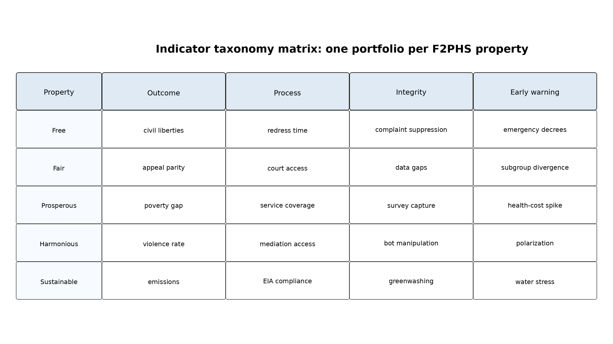
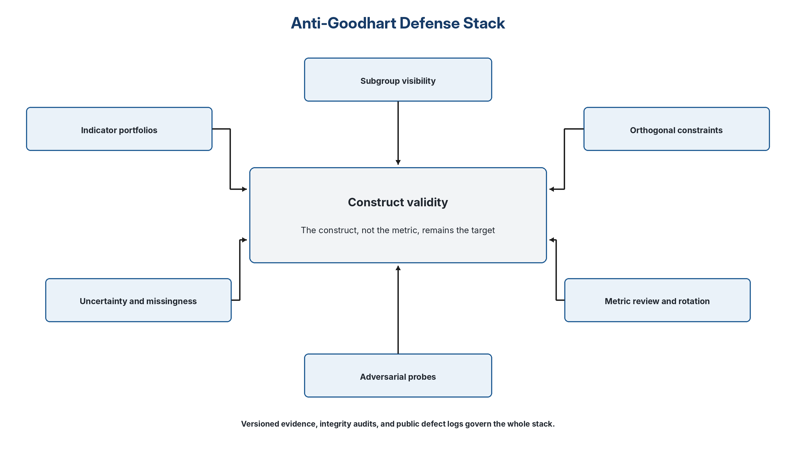

# Auditable Flourishing v6.2 Measurement and Construct Handbook

## Status and role

This handbook is the binding implementation companion for measurement and construct claims made under Auditable Flourishing v6.2. Use of the F2PHS/F2PHS+ vocabulary is optional; satisfaction of the applicable measurement-integrity functions is not. The handbook does not define a universal theory of flourishing. It provides a default vocabulary, construct documentation rules, measurement-card fields, distribution and invariance safeguards, and anti-Goodhart controls for candidates that use indicators or structured evidence.

[[PAGEBREAK]]

[[TOC_HEADING]]

[[TOC]]

[[PAGEBREAK]]

## 1. Functional coverage and ontology pluralism

Candidates must address protected agency; fairness and non-domination; material and capability security; peaceful pluralism and social integrity; and ecological and intergenerational continuity, or provide a principled explanation of non-equivalence. F2PHS is the default public vocabulary, not a mandatory ontology.

A two-way crosswalk is required:

1. candidate construct -> protocol function; and
2. protocol function -> candidate construct, integrated location, or justified omission.

Reviewers must permit principled non-equivalence. A candidate may explain that a function is relational, embedded, or not separable in its ontology. The question is whether protection and evidence are materially present, not whether labels match.

## 1.1 Operational anchor discipline

Every construct or Stage B dimension must declare: object and unit of analysis; protected-floor relation; applicable and non-applicable domains; observable evidence; category anchors; counterexamples; uncertainty; missingness; subgroup and distribution implications; evidence maturity; reviewer confidence; gaming pathways; update trigger; retirement condition; and authority boundary. An ordinal label is not a unit. Categories may be ordered only through defended descriptors and may not be summed, averaged, differenced, or assigned decimal weights without a validated measurement model.

A positive category requires evidence that distinguishes the category from adjacent alternatives. `Unknown`, `not applicable`, and `not reviewed` remain distinct. Applicability cannot be chosen strategically to improve a profile. A category that masks a material C0-C5 defect triggers Stage A re-entry rather than remaining a weak compensable score.

## 2. Functional architecture

### 2.1 Harmony is not conformity

Harmony is the most culturally vulnerable term in F2PHS, so it requires
a strict definition. In this protocol, harmony means low violence,
protected dissent, constructive pluralism, conflict-resolution capacity,
social trust, meaningful relationships, and institutional legitimacy. It
does not mean unanimity, obedience, suppression of contestation,
quietism, or absence of disagreement. A society can be harmonious only
if dissent remains protected, grievances can be voiced, and conflict can
be processed without coercion, dehumanization, or organized violence.
This anti-conformity rule is part of the definition rather than a later
caveat: if dissent, complaint, minority expression, or lawful opposition
is suppressed, the Harmony dimension fails its integrity condition even
if reported trust or visible order appears high.

Operationally, protected dissent and constructive pluralism should be
measured through portfolios rather than a single trust metric. Candidate
indicators may include independent measures of civil liberties, judicial
independence, protest-rights protection, journalist or opposition
detention, protest-policing harm, complaint-channel accessibility,
deliberative-democracy indicators, mediation access, and polarization or
dehumanization measures. These indicators should be interpreted together
so that high reported trust or low visible conflict cannot mask
coercion, censorship, or fear-induced silence.

### 2.2 Indicator taxonomy

Every F2PHS property must be represented by an indicator portfolio. A
portfolio must include outcome indicators, process indicators, integrity
indicators, and early-warning indicators. This distinction is essential
because a society can improve an outcome measure while degrading process
fairness, manipulate a reporting system while appearing compliant, or
fail to detect early-warning signs before slower outcome indicators
shift.

Figure 1. Indicator taxonomy matrix. Each property requires outcome,
process, integrity, and early-warning indicators.

Table 1. Indicator taxonomy.

| **Indicator type** | **Question answered**                          | **Example**                                                                                      | **Why it matters**                                       |
|--------------------|------------------------------------------------|--------------------------------------------------------------------------------------------------|----------------------------------------------------------|
| Outcome            | What is the actual condition?                  | Poverty headcount, avoidable mortality, homicide, emissions trajectory, life satisfaction        | Shows whether the target state is improving or declining |
| Process            | Is governance operating correctly?             | Appeal timeliness, procurement review, procedural safeguard compliance, participatory quality    | Prevents outcome-only shortcuts and compliance theater   |
| Integrity          | Is the measurement system being gamed?         | Missingness spikes, complaint suppression, sudden definition changes, greenwashing audits        | Detects manipulation, proxy drift, and reporting capture |
| Early warning      | What signals emerging failure before collapse? | Food-price spikes, appeal backlogs, groundwater depletion, trust collapse, heat mortality trends | Supports prevention rather than post hoc repair          |

### 2.3 Suggested core factor map

Table 2. Suggested core factor map.

| **Factor**                       | **Why it belongs**                                        | **Example indicators**                                                                             | **Evidence strength** | **Main measurement risk**                         |
|----------------------------------|-----------------------------------------------------------|----------------------------------------------------------------------------------------------------|-----------------------|---------------------------------------------------|
| Freedom and agency               | Central to rights and capabilities                        | Civil liberties, privacy, association, voice, appeal access                                        | High                  | Rights-on-paper versus lived reality              |
| Fairness and justice             | Required for legitimacy and non-domination                | Due-process access, appeal outcomes, discrimination gaps, corruption control                       | High                  | Selective enforcement and underreporting          |
| Health                           | Universal flourishing component                           | Life expectancy, HALE, avoidable mortality, mental distress, catastrophic health spending          | Very high             | Lagging data and mental health comparability      |
| Material security                | Basic condition for stable life                           | Poverty rate and gap, food insecurity, housing insecurity, debt stress                             | Very high             | Hidden deprivation and informal economies         |
| Education and knowledge          | Capability expansion and resilience                       | Literacy, numeracy, completion, learning outcomes, digital access                                  | High                  | Schooling substituted for learning                |
| Safety and peace                 | Violence collapses flourishing                            | Homicide, victimization, conflict incidence, displacement                                          | Very high             | Authoritarian order masking repression            |
| Social connection and trust      | Supports cooperation and wellbeing                        | Loneliness, social support, interpersonal trust, institutional trust                               | Moderate-high         | Survey manipulation and cultural variance         |
| Institutional legitimacy         | Enables compliance without coercion                       | Rule of law, procedural fairness, trust in courts, state capacity                                  | Moderate-high         | Halo effects and politicization                   |
| Ecological integrity             | Life-support condition                                    | GHG trajectory, PM2.5, water stress, land use, biodiversity proxies                                | Very high             | Offset theater and boundary mismatch              |
| Intergenerational resilience     | Flourishing must persist                                  | Adaptation capacity, critical infrastructure resilience, disaster preparedness, tail-risk exposure | Moderate-high         | Modeled uncertainty and long time horizons        |
| Meaning and subjective wellbeing | Captures lived quality not visible in material statistics | Life satisfaction, purpose, affect balance, character, close relationships                         | Moderate-high         | Adaptation, response bias, suppression of dissent |

Subjective wellbeing and meaning are core field dimensions because lived
experience matters and cannot be inferred from material statistics
alone. However, subjective wellbeing and meaning cannot override rights
floors, ecological boundaries, protected dissent, or independently
evidenced harms. They operate as part of the flourishing field and as
validation signals, not as permissions to ignore coercion, ecological
damage, or subgroup injury.

### 2.4 Ecological ceilings and planetary boundaries

The sustainability horizon should not be operationalized only through
emissions or generic environmental indicators. A credible protocol must
engage the planetary-boundaries literature. The 2025 Planetary Health
Check reports that seven of nine boundaries have been breached and that
all breached boundaries are under increasing pressure (Sakschewski et al., 2025). Auditable Flourishing therefore treats planetary boundaries as a
canonical ecological reference set for any framework claiming
civilizational scope. Candidate frameworks may use alternative
ecological models, but they must justify why those models are at least
as protective, measurable, and updateable.

Local ecological conditions that directly bear on life, health,
subsistence, cultural continuity, or protected community survival may
instantiate floor-level protections. Planetary-boundary conditions and
long-horizon resilience constraints belong to the horizon layer. This
clarifies why ecological integrity can appear both as a floor where
immediate rights or subsistence are implicated and as a horizon where
long-term biospheric stability is at stake.

This horizon framing is also grounded in the social-foundation and
ecological-ceiling tradition and the planetary-boundaries literature
(Raworth, 2017; Rockström et al., 2009; Steffen et al., 2015; Richardson
et al., 2023), while the protocol keeps those sources subordinate to the
open-core, rights, audit, and update requirements defined here.

Table 3. Planetary boundary reference families for the sustainability
horizon.

| **Boundary family**         | **Protocol use**                                                                                       | **Measurement caution**                                            |
|-----------------------------|--------------------------------------------------------------------------------------------------------|--------------------------------------------------------------------|
| Climate change              | Hard horizon constraint; track emissions, temperature anomalies, and carbon-budget alignment           | Avoid offset theater and delayed-action accounting                 |
| Biosphere integrity         | Species, habitat, and ecosystem function indicators                                                    | Do not let aggregate land protection hide local ecosystem collapse |
| Land-system change          | Land conversion, deforestation, and degradation                                                        | Distinguish legal land-use change from ecological function         |
| Freshwater change           | Surface and groundwater stress, flow alteration                                                        | Monitor local depletion and transboundary effects                  |
| Biogeochemical flows        | Nitrogen and phosphorus loading                                                                        | Avoid reporting only national totals when watershed harm is local  |
| Ocean acidification         | Ocean chemistry and marine ecosystem risk                                                              | Track lagged effects and marine food-system exposure               |
| Novel entities              | Persistent pollutants, plastics, synthetic chemicals, AI/tech-adjacent material streams where relevant | Measurement gaps are high; uncertainty should trigger precaution   |
| Stratospheric ozone         | Monitor recovery and policy compliance                                                                 | Do not treat recovery as evidence that all boundaries are safe     |
| Atmospheric aerosol loading | Regional air pollution and radiative forcing                                                           | Strong regional inequality and health burden effects               |

### 2.5 F2PHS+ dictionary status, evidence hierarchy, safe-and-just boundaries, and construct-validity guardrails

F2PHS is the top-level communication layer. F2PHS+ is the expanded subdimensional reference dictionary; together with measurement cards,
rights/horizon/integrity constraints, and the challenge protocol
constitute the operational method. Reviewers should therefore reject
submissions that merely rename existing indicators into the five F2PHS
labels without showing construct links, evidence quality, subgroup
behavior, boundary relevance, and update triggers.

For ecological and intergenerational claims, the protocol distinguishes
global horizon indicators from local floor harms. Planetary-boundary and
safe-and-just Earth-system-boundary work can guide horizon assessment
(Rockström et al., 2023),
but a local watershed, air-quality, land, food, or subsistence harm may
also trigger a floor-level rights analysis. Boundary metrics are
uncertain and sometimes politically contested; civilizational-scope
claims should therefore test robustness across plausible ecological
models when feasible.

Table 4. Evidence hierarchy distinguishes legal authority, peer-reviewed constructs, official statistics, candidate artifacts, and synthetic evidence.

| **Evidence tier**                            | **Allowed use**                                                                                                   | **Reviewer caution**                                                |
|----------------------------------------------|-------------------------------------------------------------------------------------------------------------------|---------------------------------------------------------------------|
| Primary law / binding authority              | Defines legal duties, affected-party rights, authorization limits, and mandatory impact-assessment obligations.   | Do not treat protocol admissibility as legal permission.            |
| Peer-reviewed construct or method literature | Supports construct validity, causal reasoning, reliability, measurement invariance, or ecological boundary logic. | Prefer for load-bearing scientific claims.                          |
| Official institutional statistics or reports | Supports current contextual facts and indicator selection.                                                        | Verify edition/date; do not make reports carry foundational theory. |
| Candidate-provided artifacts                 | Supports Stage A/Stage B evaluation only when independently replayable or challengeable.                          | Disclosure alone is not evidence of real-world validity.            |
| Synthetic data or illustrative scenarios     | Supports L1–L2 replay and reviewer training.                                                                  | Cannot support deployment or superiority claims.                    |

Version 6.2 treats F2PHS+ as a provisional canonical dictionary for
challenge rounds, not as a final theory of human or civilizational
value. Its function is reviewer discipline: each submitted framework
must show which floor, field, horizon, and integrity constructs it uses,
which indicators serve those constructs, what those indicators miss, and
what would count as construct drift or proxy failure.

Minimum dictionary rule. Each F2PHS+ property must disclose six
elements: protected floor, constructive field, long-horizon risk,
integrity safeguard, prohibited misuse, and example measurement-card
families. A candidate framework may use different labels, but it must
map its terms to these elements or explain why an alternative dictionary
is at least as protective, inspectable, and updateable.

Construct-validity guardrail. Indicator selection should be treated as a
validity argument rather than a dashboard choice. Reviewers should ask
whether evidence supports the inference from observed indicator to
intended construct, whether the inference holds across subgroups and
contexts, and whether plausible gaming or adaptation would break the
link. This aligns with validity-as-argument approaches in measurement
and program-evaluation practice (Messick, 1995; American Educational
Research Association et al., 2014; Shadish et al., 2002).

## 3. Measurement Architecture and Anti-Goodhart Design

### 3.1 Portfolio principle

Any civilizational target becomes dangerous when a proxy becomes the
target. The protocol therefore forbids single-KPI optimization. It
requires portfolios, process-plus-outcome pairing, integrity indicators,
uncertainty disclosure, subgroup reporting, periodic metric review, and
adversarial probes. The construct remains central; indicators are
imperfect instruments that support learning, not idols that replace
judgment.

No portfolio architecture can make Goodhart effects impossible. Goodhart
variants include regressional, extremal, causal, and adversarial
failures; the protocol therefore aims to raise the cost of gaming,
preserve construct visibility, detect proxy drift earlier, and require
repair when indicators cease to track the underlying flourishing
construct (Manheim & Garrabrant, 2018).

Figure 2. Anti-Goodhart defense stack. The construct remains central;
indicators support it through portfolios, subgroup visibility,
orthogonal constraints, integrity audits, uncertainty bands, metric
review, versioned changelogs, and adversarial probes.

### 3.2 Three additional safeguards

- Orthogonal constraints: each optimization target must be paired with a
  constraint metric that detects harm in a different measurement
  dimension. Fraud-detection efficiency, for example, must be paired
  with false-positive and subgroup-harm checks.

- Decoupling reward from telemetry: metrics should guide strategy and
  trigger review, but should not operate as mechanical payout or
  punishment triggers without contextual audit.

- Metric review and rotation: Stable core indicators should remain
  available for longitudinal comparability and archival trend analysis.
  Rotation applies mainly to primary optimization targets, high-stakes
  incentive metrics, and process indicators vulnerable to institutional
  test-gaming. Formal depreciation equations are treated as optional
  research directions, not as canonical requirements in this paper.

### 3.3 Uncertainty and subgroup discipline

Every major indicator must report uncertainty. Objective indicators
require confidence intervals or error bands where possible. Subjective
or mixed indicators require evidence grades, sampling caveats,
rater-bias discussion, and sensitivity checks. For rights-sensitive
settings, uncertainty must affect permitted actions. Low confidence
should not be used to assume compliance. When evidence is noisy and
rights are at stake, the protocol requires conservative escalation,
additional review, containment, or refusal under underdetermination.

All portfolios must report distributional effects. At minimum, reporting
should include median, bottom quintile, worst affected protected
subgroup where legally and ethically permissible, and a relevant
inequality measure. If privacy rules prevent subgroup reporting, the
submission must provide a privacy-preserving substitute and disclose
what remains unobservable.

Data minimization is part of measurement discipline. Candidate
frameworks must justify collection, retention, access control,
sensitive-attribute handling, privacy-preserving subgroup analysis, and
security safeguards for every indicator that relies on personal or
sensitive data.

When direct subgroup reporting is not lawful or safe, the substitute
method must itself be specified in the measurement card. Acceptable
substitutes may include cell suppression thresholds, k-anonymity rules,
differential-privacy parameters, secure multiparty analysis,
synthetic-data validation, re-identification risk testing, or
independent confidential review. A submission may not simply state
“privacy” as a reason for hiding worst-off-group effects; it must
disclose what remains unobservable and how the residual risk will be
monitored.

### 3.4 Measurement-card requirements and bias safeguards

This handbook requires a higher scientific burden for indicators used in
high-impact comparisons. Each material indicator should be accompanied
by a validity argument rather than a mere definition. The card must
state what inference the indicator is allowed to support, what inference
it cannot support, and what would force revision, downgrade, or
retirement.

| **Additional field**             | **Required content**                                                                                                                                                   |
|----------------------------------|------------------------------------------------------------------------------------------------------------------------------------------------------------------------|
| Construct-validity argument      | Why the indicator supports the intended F2PHS+ construct and what evidence would falsify that inference.                                                               |
| Causal status                    | Whether the indicator is an outcome, proxy, leading indicator, process measure, integrity signal, causal lever, or mixed measure.                                      |
| Measurement invariance           | Whether the indicator behaves comparably across cultures, languages, institutions, protected groups, and time.                                                         |
| Missing-data mechanism           | Whether missingness is likely random, conditionally random, or systematic, with subgroup and rights implications.                                                      |
| Decision relevance               | Which decisions the indicator may support, and which decisions it must not support.                                                                                    |
| Burden and harm risk             | Whether collecting or using the indicator creates surveillance, stigma, exclusion, administrative burden, or chilling effects.                                         |
| Retirement/deprecation condition | When proxy drift, gaming, changed law, changed science, or empirical failure should downgrade or retire the metric.                                                    |
| Independent verification path    | Who can audit the indicator, what they need to access, and how confidentiality or privacy limits are handled.                                                          |
| Decision authority boundary      | What kinds of decisions this indicator may inform, what decisions it must not decide alone, and what lawful or institutional authority remains required before action. |

Subjective wellbeing and meaning measures remain important because lived
experience matters. They are not permission structures. They cannot
override rights floors, ecological harm, coercion, or subgroup injury.
Submissions using subjective measures must discuss adaptive preferences,
fear-induced reporting, social desirability bias, authoritarian
preference falsification, cultural response styles, and survey
nonresponse.

The measurement-card requirement adapts the documentation logic of model
cards and datasheets for datasets to civilizational indicators: every
indicator must disclose what it measures, what it misses, how it can
fail, and how it should be audited (Gebru et al., 2021; Mitchell et al.,
2019).

Table 5. Measurement card template.

| **Field**                                | **Required content**                                                                                                                                                   |
|------------------------------------------|------------------------------------------------------------------------------------------------------------------------------------------------------------------------|
| Indicator name                           | Plain-language name and technical name                                                                                                                                 |
| Construct link                           | Which F2PHS+ dimension and why it belongs                                                                                                                              |
| Definition                               | Exact formula, numerator, denominator, inclusion and exclusion rules                                                                                                   |
| Data source                              | Source, owner, access, update cadence, quality issues                                                                                                                  |
| Uncertainty                              | Error bands, confidence intervals, evidence grade, rater bias, missingness                                                                                             |
| Subgroup reporting                       | Required disaggregation or privacy-preserving substitute                                                                                                               |
| Gaming risks                             | How actors might manipulate the indicator                                                                                                                              |
| Integrity checks                         | Missingness flags, audit sampling, independent verification, anomaly tests                                                                                             |
| Revision history                         | Version, date, changes, rationale, responsible party                                                                                                                   |
| Privacy, security, and data minimization | Purpose limitation, retention rules, access controls, sensitive-attribute handling, privacy-preserving subgroup analysis, and security safeguards                      |
| Decision authority boundary              | What kinds of decisions this indicator may inform, what decisions it must not decide alone, and what lawful or institutional authority remains required before action. |

For cross-country, cross-cultural, or multilingual comparison, measurement cards should also state whether measurement invariance has been evaluated. Where suitable, reviewers may request differential item functioning checks, multi-group factor analysis, alignment methods, translation/back-translation review, or explicit non-comparability warnings. Early-warning indicators should be treated as risk signals rather than causal proof unless a causal identification strategy, triangulated mechanism, or strong domain evidence is declared. Planetary-boundary and resilience indicators also carry control-variable uncertainty, threshold uncertainty, and interaction uncertainty; these uncertainties should be disclosed rather than hidden behind a single ecological score.

### 3.5 Non-documentary evidence measurement card

For oral, observed, customary, community, translated, or otherwise non-documentary evidence, the measurement card additionally records source authority, consent basis, purpose limit, custody, disclosure restrictions, translation or interpretation, verification, triangulation, correction, challenge route, compensation, withdrawal, retention and deletion, and data sovereignty. Reviewers assess function and challengeability rather than document volume, visual polish, legal drafting, or computational form.

## 4. F2PHS+ reference architecture

Table 6. F2PHS+ reference architecture. The long-form layout makes the expanded structure beneath the communication layer readable without implying that every property can be reduced to one indicator.

| **Property** | **Role** | **Reference content** |
|---|---|---|
| Free | Floor | Bodily integrity, liberty, due process, privacy, and non-coercion. |
| Free | Field | Agency, voice, participation, and informational autonomy. |
| Free | Horizon | Freedom preserved during emergencies, automation, surveillance, and institutional drift. |
| Free | Integrity guardrail | Notice, appeal access, surveillance audit, and complaint-channel integrity. |
| Free | Indicator families | Civil liberties, rights-in-practice gaps, appeal timeliness, privacy incidents. |
| Free | Prohibited misuse | Calling a society free when fear, automation, or opacity prevents meaningful challenge. |
| Fair | Floor | Non-discrimination, equal protection, fair procedure, and anti-domination. |
| Fair | Field | Equitable opportunity, administrative fairness, anti-corruption, and burden distribution. |
| Fair | Horizon | Reduced structural exclusion and long-term institutional legitimacy. |
| Fair | Integrity guardrail | Subgroup audit, procurement integrity, and selective-enforcement checks. |
| Fair | Indicator families | Disparity ratios, court access, corruption controls, discrimination complaints. |
| Fair | Prohibited misuse | Averaging away harms to protected or worst-off groups. |
| Prosperous | Floor | Basic needs, subsistence, housing security, and health access where rights-relevant. |
| Prosperous | Field | Material security, health, education, work, social protection, and resilience. |
| Prosperous | Horizon | Shock resilience, poverty persistence, and capability expansion over time. |
| Prosperous | Integrity guardrail | Benefit-denial audit, false-positive review, and survey integrity. |
| Prosperous | Indicator families | Poverty gap, MPI, food insecurity, avoidable mortality, learning outcomes. |
| Prosperous | Prohibited misuse | Treating GDP, efficiency, or aggregate output as sufficient evidence of prosperity. |
| Harmonious | Floor | Protection from violence, repression, intimidation, and forced conformity. |
| Harmonious | Field | Social trust, relationships, constructive pluralism, conflict-resolution capacity, and meaning. |
| Harmonious | Horizon | Polarization, organized violence, institutional breakdown, and intergroup dehumanization. |
| Harmonious | Integrity guardrail | Dissent protection, media integrity, bot/manipulation signals, and grievance-channel review. |
| Harmonious | Indicator families | Homicide, UCDP conflict, displacement, trust, mediation access, affective polarization. |
| Harmonious | Prohibited misuse | Equating harmony with obedience, silence, censorship, or visible order. |
| Sustainable | Floor | Ecological integrity where life, health, subsistence, or community survival is directly implicated. |
| Sustainable | Field | Environmental quality, pollution reduction, and local ecosystem health. |
| Sustainable | Horizon | Planetary boundaries, climate stability, biodiversity, and intergenerational resilience. |
| Sustainable | Integrity guardrail | Greenwashing audit, offset integrity, and boundary-data verification. |
| Sustainable | Indicator families | Emissions, PM2.5, freshwater stress, land use, biodiversity proxies, adaptation capacity. |
| Sustainable | Prohibited misuse | Using offsets or aggregate environmental scores to hide local or irreversible harm. |

This dictionary is provisional for challenge rounds. It is canonical only for comparability under this protocol family, not as a final theory of human or civilizational value. Candidate frameworks may rename dimensions or use richer ontologies, but they must map their constructs to the protected-floor, field, horizon, integrity, and indicator roles above or justify a principled alternative. No top-level property may be represented by a single KPI.

## 5. Worked measurement-card examples

Worked measurement-card examples. These are illustrative minimums for a public challenge packet; final cards must be adapted to jurisdiction, domain, authority, and data availability.

Table 7. Worked measurement-card examples in long form.

| **Measurement card** | **Required element** | **Illustrative content** |
|---|---|---|
| Appeal access and timeliness | Construct link | Free/Fair floor and process indicator. |
| Appeal access and timeliness | Definition | Share of affected persons receiving notice, explanation, accessible appeal, and decision within a declared timeframe. |
| Appeal access and timeliness | Uncertainty and subgroups | Report median, bottom quintile, protected groups where lawful, disability/language access, missingness, and confidence limits. |
| Appeal access and timeliness | Gaming and integrity checks | Audit random cases; compare appeal success rates, abandoned appeals, inaccessible notices, and complaint suppression. |
| Appeal access and timeliness | Revision trigger | Delay, access gap, or appeal-success reversal exceeds a predeclared threshold. |
| Missing-document denial risk | Construct link | Fair/Prosperous rights-sensitive integrity indicator. |
| Missing-document denial risk | Definition | Rate at which missing documentation leads to denial, delay, or manual review, separated from confirmed ineligibility. |
| Missing-document denial risk | Uncertainty and subgroups | Disaggregate by protected or worst-off groups, or use confidential/privacy-preserving review. |
| Missing-document denial risk | Gaming and integrity checks | Detect documentation-burden laundering, subgroup missingness, and fraud-flag overreach. |
| Missing-document denial risk | Revision trigger | Missingness predicts adverse action more strongly than eligibility evidence or diverges materially by subgroup. |
| Eviction-after-contact outcome | Construct link | Prosperous field and floor-risk outcome. |
| Eviction-after-contact outcome | Definition | Share of applicants with housing-risk contact who experience eviction, homelessness, or unresolved arrears within a defined follow-up window. |
| Eviction-after-contact outcome | Uncertainty and subgroups | Use survival or time-to-event logic where appropriate; report uncertainty and data-linkage gaps. |
| Eviction-after-contact outcome | Gaming and integrity checks | Test whether apparent fraud efficiency increases downstream housing harm. |
| Eviction-after-contact outcome | Revision trigger | Emergency-stabilization failure or subgroup divergence exceeds the declared threshold. |
| Protected dissent and grievance-channel integrity | Construct link | Harmonious integrity and anti-conformity safeguard. |
| Protected dissent and grievance-channel integrity | Definition | Presence, accessibility, safety, and responsiveness of complaint, protest, media, and deliberation channels. |
| Protected dissent and grievance-channel integrity | Uncertainty and subgroups | Report under-sampling, fear-response risk, retaliation reports, and journalist/opposition detention proxies where relevant. |
| Protected dissent and grievance-channel integrity | Gaming and integrity checks | Compare trust scores against repression, censorship, complaint suppression, and visible-conflict measures. |
| Protected dissent and grievance-channel integrity | Revision trigger | Trust rises while dissent channels narrow or retaliation indicators increase. |
| Boundary-aligned ecological stress | Construct link | Sustainable horizon and local floor where life support is implicated. |
| Boundary-aligned ecological stress | Definition | Local or sectoral indicator linked to a planetary-boundary or safe-operating-space family, such as freshwater stress, PM2.5, emissions trajectory, biodiversity proxy, or land conversion. |
| Boundary-aligned ecological stress | Uncertainty and subgroups | Report model uncertainty, local hotspots, affected communities, lag effects, and boundary mismatch. |
| Boundary-aligned ecological stress | Gaming and integrity checks | Audit greenwashing, offsets, scope shifting, and aggregate masking of local collapse. |
| Boundary-aligned ecological stress | Revision trigger | Boundary trajectory worsens, offset integrity fails, or local life-support risk becomes rights-relevant. |

## 6. Enhanced measurement-card fields

The following fields extend the measurement-card template for
high-impact uses. They are recommended for Core-tier challenges and
required for Full-tier validation unless a public justification explains
why a field is inapplicable.

Table 8. Enhanced measurement-card fields expose validity, burden, verification, and authority risks.

| **Field**                        | **Reviewer question**                                                                                      | **Failure signal**                                                                                    |
|----------------------------------|------------------------------------------------------------------------------------------------------------|-------------------------------------------------------------------------------------------------------|
| Construct-validity argument      | Why should this indicator support the intended construct?                                                  | Indicator is convenient or prestigious but not tied to the claimed construct.                         |
| Causal status                    | Is the indicator an outcome, proxy, leading indicator, process measure, integrity signal, or causal lever? | Indicator is used to justify action beyond its inferential role.                                      |
| Measurement invariance           | Does the indicator behave comparably across cultures, languages, institutions, groups, and time?           | Observed differences may reflect measurement artifact rather than real differences.                   |
| Missing-data mechanism           | Is missingness random, conditionally random, or systematic?                                                | Missingness tracks vulnerability, exclusion, fear, instability, or administrative burden.             |
| Decision relevance               | What decisions may this indicator support or not support?                                                  | Indicator is used for denial, ranking, or coercion beyond its design scope.                           |
| Burden and harm risk             | Can collecting or using the indicator create surveillance, stigma, exclusion, or chilling effects?         | Measurement itself harms the group being measured.                                                    |
| Retirement/deprecation condition | What would make this indicator stale, gamed, unlawful, invalid, or misleading?                             | Metric persists after proxy drift or observed failure.                                                |
| Independent verification path    | Who can audit it, under what access rules, and with what privacy safeguards?                               | No independent route exists to inspect the data, assumptions, or transformation.                      |
| Decision authority boundary      | What decision authority is being claimed?                                                                  | Indicator is used to deny, rank, coerce, authorize, or certify beyond its permitted evidentiary role. |

## 7. Evidence maturity and confidence

Every rating or indicator claim reports evidence maturity, evidence mode, and reviewer confidence separately. `evidence_maturity_level` uses L0-L6. `evidence_mode` records how evidence was produced, such as conceptual analysis, synthetic replay, historical backtest, independent replay, shadow mode, pilot, live observation, or experiment. The record also states `maturity_subject`, `maturity_rationale`, and `evidence_pointer`. Reviewer confidence is high, moderate, low, or unresolved. None of these fields is added arithmetically to an ordinal category.

## 7.0 Common Stage B anchor ladder

All twelve dimensions instantiate the same pattern: 0 absent/defeating; 1 nominal/weak; 2 operative/inspectable; 3 independently challenged; 4 demonstrated/corrected. Dimension-specific Appendix F anchors control. A shared ladder does not establish one latent scale.

## 7.1 Ordinal category interpretation and calibration

The core paper owns the twelve Stage B dimensions and their ordered 0-4 descriptors. This handbook governs evidence interpretation and calibration. Reviewers must not sum, average, subtract, or assign decimal materiality thresholds to the category labels. Category evidence is reported alongside evidence maturity level, evidence mode, maturity subject and rationale, evidence pointers, reviewer confidence, and material disagreement.

Calibration cases should test boundary conditions between adjacent categories, not merely obvious 0-versus-4 examples. Each case should identify the decisive evidence, plausible alternative interpretation, affected subgroup or rights issue, and what additional evidence would change the category. Low agreement at one boundary is evidence that the anchor, evidence requirement, or reviewer training may be defective.

Agreement methods must fit the scale. With expected concentration in middle ordinal categories, Gwet AC2 is a defensible primary coefficient and ordinal Krippendorff alpha a useful cross-check; weighted kappa is a secondary comparator whose weighting and prevalence sensitivity must be disclosed. ICC is reserved for justified interval or continuous indicators. The protocol does not prescribe a universal numerical reliability threshold. Targets and consequences must be preregistered for the specific pilot (Gwet, 2014; Krippendorff, 2018; Liddell & Kruschke, 2018).

Reliability must be reported separately for each C0-C5 criterion, each Stage B dimension, the final Stage A outcome, and the final Stage B outcome. A mean that mixes criterion categories with categorical final decisions is invalid. Phase 0 estimates are exploratory; a later confirmatory design uses simulation-based precision or decision-error planning informed by observed prevalence and dependence. Criterion order is randomized or balanced, and global-impression probes are recorded before and after rating so halo and order effects can be estimated rather than mistaken for shared criterion interpretation. Ratings materially suggested or generated by a common AI system are analyzed in a separate condition and are not treated as independent human ratings.

## 7.2 Not applicable, unknown, and zero

A category of 0 means the dimension is applicable and the required function is absent, contradictory, or materially failing. It must not encode `unknown`, `not reviewed`, or `not applicable`. Machine records and public reports must preserve these states separately with a rationale. A profile with a material unknown cannot support dominance if the missing dimension could reverse the relation. Core Table 8M controls the resulting public outcome: a valid but evidentially unresolved comparison is `non_decisive`; invalid comparison prerequisites require `refusal_to_compare`; adequately evidenced crossing profiles are `incomparable`.

For dimensions fully linked to a Stage A floor, category 0 is presumptively incompatible with continuing Stage B eligibility. Reviewers return the candidate to Stage A when later evidence establishes a material C0–C5 defect. Category 1 on a floor-linked dimension is reportable only with a written explanation of why the weakness did not reach Stage A materiality. Partly linked dimensions require an explicit `floor_linkage` record and the same analysis for the linked portion.

Reviewer confidence on a `not_applicable` record attaches to the applicability rationale, not to a nonexistent category. An applicability mismatch or category disagreement is reversal-capable when substituting an evidence-supported alternative changes the partial-order relation; the comparison record must preserve and rerun each defended alternative.

## 7.3 Assisted and differential evidence pathways

Measurement integrity does not require every architecture to produce the same artifact form. A measurement card may bind evidence from structured data, reasons records, observation, testimony, oral or translated deliberation, customary practice, community records, protected administrative data, or computational logs when the host can reconstruct provenance, scope, construct link, uncertainty, distribution, and challengeability.

Assistance changes the form of evidence, not the evidentiary standard. The card records the original form, assistance provider, translation or transformation, candidate approval, information loss, confidentiality constraints, and whether the assisted representation could alter interpretation. Reviewers assess polished presentation separately from construct support. No candidate gains a higher category merely because it can purchase more elaborate documentation.

Pilots compare missingness, reviewer time, confidence, disagreement, and category outcomes across evidence pathways and resource groups. Systematic disadvantage for community, customary, low-resource, disabled, or non-dominant-language entrants is evidence of C1-D05 and may require redesign or refusal.

## 7.4 Calibration sample planning, differential performance, and burden

A measurement calibration plan must identify the subject of each maturity claim, the evidence mode, the architecture families represented, reviewer structure, affected-party participation, and the precision required for the intended inference. It reports criterion- and dimension-level agreement, differential missingness and burden by architecture type, the effect of assisted-dossier support, and whether particular evidence forms systematically generate lower confidence or Indeterminate outcomes.

Formal power calculations are used only when the estimand, sampling model, effect size, and dependence structure are defensible. Otherwise, the study uses precision-based planning and declares target uncertainty intervals, minimum informative case diversity, reviewer count, and stopping rules. Exploratory factor or redundancy analysis of AF-SB12 remains hypothesis-generating until sample size and ordinal-model assumptions are justified.

Burden is a measurement-integrity variable rather than an administrative afterthought. The calibration record includes preparation time, review and adjudication time, translation and accessibility support, assistance hours and cost, withdrawals, missing evidence caused by resource limits, and whether assistance materially changed a finding. Persistent resource-linked missingness, withdrawal, or Indeterminate outcomes trigger redesign of the evidence pathway rather than automatic attribution to candidate opacity.

## 8. Indicator retirement and construct revision

Indicators should be retired or redesigned when they lose construct validity, create unacceptable burden, become gameable, conceal subgroup harm, depend on unstable access, violate privacy, or cease to inform action. A construct vocabulary should be revised when affected parties or diverse candidates demonstrate systematic omission or architecture bias. Revision must preserve a public changelog and explain whether historical comparisons remain valid.

## AF-SB12-v5.6 dimension-set and AF-SB-RELATION-v6.0 governance

The twelve Stage B dimensions remain the provisional component AF-SB12-v5.6 because v6.2 does not add, merge, split, retire, or reorder them. They cover protected floors and power; evidence and inspectability; learning and anti-gaming; and horizon, feasibility, and institutional fit. Calibration tests overlap, omissions, burden, architecture bias, and dimension-level reliability. A change to the dimension set requires a new component version, construct map, backward-compatibility note, benchmark replay, and public evidence under C3-D07.

Version 6.2 preserves the separately versioned relation component, AF-SB-RELATION-v6.0. Reviewers compute the base partial-order relation and replay every evidence-supported alternative category. If all relations remain one-direction dominance, dominance is invariant. If all remain crossing, incomparability is invariant. If relations change, include a tie, or remain unresolved under valid prerequisites, the outcome is non-decisive. Invalid prerequisites produce refusal to compare. This symmetric rule prevents peripheral disagreement from erasing a stable crossing while preventing fragile dominance from being overstated.

A category is floor-linked unreachable when its descriptor necessarily entails a material Stage A defect under the same scope. Rights robustness category 0 and Refusal quality category 0 are not stable Stage B values; they route to Stage A. Category 1 on either requires a written materiality rationale. Other dimensions route back when the evidence establishes a material C0-C5 defect.

Calibration reports Stage A outcomes, eligible pairs, base dominance, invariant dominance, invariant incomparability, non-decisiveness, refusal, ties, relation changes, and reason-coded empty sets. The v6.2 supplement provides five-category, range-restricted, mixed, and correlated structural sensitivities. These are model diagnostics, not forecasts.

Stage A can restrict the observed category range, especially on dimensions close to C0-C5. This can raise base-profile dominance while simultaneously making dominance fragile when it rests on one adjacent category. The first external studies preregister competing hypotheses and report the actual relation set. They do not assume in advance that dominance, incomparability, or non-decisiveness must prevail.

The first empirical calibration also tests whether dimensions load onto the four functional groups. Factor or latent-structure analysis is exploratory until ordinal-model assumptions and sample size are justified. Group summaries remain explanatory and cannot replace the dimension-level partial order without separate normative justification.

A `not_applicable` judgment requires a rationale, scope binding, and reviewer confirmation. A potentially resolvable mismatch produces non-decisiveness; inability to establish a valid common scope produces refusal to compare.

## Burden as a measurement and validity construct

Burden is multidimensional and distributional. The minimum record separates candidate preparation, reviewer assessment, adjudication, affected-party participation, access and translation, evidence security, appeal, direct financial cost, uncompensated time, delay, abandonment, and subjective burden. Means cannot hide role-specific or subgroup concentration. A study must report medians, ranges, tails, missingness, and architecture-, language-, disability-, resource-, and documentation-intensity differences where feasible.

Feasibility is conjunctive: all required capacity and access conditions must be met. The v6.2 aggregation workbook and reference engine deliberately include a false-green case in which per-case hours are acceptable while reviewer count, calendar, and interpretation fail. The correct result is not feasible.

## External construct and architecture-fairness validation

Validation proceeds through content review, response-process evidence, inter-reviewer reliability, internal-structure analysis where appropriate, relations to external variables, decision utility, consequences, and measurement invariance. Because AF contains ordinal and normative constructs, no single coefficient establishes validity. The external study must include functionally equivalent architectures with different artifact forms and must estimate differential false clearance, false rejection, indeterminacy, burden, and appeal reversal.

The audit-theatre arm crosses document polish with substantive safeguard quality. A valid instrument should reject or question polished but deficient records and should not penalize substantively adequate low-polish records after appropriate support. Ablation tests whether each dimension earns its burden; decision-value analysis asks whether the added information improves decisions or merely produces more documentation.

## AF v6.2 synchronization note

This artifact implements the v6.2 three-axis record (`decision_status`, `evidence_state`, `review_state`), the non-erasure invariant, perturbation-replay anti-inflation and anti-suppression controls, and the separation of raw agreement, reliability, adjudication, and external validity. These controls clarify the existing protocol and do not confer legal, moral, procurement, or deployment authority.

# References

American Educational Research Association, American Psychological Association, & National Council on Measurement in Education. (2014). *Standards for educational and psychological testing*. American Educational Research Association.

Campbell, D. T. (1979). Assessing the impact of planned social change. *Evaluation and Program Planning, 2*(1), 67-90. https://doi.org/10.1016/0149-7189(79)90048-X

Gebru, T., Morgenstern, J., Vecchione, B., Vaughan, J. W., Wallach, H., Daumé III, H., & Crawford, K. (2021). Datasheets for datasets. *Communications of the ACM, 64*(12), 86-92. https://doi.org/10.1145/3458723

Gwet, K. L. (2014). *Handbook of inter-rater reliability* (4th ed.). Advanced Analytics.

Krippendorff, K. (2018). *Content analysis: An introduction to its methodology* (4th ed.). SAGE.

Liddell, T. M., & Kruschke, J. K. (2018). Analyzing ordinal data with metric models: What could possibly go wrong? *Journal of Experimental Social Psychology, 79*, 328-348. https://doi.org/10.1016/j.jesp.2018.08.009

Manheim, D., & Garrabrant, S. (2018). Categorizing variants of Goodhart's Law. arXiv. https://arxiv.org/abs/1803.04585

Messick, S. (1995). Validity of psychological assessment: Validation of inferences from persons' responses and performances as scientific inquiry into score meaning. *American Psychologist, 50*(9), 741-749. https://doi.org/10.1037/0003-066X.50.9.741

Mitchell, M., Wu, S., Zaldivar, A., Barnes, P., Vasserman, L., Hutchinson, B., Spitzer, E., Raji, I. D., & Gebru, T. (2019). Model cards for model reporting. *Proceedings of the Conference on Fairness, Accountability, and Transparency*, 220-229. https://doi.org/10.1145/3287560.3287596

Raworth, K. (2017). *Doughnut economics: Seven ways to think like a 21st-century economist*. Chelsea Green Publishing.

Richardson, K., Steffen, W., Lucht, W., et al. (2023). Earth beyond six of nine planetary boundaries. *Science Advances, 9*(37), eadh2458. https://doi.org/10.1126/sciadv.adh2458

Rockström, J., Gupta, J., Qin, D., et al. (2023). Safe and just Earth system boundaries. *Nature, 619*, 102-111. https://doi.org/10.1038/s41586-023-06083-8

Rockström, J., Steffen, W., Noone, K., et al. (2009). A safe operating space for humanity. *Nature, 461*, 472-475. https://doi.org/10.1038/461472a

Sakschewski, B., Caesar, L., Andersen, L. S., et al. (2025). *Planetary Health Check 2025: A scientific assessment of the state of the planet*. Potsdam Institute for Climate Impact Research. https://doi.org/10.48485/pik.2025.017

Shadish, W. R., Cook, T. D., & Campbell, D. T. (2002). *Experimental and quasi-experimental designs for generalized causal inference*. Houghton Mifflin.

Steffen, W., Richardson, K., Rockström, J., et al. (2015). Planetary boundaries: Guiding human development on a changing planet. *Science, 347*(6223), 1259855. https://doi.org/10.1126/science.1259855
